Oracle RAC를 구성하기위해 ASM 및 Grid Infrastructure를 설치 및 구성하는 가이드입니다.

!!! info
    가이드에 사용되는 입력값은 예시입니다. 필요시 환경에 맞게 변경 가능합니다.

## ASM(Automatic Storage Management) 구성
Oracle에서 만든 자동으로 스토리지를 관리하는 소프트웨어로써, 데이터 베이스에서 사용하는 모든 파일(Contorl File, Archive log file, Redolog File, DataDump File, DataFile, SPFILE 등) 에 대해 자동저장공간 관리를 위해 ASM을 구성합니다.

```shell title="네트워크 IP 세팅 확인 ( 노드 : 전체 / 계정 : root )"
ip a 
```

결과 값

- node1 : Eth0 : 192.168.0.110/24, Eth1 : 10.1.1.110/24
- node2 : Eth0 : 192.168.0.120/24, Eth1 : 10.1.1.120/24

```shell title="공유 디스크 세팅 확인 ( 노드 : 전체 / 계정 : root )"
lsblk
```

디스크 목록에 sdb가 있는지 확인

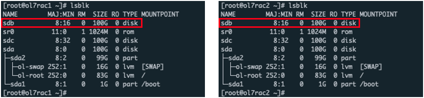{:class="imgCenter"}


```shell title="호스트 네임 세팅 ( 노드 : node1 / 계정 : root )"
hostnamectl  set-hostname  ol7rac1
```

```shell title="호스트 네임 세팅 ( 노드 : node2 / 계정 : root )"
hostnamectl  set-hostname  ol7rac2
```

```shell title="오라클 데이터베이 구성전 설치 ( 노드 : 전체 / 계정 : root )"
yum install -y oracle-database-preinstall-19c
```
preinstall이 완료되면 자동으로 rpm을 설치하고, 필요 그룹을 생성하고 해당 설치과정에서는 dba 그룹만 사용

```shell title="그룹 자동생성 확인 ( 노드 : 전체 / 계정 : root )"
cat /etc/group
```

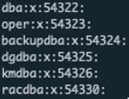{:class="imgCenter"}

```shell title="oracle, grid 유저 생성 및 비밀번호 수정 ( 노드 : 전체 / 계정 : root )"
useradd -s /bin/bash -g dba oracle
passwd oracle
useradd -s /bin/bash -g dba grid
passwd grid
```

```shell title="유저 생성 확인 ( 노드 : 전체 / 계정 : root )"
id oracle
(출력)
uid=1000(oracle) gid=54322(dba) groups=54322(dba)

id grid
(출력)
uid=1001(grid) gid=54322(dba) groups=54322(dba)
```

```shell title="계정별 bash_profile 수정 ( 노드 : 전체 / 계정 : root )"
vi ~/.bash_profile

(추가)
umask 022

vi ~grid/.bash_profile

(추가)
umask 022

vi ~oralce/.bash_profile

(추가)
umask 022
```

```shell title="Grid 설치 폴더 생성 및 권한설정 ( 노드 : 전체 / 계정 : root )"
mkdir -p /u01/app/19.0.0/grid
mkdir -p /u01/app/grid
chown -R grid:dba /u01
chmod -R 775 /u01
```

```shell title="hosts 파일에 ip 등록 ( 노드 : 전체 / 계정 : root )"
vi /etc/hosts

(추가)
### Public
192.168.0.110 ol7rac1
192.168.0.120 ol7rac2
### Private
10.1.1.110 ol7rac1-priv
10.1.1.120 ol7rac2-priv
### Virtual
192.168.0.121 ol7rac1-vip
192.168.0.122 ol7rac2-vip
### SCAN (스캔을 안쓰는 경우 세팅을 안해도 되는데 구성시 필수여서 입력해야함)
192.168.0.123 ol7rac-scan
192.168.0.124 ol7rac-scan
192.168.0.125 ol7rac-scan
```

```shell title="Memory 확인 ( 노드 : 전체 / 계정 : root )"
grep MemTotal /proc/meminfo

(결과)
GI는 8GB 이상, DB는 1GB 이상.
```

```shell title="Swap 공간 확인 ( 노드 : 전체 / 계정 : root )"
grep SwapTotal /proc/meminfo

(결과)
메모리크기의 1~1.5배 이어야함. <16GB
```

```shell title="[필요시] swap 볼륨 추가 ( 노드 : 전체 / 계정 : root )"
> 10GB 생성
dd if=/dev/zero of=/etc/swapfile bs=1024 count=10000000

> Swap 파일로 포맷
mkswap /etc/swapfile

> Swap 공간으로 활성화
swapon /etc/swapfile

> /etc/fstab 파일에 추가
vi /etc/fstab

(추가)
/etc/swapfile          swap            swap    defaults        0 0
```

```shell title="ntp 설치 및 불필요 프로그램 종료 ( 노드 : 전체 / 계정 : root )"
> ntpd 설치
yum install -y ntp

> ntpd 설정 파일 수정
vi /etc/sysconfig/ntpd

(수정)
# Command line options for ntpd
#OPTIONS="-g"
OPTIONS="-x -u ntp:ntp -p /var/run/ntpd.pid"

> ntpd 실행 및 상태확인
systemctl enable --now ntpd
systemctl status ntpd

> 불필요 소프트웨어 종료
systemctl disable --now avahi-daemon

> 방화벽 종료 (운영시 종료X)
systemctl disable --now firewalld
```

```shell title="Resource Limit 관련 파라메타 세팅 ( 노드 : 전체 / 계정 : root )"
vi /etc/security/limits.conf

(추가) #End of file 바로 위에
grid       soft     nofile     4096
grid       hard     nofile     65536
grid       soft     nproc      16384
grid       hard     nproc      16384
grid       soft     stack      10240
grid       hard     stack      32768
grid       soft     memlock    3145728
grid       hard     memlock    3145728

oracle       soft     nofile     4096
oracle       hard     nofile     65536
oracle       soft     nproc      16384
oracle       hard     nproc      16384
oracle       soft     stack      10240
oracle       hard     stack      32768
oracle       soft     memlock    3145728
oracle       hard     memlock    3145728
```

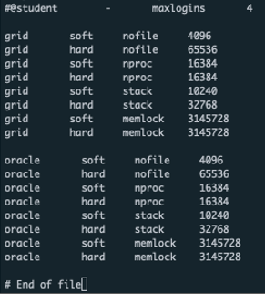{:class="imgCenter"}

```shell title="asmlib 설치 ( 노드 : 전체 / 계정 : root )"
yum install -y oracleasm-support
yum install -y kmod-oracleasm
```

## ASM Disk 구성 작업
1,2,5번 작업은 모든 노드에서 수행하고 3,4번 작업은 1번 노드에서만 수행합니다.

```shell title="asmlib 설치 ( 노드 : 전체 / 계정 : root )"
/usr/sbin/oracleasm configure -i
(입력)
grid > dba > y > y 순으로 입력
```

```shell title="oracleasm 커널모듈 로딩 ( 노드 : 전체 / 계정 : root )"
/usr/sbin/oracleasm init
```

```shell title="사용할 수 있는 Disk 확인 및 파티션 생성 ( 노드 : node1 / 계정 : root )"
lsblk
fdisk /dev/sdb (n > 엔터 > 엔터 > 엔터 > w) 파티션 생성
pvcreate /dev/sdb1    
```

```shell title="ASM disk scan ( 노드 : 전체 / 계정 : root )"
oracleasm scandisks

(결과)
1,2번 노드에 DATA가 출력되는지 확인
```

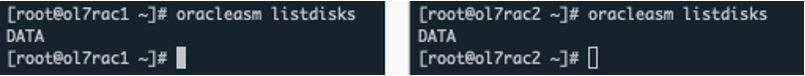{:class="imgCenter"}


```shell title="grid S/W 설치 ( 노드 : node1 / 계정 : root )"
mkdir -p /home/STAGE
cd /home/STAGE
wget https://gofile.me/3ThCa/3vK04a0LS
wget https://gofile.me/3ThCa/XUd4hxJIV
( 다운로드 : LINUX.X64_193000_grid_home.zip, LINUX.X64_193000_grid_home.zip 파일은 다운로드 사이트 > https://www.oracle.com/database/technologies/oracle19c-linux-downloads.html  오라클 계정으로 로그인해야 다운로드 가능)  
```

```shell title="grid 계정 bash_profile 수정 ( 노드 : node1 / 계정 : grid )"
su – grid
vi .bash_profile

(추가)
export LANG=C
export ORACLE_BASE=/u01/app/grid
export ORACLE_HOME=/u01/app/19.0.0/grid
export ORACLE_SID=+ASM1
export LD_LIBRARY_PATH=$ORACLE_HOME/lib:/lib:/usr/lib
export NLS_LANG=AMERICAN_AMERICA.AL32UTF8
export PATH=$ORACLE_HOME/bin:$PATH

alias oh='cd $ORACLE_HOME'
```

```shell title="grid 계정 bash_profile 수정 ( 노드 : node2 / 계정 : grid )"
su – grid
vi .bash_profile

(추가)
export LANG=C
export ORACLE_BASE=/u01/app/grid
export ORACLE_HOME=/u01/app/19.0.0/grid
export ORACLE_SID=+ASM2
export LD_LIBRARY_PATH=$ORACLE_HOME/lib:/lib:/usr/lib
export NLS_LANG=AMERICAN_AMERICA.AL32UTF8
export PATH=$ORACLE_HOME/bin:$PATH

alias oh='cd $ORACLE_HOME'
```

~grid/.bash_profile 확인

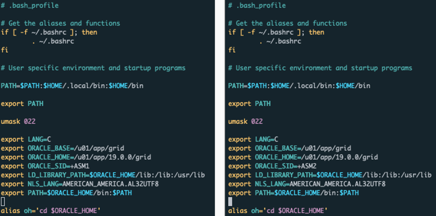{:class="imgCenter"}


```shell title="grid 설치파일 압축 풀기 ( 노드 : node1 / 계정 : grid )"
cd /u01/app/19.0.0/grid
unzip -q /home/STAGE/LINUX.X64_193000_grid_home.zip
(1번노드에서만 풀면 됨 > 설치시 다른노드에 자동 복사함)
```

```shell title="grid infrastructure 설치 ui 구동 ( 노드 : node1 / 계정 : grid )"
> 윈도우 x-trem으로 접속하여 실행 (mac os 에서는 설치 UI 화면 깨짐 / windows MobaXtrem 사용)
su - grid
/u01/app/19.0.0/grid/gridSetup.sh
```

## grid infrastructure 구성
grid infrastructure 구성 마법사를 통해 작업을 진행합니다.

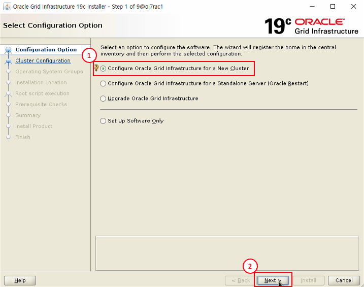{:class="imgCenter"}

- Configure Oracle Grid Infrastructure for a New Cluster 선택
- Next 버튼 클릭

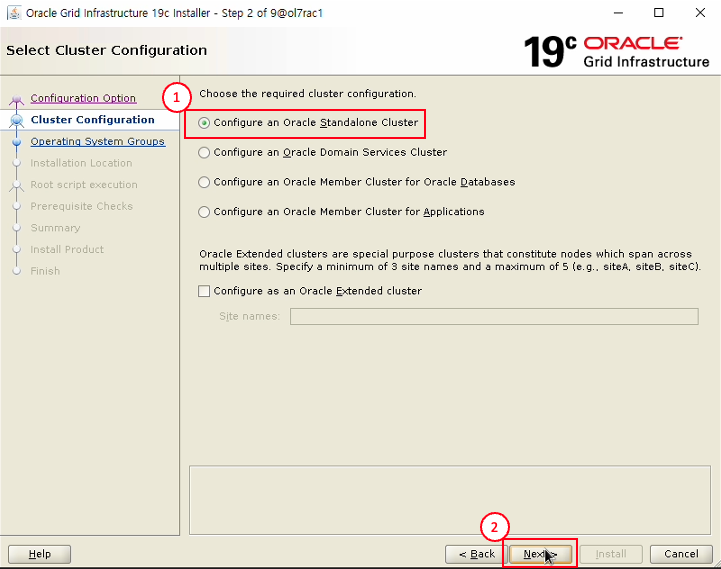{:class="imgCenter"}

- Configure an Oracle Standalone Cluster 선택
- Next 버튼 클릭

{:class="imgCenter"}

- Cluster Name : ol7rac-cluster 입력
- SCAN Name : ol7rac-scan 입력
- SCAN Port : 1521 입력
- Next 버튼 클릭

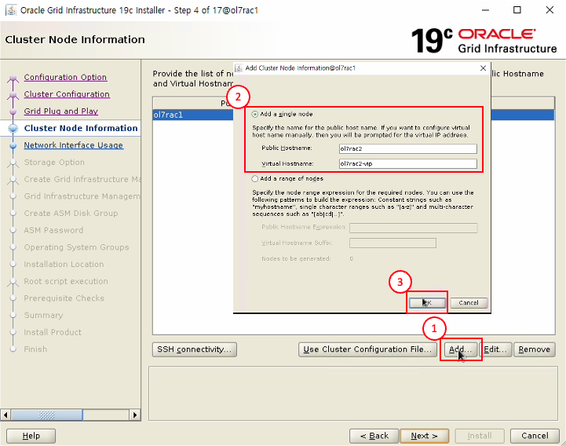{:class="imgCenter"}

- Add 버튼 클릭
- Public Hostname : ol7rac2 입력
- Virtual Hostname : ol7rac2-vip 입력
- Ok 버튼 클릭

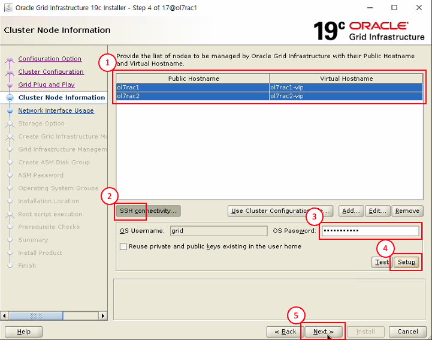{:class="imgCenter"}

- ol7rac1, ol7rac2 선택
- SSH connectivity 클릭
- OS Password : grid 계정 비밀번호 입력
- Setup 버튼 클릭
- Next 버튼 클릭

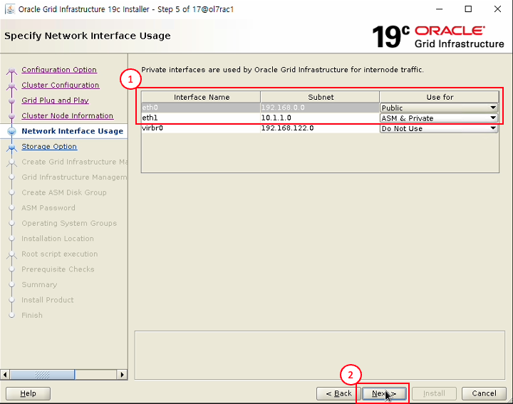{:class="imgCenter"}

- eth0 : Public
- eth1 : ASM & Private
- Next 버튼 클릭

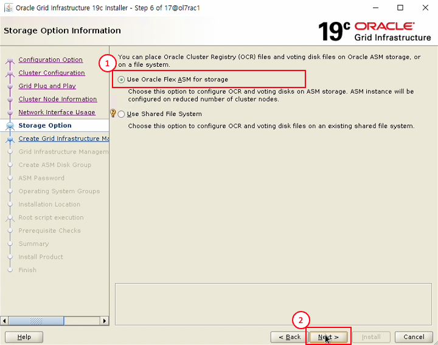{:class="imgCenter"}

- Use Oracle Flex ASM for storage 선택
- Next 버튼 클릭

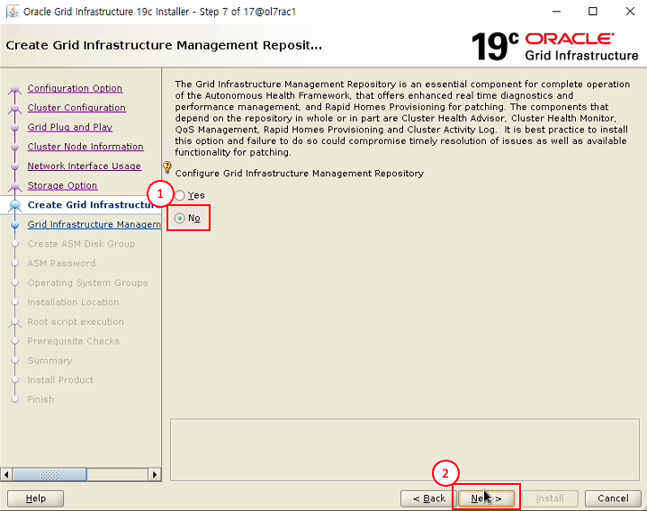{:class="imgCenter"}

- No 선택
- Next 버튼 클릭

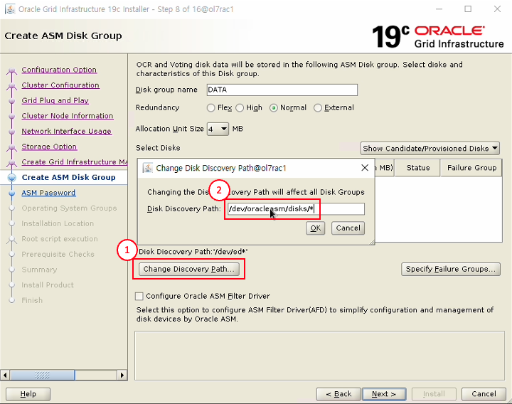{:class="imgCenter"}

- Change Discovery Path 선택
- /dev/oracleasm/disks/* 입력
- 엔터 입력

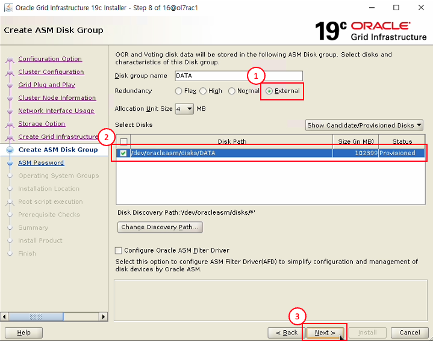{:class="imgCenter"}

- External 선택
- /dev/oracleasm/disks/DATA 선택
- Next 버튼 클릭

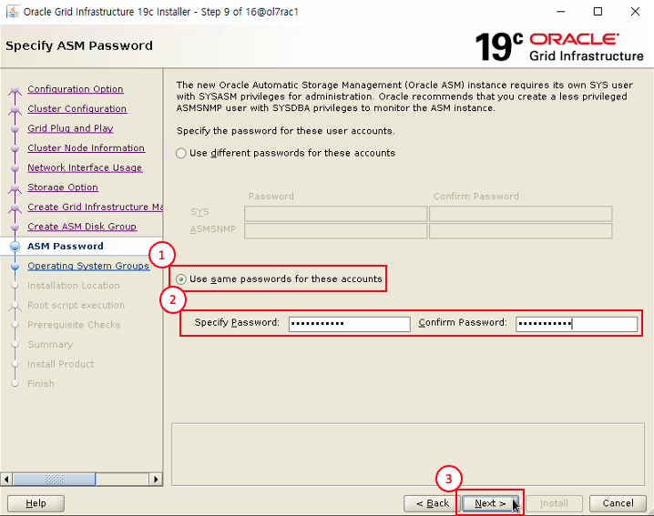{:class="imgCenter"}
오라클 관리자 계정 비밀번호 입력
- Use same passwords for these accounts 선택
- 비밀번호 입력
- Next 버튼 클릭

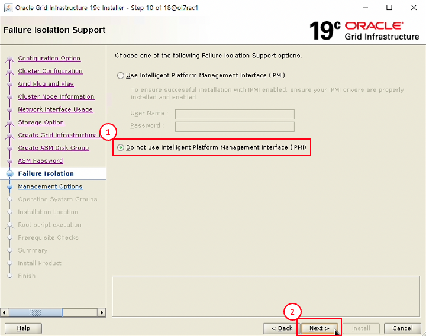{:class="imgCenter"}

- Do not use Intelligent Platform Management Interface (IPMI) 선택
- Next 버튼 클릭

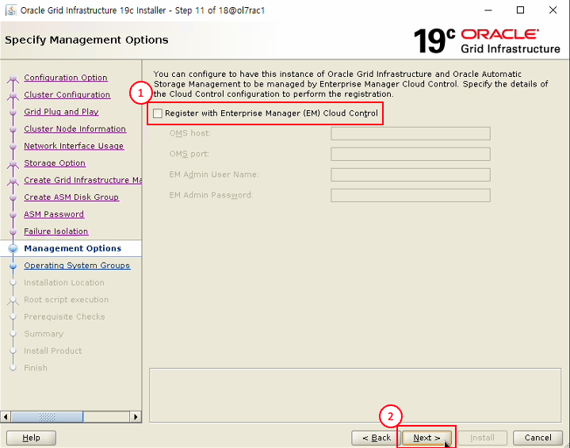{:class="imgCenter"}

- Register with Enterprise Manager (EM) Cloud Control 해제
- Next 버튼 클릭

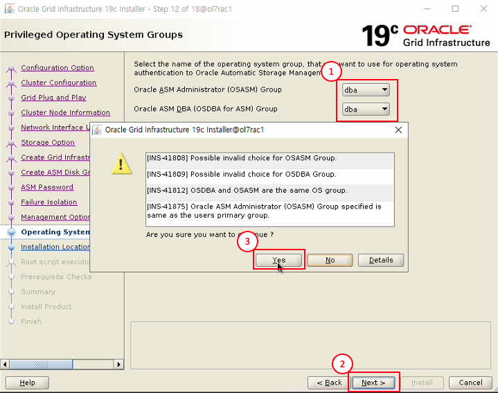{:class="imgCenter"}

- OSASM group, OSDBA for ASM Group dba로 선택
- Next 버튼 클릭
- Yes 버튼 클릭

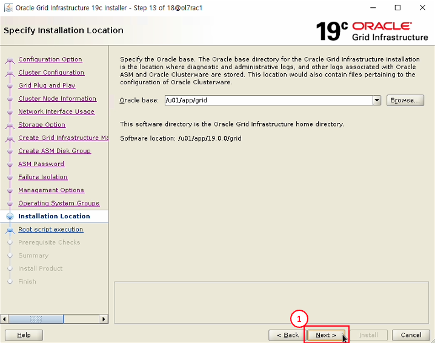{:class="imgCenter"}

- Next 버튼 클릭

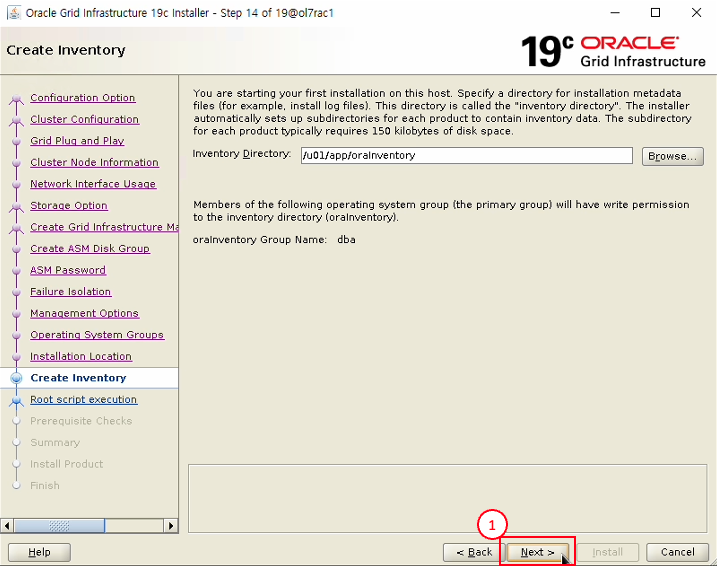{:class="imgCenter"}

- Next 버튼 클릭

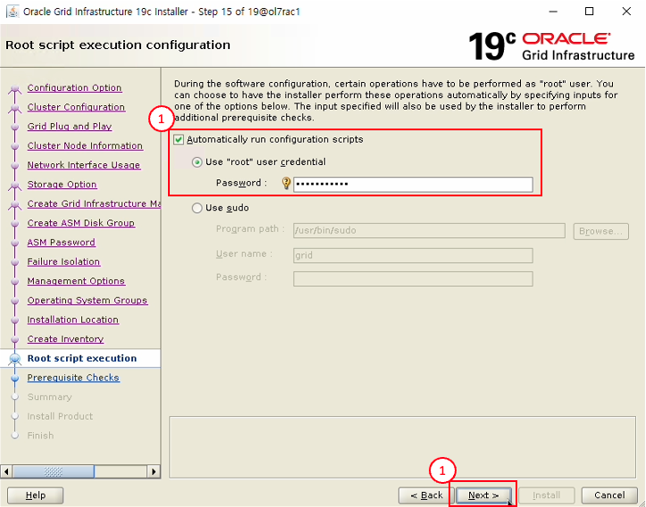{:class="imgCenter"}

- Automatically run configuration scripts 선택
- Password : root 계정 비밀번호 입력
- Next 버튼 클릭

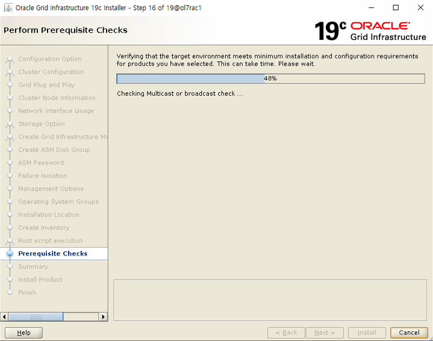{:class="imgCenter"}

- 설치 전 체크 테스트 화면

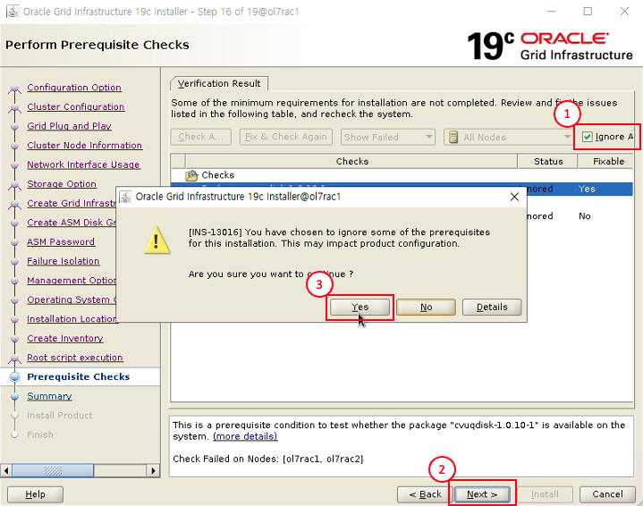{:class="imgCenter"}

- Ignore 선택
- Next 버튼 클릭
- Yes 버튼 클릭

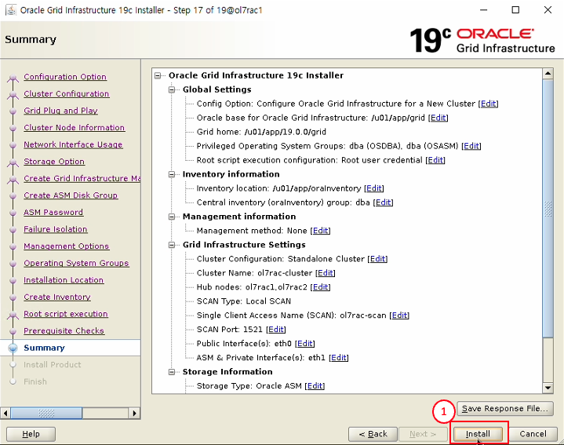{:class="imgCenter"}

- Install 버튼 클릭

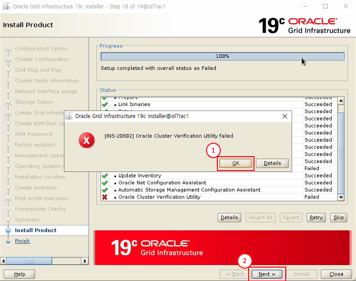{:class="imgCenter"}

- Ok 버튼 클릭
- Next 버튼 클릭

{:class="imgCenter"}

- Yes 버튼 클릭 (SCAN 구성 관련 에러 무시하고 진행)

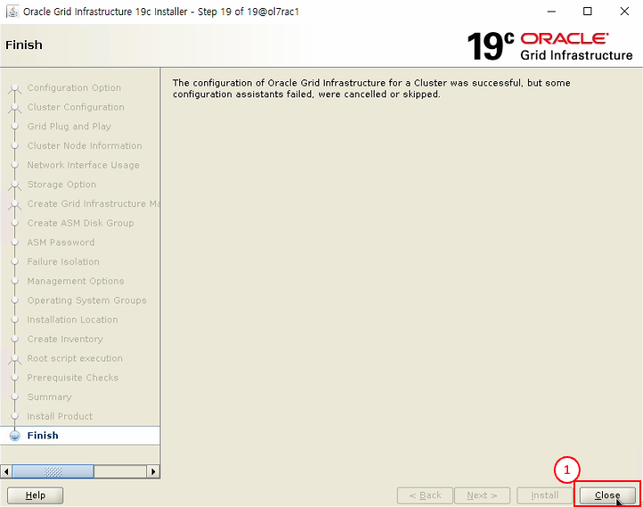{:class="imgCenter"}

- Close 버튼 클릭

ASM 및 Grid Infrastructure 구성 완료

```shell title="Grid Infrastructure 구성 확인 ( 노드 : node1 / 계정 : grid )"
crsctl stat res -t
```

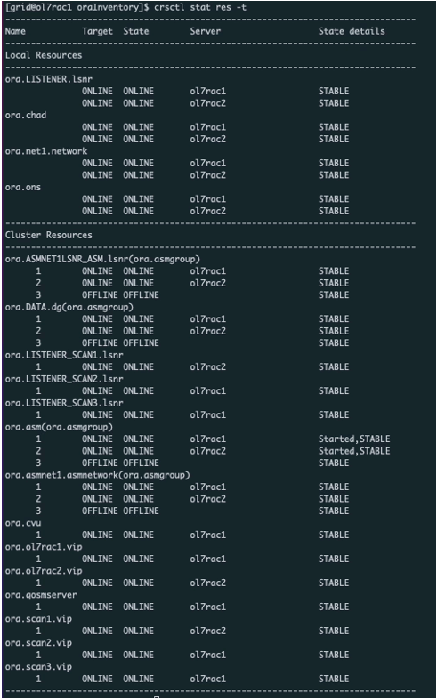{:class="imgCenter"}

ASM 및 GI 작업이 완료 되었으며, 다음 작업으로 Oracle 데이터베이스 소프트웨어 설치 및 데이터베이스 구성 작업을 진행합니다.
