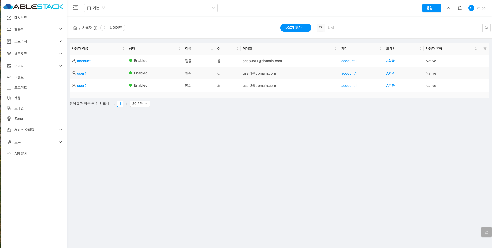

## 개요
도메인은 ABLESTACK 환경에서 계정과 리소스를 계층적으로 관리할 수 있는 최상위 단위로, 학과나 부서 등 조직 단위로 활용할 수 있습니다. 각 도메인은 하위 도메인과 계정(Account) 을 포함할 수 있으며, 이를 통해 멀티테넌시(Multi-tenancy) 구조를 지원합니다. 도메인 간 자원을 격리된 환경에서 독립적으로 사용할 수 있도록 구성함으로써 보안성과 독립성을 동시에 확보할 수 있습니다.

!!! info
    해당 문서에서 사용되는 도메인은 학과, 학부, 조직, 팀 등 관리 단위를 의미합니다. 계정은 해당 도메인에 포함된 사용자 그룹입니다.

## 도메인 활용하기 위한 도메인 생성 및 도메인 관리자 생성

1. admin 관리자로 로그인
    Mold 로그인 화면으로 접속합니다.
    { align=center }

    * **사용자 이름 :** 사용자 이름에 admin 을 입력합니다.
    * **비밀번호 :** 비밀번호를 입력합니다.
    * **로그인** 버튼을 클릭하여 admin 계정으로 로그인 합니다.

2. 로그인이 완료 되면 대시보드 화면을 확인합니다.
    { align=center }

3. 추가할 도메인을 확인후 도메인 추가 버튼을 클릭합니다.
    { align=center }

    * 왼쪽 사이드 메뉴중 **도메인** 을 클릭합니다.
    * 트리구조로 조회되는 도메인 목록중 하위로 추가할 도메인을 선택합니다. (해당 예시에서는 ROOT를 선택)
    * **도메인 추가** 버튼을 클릭하여 도메인 추가 화면을 호출합니다.

4. 생성할 도메인 정보를 입력합니다.
    { align=center }

    * **이름 :** 이름에 학과의 이름을 입력니다.
    * **확인** 버튼을 클릭하여 도메인을 등록합니다.

5. 필요한 도메인을 생성후 확인합니다.
    { align=center }

    * **A학과, B학과, C학과** 로 구분하여 도메인 생성 완료 화면입니다.

6. 구성(할당 가능 자원) 제한하기
    설정에 따라 도메인(A학과)에 자원을 제한할 수 있습니다.

    !!! info
        구성 제한 값이 -1 인 경우 제한 없음을 의미합니다.

    { align=center }

    * **구성 제한** 탭을 클릭합니다.
    * 제한할 값을 설정합니다.
    * **보내기** 버튼을 클릭하여 구성 제한 설정합니다.

7. 각 도메인(학과)별 도메인 관리자 계정을 생성합니다.

    { align=center }

    * 왼쪽 사이드 메뉴중 **계정** 을 클릭합니다.
    * **계정 추가** 버튼을 클릭하여 계정 추가 화면을 호출합니다.

    { align=center }

    * **역할 :** 역할을 **Domain Admin** 으로 선택합니다.
    * **사용자 이름 :** 사용자 이름을 입력합니다. (영문, 숫자, - 만 인력 해주세요.)
    * **비밀번호 :** 비밀번호를 입력합니다.
    * **비밀번호 확인 입력 :** 비밀번호 확인 입력을 입력합니다.
    * **이메일 :** 이메일을 입력합니다.
    * **이름 :** 이름을 입력합니다.
    * **성 :** 성을 입력합니다.
    * **도메인 아이디 :** 도메인 아이디 (학과)를 선택합니다. (예제에서는 A학과 선택)
    * **확인** 버튼을 클릭하여 도메인을 등록합니다.
    * 계정 생성시 기본 계정과 동일한 이름의 사용자가 1개 등록되며, 필요시 하나의 도메인에 다수의 도메인 관리자를 생성할 수 있습니다.

8. 필요한 도메인 관리자 계정을을 생성후 확인합니다.
    { align=center }

    * **A학과 도메인 관리자, B학과 도메인 관리자, C학과 도메인 관리자** 로 구분하여 도메인 생성 완료 화면입니다.

## 도메인 관리자로 도메인 관리

1. 도메인 계정으로 계정 생성
    Mold 로그인 화면에 접속하여 도메인 관리자로 로그인합니다.

    { align=center }

    * **사용자 이름 :** 사용자 이름에 a-domain 을 입력합니다.
    * **비밀번호 :** 비밀번호를 입력합니다.
    * **도메인 :** 도메인에 **/A학과** 를 입력합니다.
        * 도메인의 시작은 / 를 입력해야 합니다.
    * **로그인** 버튼을 클릭하여 a-domain 계정으로 로그인 합니다.

2. 각 도메인(학과)별 계정을 생성합니다.

    { align=center }

    * 왼쪽 사이드 메뉴중 **계정** 을 클릭합니다.
    * **계정 추가** 버튼을 클릭하여 계정 추가 화면을 호출합니다.

    { align=center }

    * **역할 :** 역할을 **User** 으로 선택합니다.
    * **사용자 이름 :** 사용자 이름을 입력합니다. (영문, 숫자, - 만 인력 해주세요.)
    * **비밀번호 :** 비밀번호를 입력합니다.
    * **비밀번호 확인 입력 :** 비밀번호 확인 입력을 입력합니다.
    * **이메일 :** 이메일을 입력합니다.
    * **이름 :** 이름을 입력합니다.
    * **성 :** 성을 입력합니다.
    * **도메인 아이디 :** 도메인 아이디 (학과)를 선택합니다. (예제에서는 A학과 선택)
    * **확인** 버튼을 클릭하여 도메인을 등록합니다.
    * 계정 생성시 기본 계정과 동일한 이름의 사용자가 1개 등록되며, 필요시 하나의 도메인에 다수의 도메인 관리자를 생성할 수 있습니다.

3. 계정에 자원 제한 하기
    설정에 따라 계정의 구성 자원을 제한할 수 있습니다.

    !!! info
        구성 제한 값이 -1 인 경우 제한 없음을 의미합니다.
        도메인 구성 제한을 초과하면 자원 생성을 할 수 없습니다.

    { align=center }

    * **구성 제한** 탭을 클릭합니다.
    * 제한할 값을 설정합니다.
    * **보내기** 버튼을 클릭하여 구성 제한 설정합니다.

4. 계정에 사용자 추가하기

    { align=center }

    * 계정 목록에서 사용자 추가할 계정 이름을 클릭합니다.
    * 목록에서 **account1** 을 클릭합니다.

    { align=center }

    * 사용자 보기 버튼을 클릭하여, 계정에 사용자 목록을 확인합니다.

    { align=center }

    * 계정에 포함된 사용자 정보를 확인할 수 있습니다.
    * **사용자 추가** 버튼을 클릭하여 사용자 추가 화면을 호출합니다.

    { align=center }

    * **사용자 이름 :** 사용자 이름을 입력합니다. (영문, 숫자, - 만 인력 해주세요.)
    * **비밀번호 :** 비밀번호를 입력합니다.
    * **비밀번호 확인 입력 :** 비밀번호 확인 입력을 입력합니다.
    * **이메일 :** 이메일을 입력합니다.
    * **이름 :** 이름을 입력합니다.
    * **성 :** 성을 입력합니다.
    * **시간대 :** 시간대를 선택합니다.
    * **확인** 버튼을 클릭하여 사용자를 등록합니다.

    { align=center }

    * **user1, user2** 사용자가 추가된 것을 확인합니다.

## 자원 사용 범위

1. 도메인 및 계정 별 자원 사용가능 범위를 이미지로 확인할 수 있습니다.

    { align=center }

    * ROOT 관리자
        * 모든 도메인, 모든 계정의 컴퓨트, 네트워크, 템플릿, 이미지, 스토리지 자원 사용 및 관리 가능
    * 도메인 관리자
        * 해당 도메인에 포함된 모든 계정의 컴퓨트, 네트워크, 템플릿, 이미지, 스토리지 자원 사용 및 관리 가능
    * 계정
        * 해당 계정에 포함된 모든 사용자의 컴퓨트, 네트워크, 템플릿, 이미지, 스토리지 자원 사용 및 관리 가능

## 도메인 활용 시나리오
도메인 및 계정의 구분 방식에 따라 사용자 간 자원 공유 가능 여부를 시나리오를 통해 확인할 수 있습니다.

### 시나리오 1
   하나에 계정에 여러 사용자(학생)를 생성하여, 모든 학생이 자원을 공유 하도록 구성
   { align=center }

   * 25학번 계정에 포함된 학생 모두 가상머신, 네트워크, 볼륨 이미지, 템플릿 등 자원 공유

### 시나리오 2
   하나에 계정에 하나의 사용자(학생)를 생성하여, 모든 학생이 자원을 격리 하도록 구성
   { align=center }

   * 학생 모두 자원을 공유하지 않음

## 공유 자원 생성 방법
ROOT 관리자 및 도메인 관리자는 하위 포함한 계정에 공유자원을 생성하여 모든 계정이 접근 가능하도록 생성할 수 있습니다.

### 도메인 및 계정간 통신 가능한 네트워크 생성 방법
Shared 네트워크로 공유할 범위(모두, 도메인, 계정, 프로젝트)를 설정하여 범위에 포함된 모든 계정이 사용가능한 네트워크를 만들 수 있습니다.

1. admin 관리자로 로그인

2. 네트워크 추가 메뉴로 이동하여 네트워크 추가버튼을 클릭합니다.
    { align=center }

    * 왼쪽 사이드 메뉴중 **네트워크** 를 클릭합니다.
    * **네트워크 추가** 버튼을 클릭하여 네트워크 추가 화면을 호출합니다.

3. shared 네트워크를 만들기 위한 값을 입력합니다.

    !!! info
        해당 입력값은 예시입니다. 환경에 맞게 구성하세요.

    { align=center }

    * **shared** 탭을 클릭합니다.
    * **이름 :** 이름를 입력합니다.
    * **설명 :** 설명를 입력합니다.
    * **Zone :** Zone을 선택합니다.
    * **물리 네트워크 :** 물리 네트워크를 선택합니다.
    * **VLAN/VNI :** VLAN/VNI를 입력합니다.
    * **범위 :** 범위를 원하는 범위로 선택합니다.
        * 모두 : 모든 계정 사용 가능
        * 도메인 : 선택한 도메인 포함된 모든 계정 사용 가능
        * 계정 : 특정 계정 사용 가능
    * **네트워크 오퍼링 :** 네트워크 오퍼링을 선택합니다.

    { align=center }

    * **IPv4 게이트웨이 :** 이름를 입력합니다.
    * **IPv4 넷마스크 :** 이름를 입력합니다.
    * **IPv4 시작 IP :** 이름를 입력합니다.
    * **IPv4 종료 IP :** 이름를 입력합니다.
    * **확인** 버튼를 클릭하여 공유 네트워크를 생성합니다.

    { align=center }

    * 만들어진 공유 네트워크는 설정한 범위(모두, 도메인, 계정)에 따라 사용 가능합니다.

### 모든 사용자 공개 템플릿 생성 방법
공개 템플릿으로 도메인 아이디 설정에 따라 공유할 범위(모두, 도메인, 계정, 프로젝트)를 설정하여 범위에 포함된 모든 계정이 사용가능한 템플릿을 만들 수 있습니다.

1. admin 관리자로 로그인

2. 템플릿 추가 메뉴로 이동하여 URL로 템플릿 등록 버튼을 클릭합니다.
    { align=center }

    * 왼쪽 사이드 메뉴중 **이미지 > 템플릿** 를 클릭합니다.
    * **URL로 템플릿 등록** 버튼을 클릭하여 URL로 템플릿 등록 화면을 호출합니다.

3. 공개 템플릿을 만들기 위한 값을 입력합니다.

    { align=center }

    * **URL :** URL을 입력합니다.
    * **이름 :** 이름를 입력합니다.
    * **설명 :** 설명을 입력합니다.
    * **Zone :** Zone을 선택합니다.
    * **도메인 아이디 :** 도메인 아이디를 선택 또는 미선택합니다.
        * 도메인 미선택 : 모든 계정에서 사용가능
        * 도메인 선택 : 선택한 도메인 계정에서 사용가능
    * **하이퍼바이저 :** 하이퍼바이저를 선택합니다.
    * **형식 :**  형식을 선택합니다.
    * **OS 유형 :** OS 유형을 선택합니다.

    { align=center }

    * **추천 :** 추천을 선택합니다.
        * 체크시 가상머신 생성시 템플릿 추천 선택 목록에 보여줍니다.
    * **공개 :** 공개를 선택합니다.
        * 체크시 등록한 사용자만 선택할 수 있습니다.
    * **확인** 버튼를 클릭하여 공유 템플릿을 생성합니다.

### 모든 사용자 공개 이미지 생성 방법
공개 이미지로 도메인 아이디 설정에 따라 공유할 범위(모두, 도메인, 계정, 프로젝트)를 설정하여 범위에 포함된 모든 계정이 사용가능한 ISO를 만들 수 있습니다.

1. admin 관리자로 로그인

2. ISO 추가 메뉴로 이동하여 ISO 등록 버튼을 클릭합니다.
    { align=center }

    * 왼쪽 사이드 메뉴중 **이미지 > ISO** 를 클릭합니다.
    * **ISO 등록** 버튼을 클릭하여 ISO 등록 화면을 호출합니다.

3. 공개 ISO를 만들기 위한 값을 입력합니다.

    { align=center }

    * **URL :** URL을 입력합니다.
    * **이름 :** 이름를 입력합니다.
    * **설명 :** 설명을 입력합니다.
    * **Zone :** Zone을 선택합니다.
    * **도메인 아이디 :** 도메인 아이디를 선택 또는 미선택합니다.
        * 도메인 미선택 : 모든 계정에서 사용가능
        * 도메인 선택 : 선택한 도메인 계정에서 사용가능
    * **OS 유형 :** OS 유형을 선택합니다.

    { align=center }

    * **추천 :** 추천을 선택합니다.
        * 체크시 가상머신 생성시 ISO 추천 선택 목록에 보여줍니다.
    * **공개 :** 공개를 선택합니다.
        * 체크시 등록한 사용자만 선택할 수 있습니다.
    * **확인** 버튼를 클릭하여 공유 ISO을 생성합니다.
