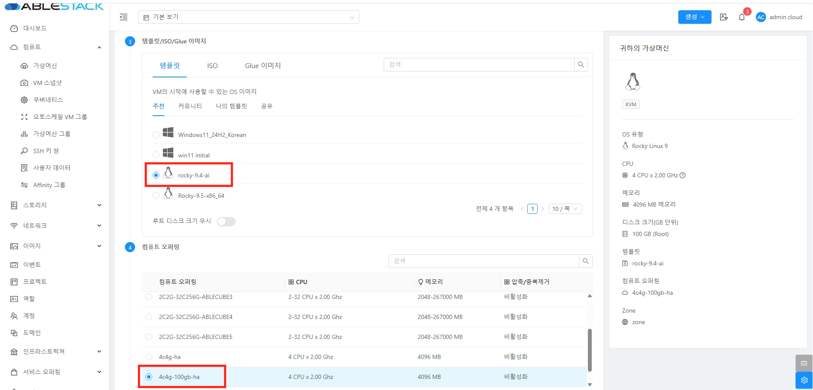
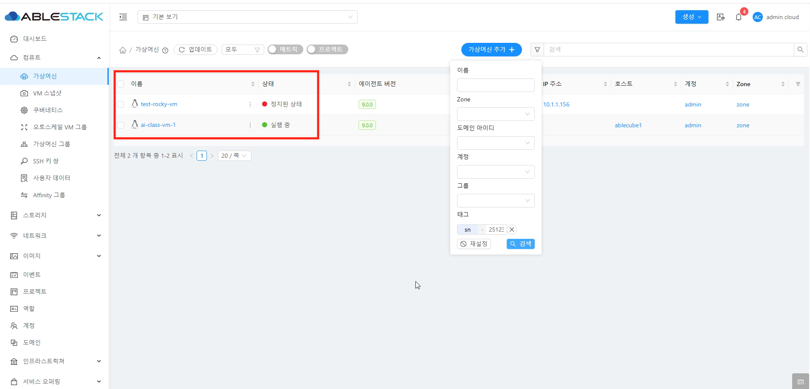

## 개요
이 가이드는 ABLESTACK Mold에서 가상머신을 생성하고, 태깅 기능을 활용하여 각 가상머신에 메타데이터를 부여함으로써 효율적으로 구분하고 관리하는 방법을 설명합니다. 태그를 통해 사용자, 학생 구분, 용도별 분류 등 체계적인 자원 관리가 가능합니다.

## 작업 시나리오
- 가상머신 생성
- 가상머신에 태깅 작업
- 태깅된 가상머신 조회

## 가상머신 생성

!!! info
    * 생성에 사용되는 템플릿, 네트워크, 오퍼링, 입력값은 예시입니다. 운영환경에 맞는 값을 입력하여주세요.

1. admin 관리자로 로그인
    Mold 로그인 화면으로 접속합니다.
    { align=center }

    * **사용자 이름 :** 사용자 이름에 admin 을 입력합니다.
    * **비밀번호 :** 비밀번호를 입력합니다.
    * **로그인** 버튼을 클릭하여 admin 계정으로 로그인 합니다.

2. 로그인이 완료 되면 대시보드 화면을 확인합니다.
    { align=center }

3. 가상머신 생성을 위한 메뉴 이동
    { align=center }

    * 왼쪽 사이드 메뉴중 **컴퓨트 > 가상머신** 을 클릭합니다.
    * **가상머신 추가 +** 버튼을 클릭하여 가상머신 추가 화면을 호출합니다.

4. 가상머신 생성을 위한 항목 입력
    { align=center }

    * **소유자 유형 :** 을 계정으로 선택합니다.
    * **도메인 :** 을 ROOT로 선택합니다.
    * **계정 :** 을 admin으로 선택합니다.
    * **Zone :** 을 zone으로 선택합니다.
    * **Pod :** 를 선택하지 않습니다.
        * 미선택시 기본 pod를 사용합니다.
    * **클러스터 :** 를 선택하지 않습니다.
        * 미선택시 기본 cluster를 사용합니다.
    * **호스트 :** 를 선택하지 않습니다.
        * 미선택시 사용가능한 호스트중 가장 적합한 호스트에 배포합니다.

    { align=center }

    * **템플릿 :** 사용할 가상머신 템플릿을 선택합니다.
    * **컴퓨트 오퍼링 :** 적합한 컴퓨트 오퍼링을 선택합니다.

    { align=center }

    * **데이터 디스크 :** 를 선택하지 않습니다.
        * 템플릿으로 생성시 OS 설치를 위한 데이터 디스크가 필요하지 않습니다.
        * 추가적인 data 디스크를 생성시 선택하여 사용 가능합니다.
    * **네트워크 :** 적합한 네트워크를 선택합니다.

    { align=center }

    * **SSH 키 쌍 :** 을 선택하지 않습니다.
        * SSH 키 파일을 사용하여 가상머신 관리할 경우 사용합니다.
    * **부팅 유형 :** 을 UEFI로 선택합니다.
    * **부팅 모드 :** 를 LEGACY로 선택합니다.
    * **TPM 활성화 :** 를 Disabled로 선택합니다.

    { align=center }

    * **IOThreads :** 를 체크합니다.
    * **IO 드라이버 정책 :** 을 io_uring으로 선택합니다.
    * **이름 :** 을 가상머신 구분이 유용하도록 입력합니다.
    * **생성할 가상머신 수 :** 를 생성할 사용자(학생) 수 만큼 입력합니다.
    * **VM 시작 :** 버튼을 클릭하여 가상머신을 생성합니다.

    { align=center }

    * **검색창 :** 에 ai-class-vm 을 입력하여 ai-class-vm 전체를 조회합니다.
    * 생성한 모든 가상머신 상태가 **실행 중** 이면 정상적으로 완료되었습니다.

## 가상머신에 사용자(학생) 태그 추가

!!! info
    태깅 작업은 각 가상머신마다 개별적으로 수행해야 합니다.

1. 가상머신 목록에서 태깅 작업할 가상머신을 선택합니다.
    { align=center }

    * 목록에서 태깅 작업할 가상머신을 선택하여 상세화면으로 이동합니다.

2. 태깅 작업을 위한 항목을 입력합니다.
    { align=center }

    * **+ 새 태그 :** 버튼을 클릭하여 태그 입력창을 활성화 합니다.

    { align=center }

    * **입력 항목** 은 key, value 형식으로 입력합니다.
    * **key :** 항목에 sn(student number)를 입력합니다.
    * **value :** 항목에 251234(학번)을 입력합니다.
    * **확인 :** 버튼을 클릭하여 태그를 추가합니다.

    { align=center }

    * **업데이트** 버튼을 클릭하여 상세화면 정보를 새로 불러옵니다.

    { align=center }

    * **태그** 항목에 입력한 sn=251234 가 정상적으로 반영되었는지 확인합니다.

## 가상머신에 사용자(학생) 태그 조회

1. 태그를 활용하여 사용자(학생)에 할당된 가상머신을 확인합니다.
    { align=center }

    * **태그 :** 항목에 key = sn, value = 251234를 입력합니다.
    * **검색 :** 버튼을 클릭합니다.

    { align=center }

    * 태그를 활용하여 학번이 251234인 학생의 가상머신을 조회합니다.
