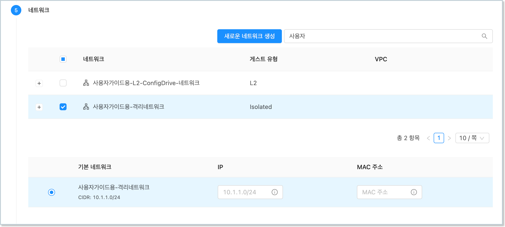
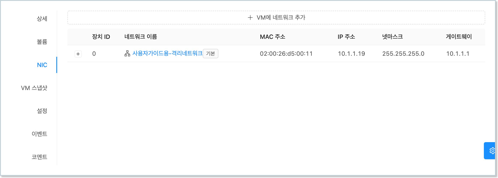
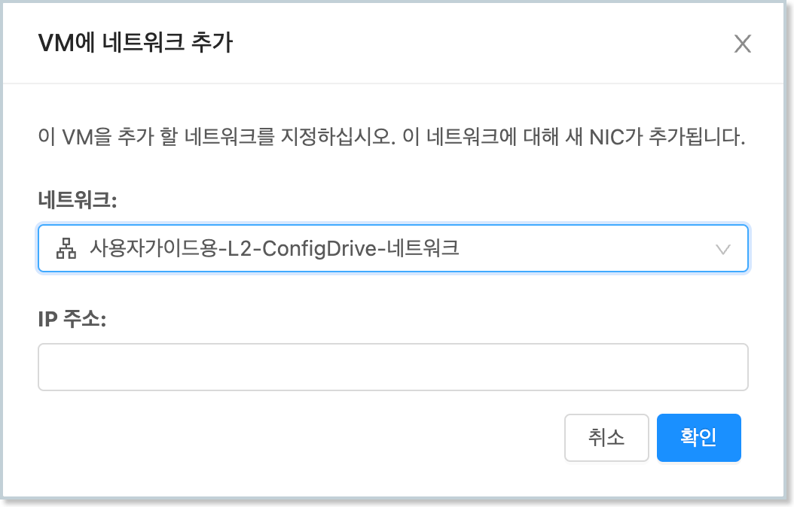
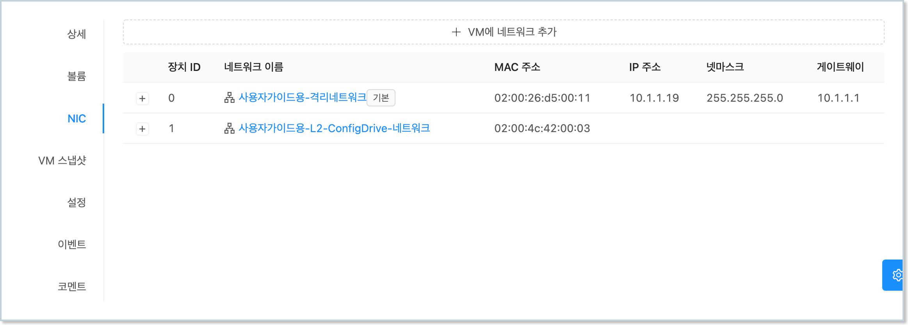
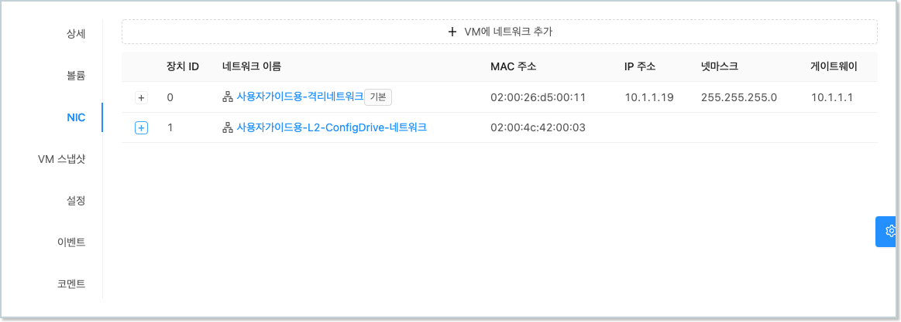
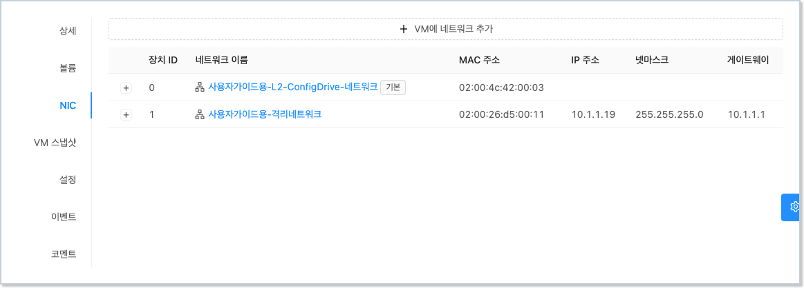
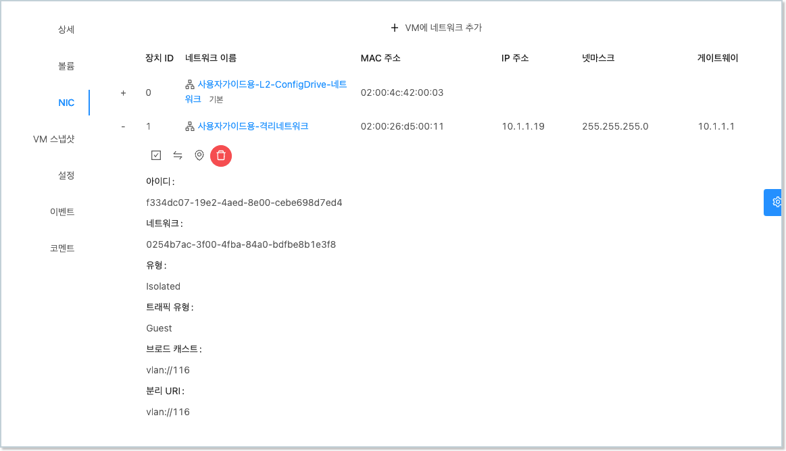

ABLSTACK은 가상머신에 서로 다른 네트워크에 연결되는 여러 NIC를 추가할 수 있습니다. 

본 문서에서는 CentOS 가상머신에 NIC를 추가하고, 설정하며, 사용하는 방법을 설명합니다. 

## 가상머신 생성 시 기본 NIC 연결

가상머신을 생성할 때에는 반드시 1개 이상의 NIC를 가상머신에 연결해야 합니다. 가상머신 생성 시 NIC를 연결하는 방법은 다음과 같습니다. 

1. `컴퓨트 > 가상머신` 화면으로 이동한 후 "가상머신 추가"를 실행합니다.
   
2. 배포 인프라를 선택합니다.
   
3. 템플릿/ISO 단계에서 CentOS 템플릿 이미지를 선택합니다. 
   
4. 컴퓨트 오퍼링을 선택합니다.
   
5. 데이터 디스크를 선택합니다. 
   
6. 가상머신에 연결하고자 하는 NIC를 1개 이상 다음과 같이 선택합니다. 
    { style="margin-top: 20px;" width="600" }
   
7. SSH 키 쌍을 선택합니다. 
   
8. 확장 모드를 선택합니다. 
   
9.  상세 정보를 입력합니다. 
    
10. 가상머신을 시작합니다. 
    

!!! info "예제에서의 가상머신 NIC의 네트워크 종류 선택"
    예제에서는 NIC 설정 및 사용의 이해를 돕기 위해 가상머신의 NIC를 Isolated Network 타입의 NIC로 추가합니다. 
    
    Isolated Network는 DHCP 서버에 의해 가상머신의 NIC에 IP 주소 등의 네트워크 설정이 자동 설정됩니다. 

가상머신 상세 화면에서 다음과 같이 NIC가 연결된 것을 확인할 수 있습니다. 

<center>{ width="600" }</center>

가상머신의 콘솔에 접속하여 실제 해당 NIC가 같은 정보로 설정되어 있는지 확인합니다. 가상머신에 접속하여 다음의 명령을 실행하여 네트워크 정보를 확인합니다. (아래의 예제 명령에서 ens3 부분은 가상머신에 할당된 NIC의 디바이스명으로 가상머신에 따라 다를 수 있습니다.)

```
$ ifconfig ens3
ens3: flags=4163<UP,BROADCAST,RUNNING,MULTICAST>  mtu 1500
        inet 10.1.1.19  netmask 255.255.255.0  broadcast 10.1.1.255
        inet6 fe80::26ff:fed5:11  prefixlen 64  scopeid 0x20<link>
        ether 02:00:26:d5:00:11  txqueuelen 1000  (Ethernet)
        RX packets 382  bytes 38797 (37.8 KiB)
        RX errors 0  dropped 0  overruns 0  frame 0
        TX packets 395  bytes 38291 (37.3 KiB)
        TX errors 0  dropped 0 overruns 0  carrier 0  collisions 0
```

연결된 NIC는 가상머신의 기본 NIC로 사용됩니다. 기본 NIC 라는 것은 가상머신 내부의 라우팅 테이블에서 주요 트래픽을 처리하는 NIC라는 의미입니다. 해당 가상머신에서 다음의 명령을 실행하면 기본 NIC 설정을 확인할 수 있습니다. 

```
$ route
Kernel IP routing table
Destination     Gateway         Genmask         Flags Metric Ref    Use Iface
default         r-652-vm.cs2clo 0.0.0.0         UG    100    0        0 ens3
10.1.1.0        0.0.0.0         255.255.255.0   U     100    0        0 ens3
```

위의 실행 결과에서 default로 설정된 NIC는 `ens3`인 것을 확인할 수 있습니다. 해당 NIC의 IP 서브넷 대역을 제외한 나머지 IP 트래픽도 모두 ens3를 통해 처리되도록 설정되어 있습니다. 

## 가상머신 NIC 추가 연결

운영 중인 가상머신에 별도의 트래픽을 처리하기 위해 NIC를 추가하여 연결할 수 있습니다. 

운영 중인 가상머신에 NIC를 추가하는 방법은 다음과 같습니다. 

1. `컴퓨트 > 가상머신` 화면으로 이동한 후 NIC를 추가하고자 하는 가상머신의 상세 화면으로 이동합니다. 
2. 가상머신 상세화면에서 "NIC" 탭을 클릭하여 탭을 표시합니다. 
    { style="margin-top: 20px;" width="600" }
3. 해당 탭의 상단에 있는 "VM에 네트워크 추가" 버튼을 클릭하여 대화상자를 표시합니다. 
4. 추가하고자 하는 NIC에 연결할 네트워크를 선택하고, "확인" 버튼을 클릭합니다. 
    { style="margin-top: 20px;" width="450" }
5. 가상머신에 NIC가 추가되었는지 해당 탭에서 확인합니다.
    { style="margin-top: 20px;" width="600" }

추가된 NIC는 가상머신 내부에서 다음의 명령을 통해 확인할 수 있습니다. 

```
$ nmcli dev
DEVICE  TYPE      STATE         CONNECTION
ens3    ethernet  connected     ens3
ens8    ethernet  disconnected  --
lo      loopback  unmanaged     --
```

위의 예에서 첫번째 연결한 NIC(ens3)는 DHCP 서버를 통해 IP가 자동으로 할당되어 상태가 `connected`로 표시됩니다. 하지만 새롭게 추가한 NIC(ens8)는 네트워크에 DHCP가 없기 때문에 IP가 할당되어 있지 않습니다. 따라서 상태가 `disconnected`로 표시됩니다. 

## NIC에 수동으로 IP 설정

위의 예에서 새롭게 추가한 NIC에 수동으로 IP를 설정해야 합니다. 

!!! warning "Isolated Network 수동 설정 금지"
    NIC가 DHCP 옵션이 설정된 Isoloated Network(격리 네트워크) 타입에 연결되어 있는 경우 자동으로 IP 주소가 설정됩니다. 

    따라서 Isolated Network에 연결된 NIC를 사용하는 경우 수동으로 IP 설정을 하지 않아야 합니다. 본 가이드는 L2 Network 타입과 같이 DHCP 옵션을 사용하지 않는 네트워크의 NIC인 경우에만 적용해야 합니다. 

먼저 IP를 설정할 NIC 디바이스명(예: ens8)을 이용해 다음과 같이 네트워크 정보를 추가(add) 설정합니다. 

```
$ nmcli con add \
    ifname ens8 \
    con-name ens8 \
    type ethernet \
    ipv4.address 10.10.1.254/24 \
    ipv4.gateway 10.10.0.1 \
    ipv4.dns 8.8.8.8 \
    ipv4.method manual \
    ipv4.never-default true \
    connection.autoconnect yes
```

설정한 NIC는 자동으로 활성화 됩니다.

## 기본 네트워크 설정

기본 네트워크는 사용자가 가상머신 내에서 외부로 요청하는 트래픽, 그리고 가상머신 외부에서 내부로 요청하는 트래픽을 기본적으로 처리하는 네트워크 입니다.

예를 들어, 위의 예제에서와 같이 두 개의 NIC가 있는 경우 요청 트래픽을 어떤 NIC가 처리해야 하는지를 지정해야 합니다. 

우선, 각 NIC에 설정되어 있는 IP의 서브넷 대역은 해당 NIC가 처리합니다. 즉, 예제의 `ens3`의 경우 10.1.1.x/24 대역으로 요청을 보내거나 들어오는 요청을 처리하는 NIC로 사용됩니다. 또한 `ens8`의 경우 10.10.1.x/24 대역으로 요청을 보내거나 들어오는 요청을 처리하는 NIC로 사용됩니다. 

만약 각 NIC가 명시적으로 처리하는 IP 대역 외에 다른 IP 대역, 즉 예를 들어 1.1.1.1로 요청을 보내는 경우에는 default 라우트로 설정된 NIC를 사용하게 됩니다. 

가상머신의 NIC 중 기본 네트워크로 설정되는 NIC는 가상머신 생성 시 처음 연결되는 NIC를 기본 네트워크용 NIC로 사용합니다. 기본 네트워크 설정의 확인은 다음과 같이 `route` 명령을 이용합니다. 

```
$ route
Kernel IP routing table
Destination     Gateway         Genmask         Flags Metric Ref    Use Iface
default         r-652-vm.cs2clo 0.0.0.0         UG    100    0        0 ens3
10.1.1.0        0.0.0.0         255.255.255.0   U     100    0        0 ens3
10.10.0.0       0.0.0.0         255.255.0.0     U     101    0        0 ens8
```

실행 결과를 보면 `Destination`이 `default`로 설정된 NIC가 `ens3`인 것을 확인할 수 있습니다. 

기본 네트워크 NIC를 변경하고자 하는 경우, 예제의 경우 `ens8`로 기본 네트워크를 변경하고자 하는 경우, 먼저 Mold의 `컴퓨트 > 가상머신` 화면에서 NIC 설정을 하고자 하는 가상머신을 선택한 후 해당 가상머신의 상세 화면에서 NIC 탭을 선택합니다. 

<center>{ width="600" }</center>

기본 네트워크로 설정하고자 하는 NIC를 선택하여 `+` 버튼을 클릭하면 다음과 같이 상세 내용이 표시됩니다. 

<center>{ width="600" }</center>

표시된 상세 화면에서 `기본 NIC 설정` 아이콘 버튼을 클릭하여 해당 NIC를 기본 NIC로 설정합니다. 가상머신의 NIC 상세 화면을 확인하면 선택한 NIC가 0번 장치, 즉 기본 NIC로 변경된 것을 확인할 수 있습니다. 

<center>{ width="600" }</center>

이제 가상머신에서 해당 NIC(예제에서는 `ens8`)를 기본 NIC로 설정해야 합니다. `ens3`의 기본 라우팅 설정을 취소하고, `ens8`의 기본 라우팅 설정을 활성화 한 후 NIC를 재시작합니다. 다음과 같습니다. 

```
$ nmcli con mod ens8 ipv4.never-default no
$ nmcli con mod ens8 ipv4.gateway 10.10.1.1
$ nmcli con mod ens3 ipv4.never-default yes
$ nmcli con down ens8; nmcli con up ens8
$ nmcli con down ens3; nmcli con up ens3
```

위 명령을 실행항 후 라우팅 테이블을 조회하면 다음과 같습니다. 

```
$ route
Kernel IP routing table
Destination     Gateway         Genmask         Flags Metric Ref    Use Iface
default         _gateway        0.0.0.0         UG    101    0        0 ens8
10.1.1.0        0.0.0.0         255.255.255.0   U     100    0        0 ens3
10.10.0.0       0.0.0.0         255.255.0.0     U     101    0        0 ens8
```

## 가상머신 NIC 삭제

가상머신에 연결되어 있는 NIC를 삭제하기 위해서는 다음의 조건이 만족어야 합니다. 

1. 삭제하고자 하는 NIC 외에 1개 이상의 NIC가 가상머신에 연결되어 있어야 합니다. 즉, 2개 이상의 NIC가 가상머신에 연결된 상태여야 합니다.
2. 삭제하고자 하는 NIC가 기본 네트워크, 즉 기본 NIC가 아니어야 합니다. 
3. 삭제하고자 하는 NIC에 포트포워딩, 로드밸런싱, Static NAT 등의 정책이 설정되어 있지 않아야 합니다.

위의 조건을 만족하는 NIC는 언제든 가상머신에서 NIC 연결을 해제하고 NIC를 삭제할 수 있습니다. 

NIC를 삭제하기 위해 먼저 가상머신의 상세 화면에서 NIC 탭을 클릭하고 삭제하고자 하는 NIC의 `+` 버튼을 클릭합니다. 

<center>{ width="600" }</center>

상세 화면에서 휴지통 모양의 `NIC 제거` 아이콘 버튼을 클릭하여 가상머신에서 해당 NIC를 제거합니다. 

NIC를 제거한 후 가상머신 내에서 디바이스를 확인하면 해당 NIC가 삭제된 것을 확인할 수 있습니다. 

```
$ DEVICE  TYPE      STATE      CONNECTION
ens8    ethernet  connected  ens8
lo      loopback  unmanaged  --
```

!!! warning "NIC 삭제 후 재부팅 시 디바이스 명칭 및 ID 변경 이슈"
    NIC를 Hot Plug로 등록 후, 삭제하는 경우 가상머신을 정지하고 다시 시작하게 되면 NIC 디바이스의 명칭이 변경됩니다. 

    이러한 문제는 Mold가 가상머신을 생성할 때 NIC 디바이스를 순서대로 붙여 PCI 디바이스 번호가 변경되기 때문입니다. 
    가상머신 정지 후 시작하는 경우 Hot Plug로 연결한 NIC의 디바이스가 변경될 수 있으므로 재부팅 후에는 NIC 상태를 반드시 확인해야 합니다. 