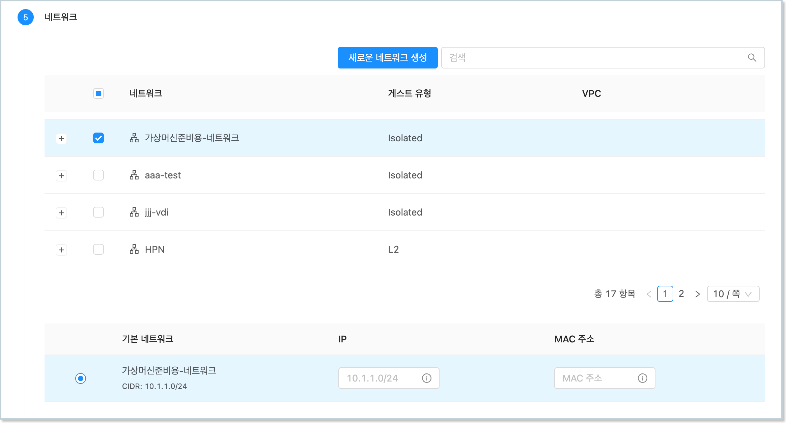
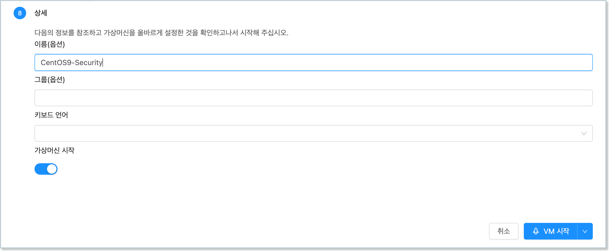
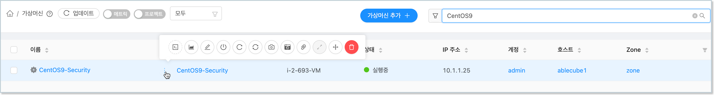
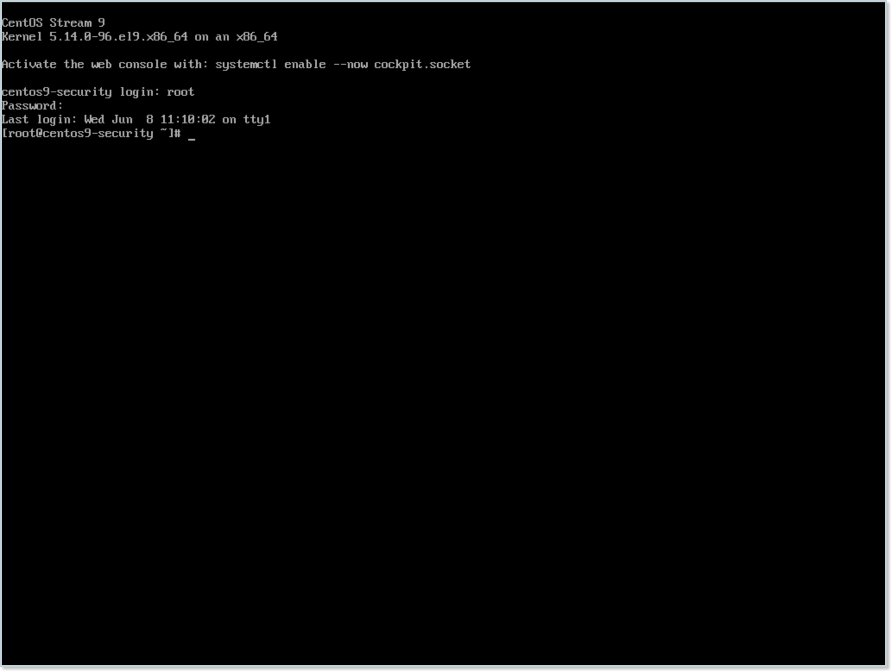
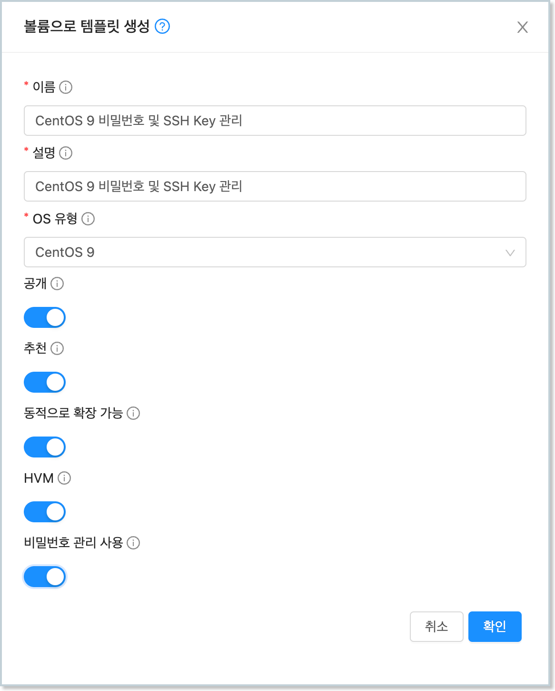
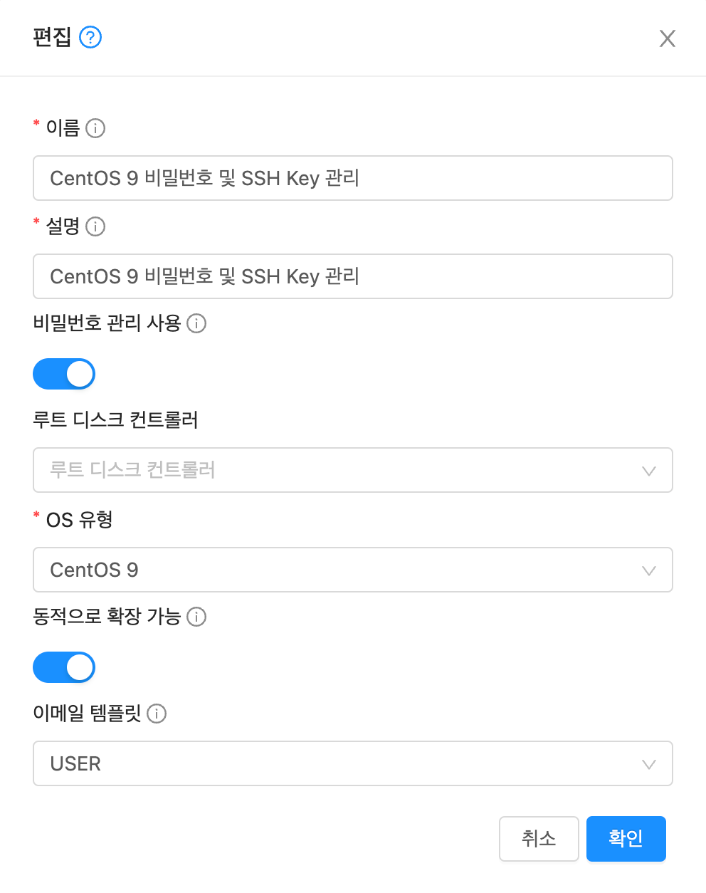
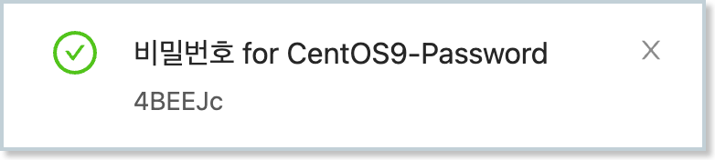
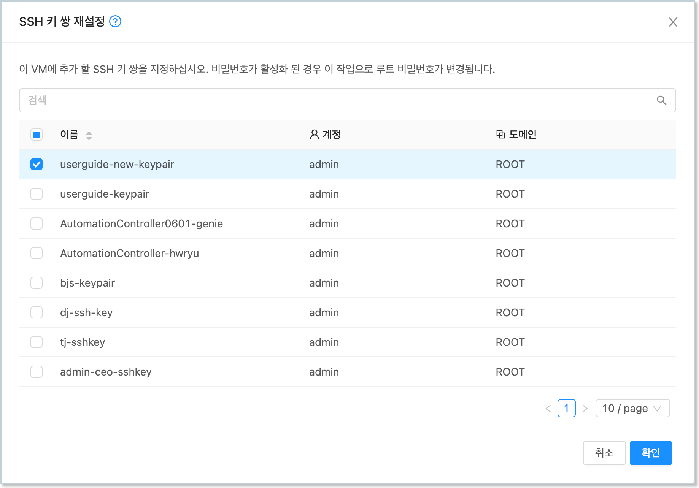

ABLESTACK을 이용해 가상머신을 생성하여 사용하고자 하는 사용자가 CentOS 리눅스 가상머신에 대한 접근을 명확하게 제어할 수 있으며, 제공되는 기능은 다음과 같습니다. 

- CentOS 가상머신 Root 비밀번호 생성
- SSH Key 등록을 통한 SSH 클라이언트 접근 제한

즉, 가상머신 생성 시 Root 사용자에 대한 비밀번호를 생성하여, 가상머신별로 사용자 비밀번호가 동일하게 생성되는 것을 방지하는 기능을 제공하고, 사용자가 SSH 클라이언트를 통해 가상머신에 접속할 때, SSH Key 파일을 이용해서만 가상머신에 접속하도록 하여 가상머신 보안을 향상할 수 있습니다. 

본 문서에서는 기본 템플릿에 비밀번호 관리 기능 및 SSH Key를 가상머신에 자동으로 설정하는 기능을 가진 프로그램을 설치하여 가상머신 접근 보안을 향상하는 방법을 설명합니다. 

!!! info "예제에서 사용되는 가상머신 이미지"
    본 문서의 예제에서 사용되는 가상머신 이미지는 CentOS 가상머신 가이드의 [가상머신 사용 준비](/userGuide/vms/centos-guide-prepare-vm/) 가이드에서 생성한 기본 가상머신 템플릿 이미지를 사용합니다. 

    따라서 본 가이드의 예제를 사용하기 전에 기본 가상머신 템플릿 이미지를 먼저 생성하여 사용하십시오.

## 가상머신 이미지 준비

### 기본 템플릿을 통한 가상머신 생성

비밀번호 관리와 SSH Key 등록 기능을 사용할 수 있는 가상머신 이미지를 준비합니다. 먼저 생성해 두었던 CentOS 기본 이미지를 이용해 `컴퓨트 > 가상머신`으로 이동하여 다음과 같은 절차로 가상머신을 신규로 생성하여 실행합니다. 

1. 배포 인프라 선택 : 기본값으로 선택합니다.

2. 템플릿/ISO : CentOS 기본 가상머신 템플릿 이미지를 다음의 그림과 같이 선택합니다. 

    { style="margin-top: 20px;" width="600" }

3. 컴퓨트 오퍼링 : 적정한 컴퓨트 오퍼링을 선택합니다. (2 vCore, 4GB 이상 권장)

4. 데이터 디스크 : '설정 안함'을 선택합니다.

5. 네트워크 : 가상머신 이미지 준비를 위해 만든 네트워크(인터넷 연결 필수)를 다음과 같이 선택합니다.

    { style="margin-top: 20px;" width="600" }

6. SSH 키 쌍 : 선택하지 않습니다.

7. 확장 모드 : 고급 설정을 하지 않습니다.

8. 상세 : 가상머신 이름 (예를 들어 CentOS9-Security)을 다음과 같이 입력합니다.

    { style="margin-top: 20px;" width="600" }

모든 설정을 완료한 후 "VM 시작" 버튼을 클릭하여 가상머신을 생성합니다. 

가상머신이 실행되면 가상머신 목록해서 해당 가상머신을 찾은 후, 다음의 그림과 같이 액션 아이콘 메뉴의 좌측에 있는 "콘솔 보기" 버튼을 클릭하여 가상머신 콘솔에 접속합니다. 

{ width="600" }

### 가상머신 인터넷 접속 확인

가상머신 콘솔에 접속했다면 먼저 root 계정을 이용해 가상머신에 로그인 합니다. 다음의 이미지와 같습니다. 

{ width="600" }

콘솔에 접속했다면 먼저 가상머신이 인터넷에 접속되어 있는지 확인합니다. 다음과 같은 명령을 실행합니다. 

~~~
$ ping 8.8.8.8
~~~

만약 정상적으로 인터넷 연결이 되지 않는다면 가상머신이 연결되어 있는 네트워크 정보를 확인하여 인터넷이 연결되도록 설정되어 있는지 확인해야 합니다. 가상머신 상세 화면에서 "NIC" 탭을 클릭하면 가상머신에 연결되어 있는 네트워크 정보를 다음과 같이 확인할 수 있습니다. 

{ width="600" }

위의 그림과 같은 상태에서 "네트워크 이름" 항목을 클릭하면 가상머신에 연결되어 있는 네트워크의 상세 정보를 확인할 수 있습니다. 네트워크 상세 정보 화면에서 "송신 규칙" 탭을 클릭합니다. 다음의 그림과 같습니다. 

{ width="600" }

기본적으로 Isolated Network의 송신규칙은 "거부"입니다. 즉, 가상머신은 인터넷에 연결이 차단되어 있습니다. 따라서 해당 가상머신이 외부로 연결될 수 있도록 설정해야 합니다. 예제에서는 모든 가상머신의 외부 송신이 가능하도록 설정할 것입니다. 

위의 화면에서 "프로토콜" 항목에서 "모두"를 선택한 후 "추가" 버튼을 클릭합니다. 이렇게 하면 해당 네트워크에 연결된 모든 가상머신에 대해 모든 외부로의 송신이 가능하도록 방화벽을 설정하는 것입니다. 다음과 같이 설정됩니다. 

{ width="600" }

설정이 완료되었다면 다시 한번 가상머신 콘솔에서 `ping` 명령을 실행하여 인터넷 연결이 활성화 되었는지 확인합니다. 

### 비밀번호 및 SSH Key 관리 프로그램 설치

ABLESTACK은 가상머신의 비밀번호 관리 기능 및 SSH Key 쌍 관리 기능을 제공하기 위한 리눅스 전용 쉘을 제공합니다. 

가상머신 콘솔에서 다음의 명령을 실행하여 파일을 다운로드 합니다. 

~~~
$ wget https://images.ablecloud.io/cloud-set-guest-sshkey-password-userdata-configdrive.in
~~~

파일을 다운로드 한 후 다음의 명령을 실행하여 데몬 스크립트로 설정합니다. 

~~~
$ sed -i'' -r -e "/bash/a\# chkconfig: 345 98 02" ./cloud-set-guest-sshkey-password-userdata-configdrive.in
$ chmod +x ./cloud-set-guest-sshkey-password-userdata-configdrive.in
~~~

파일 편집을 완료한 후 다음의 명령을 실행하여 스크립트를 데몬 스크립트 디렉토리로 이동합니다. 

~~~
$ mv ./cloud-set-guest-sshkey-password-userdata-configdrive.in /etc/rc.d/init.d/
~~~

해당 파일을 서비스로 등록하기 위해서는 `chkconfig` 프로그램이 필요합니다. 해당 프로그램을 위해서 다음의 명령을 실행하여 패키지를 설치합니다. 

~~~
$ dnf install -y chkconfig
~~~

패키지를 설치 한 후 다음의 명령을 실행하여 데몬 스크립트를 서비스로 등록합니다. 

~~~
$ chcon --reference /etc/rc.d/init.d/README /etc/rc.d/init.d/cloud-set-guest-sshkey-password-userdata-configdrive.in
$ chkconfig --add /etc/rc.d/init.d/cloud-set-guest-sshkey-password-userdata-configdrive.in
~~~

스크립트가 서비스로 등롣 되었는지를 다음의 명령을 통해 확인합니다. 

~~~
$ chkconfig --list
~~~

### 가상머신 템플릿 이미지 생성

모든 준비가 완료되면 가상머신을 이용해 가상머신 템플릿 이미지를 생성합니다. 다음의 절차로 템플릿을 생성합니다. 

1. 가상머신을 정지합니다. 

2. 해당 가상머신의 상세 화면에서 "볼륨" 탭을 클릭합니다. 

3. ROOT 디스크 볼륨 링크를 클릭하여 볼륨 상세 화면으로 이동합니다. 

4. "볼륨으로 템플릿 생성"을 클릭합니다. 표시된 대화상자에 필요한 정보를 입력합니다. 

    { style="margin-top: 20px;" width="450" }

5. "확인" 버튼을 클릭하여 템플릿을 생성합니다. 

만들어진 템플릿을 이용해 가상머신을 만들게 되면 해당 가상머신은 비밀번호가 생성되어 적용되며, 사용자가 지정한 SSH Key로 SSH 접속이 가능하도록 설정됩니다. 

## 비밀번호 관리

위의 가상머신 템플릿 이미지를 이용해 가상머신을 생성하면 가상머신의 `root` 사용자에 대한 비밀번호가 자동으로 생성되어 사용자에게 제공됩니다. 

ABLESTACK은 가상머신의 비밀번호를 자동으로 생성하는 기능 및 비밀번호 분실 시 재설정 하는 기능을 제공하여 편리하게 가상머신의 root 사용자 비밀번호를 관리할 수 있도록 합니다. 

### 비밀번호 관리 기능 설정

가상머신 템플릿 이미지는 생성 후에도 언제든지 비밀번호 관리 기능을 활성화 하거나 비활성화 할 수 있습니다. 다음과 같은 절차로 비밀번호 관리 기능의 사용여부를 설정할 수 있습니다. 

1. `이미지 > 템플릿` 화면으로 이동해 템플릿 목록을 표시합니다. 

2. 비밀번호 관리 기능을 설정할 템플릿을 검색합니다. 

3. 검색된 템플릿의 상세 화면으로 이동합니다. 

4. 화면 우측 상단의 액션 아이콘 버튼 중 "편집" 아이콘을 클릭합니다.

    { style="margin-top: 20px;" width="150" }

5. 표시된 "편집" 대화 상자에서 "비밀번호 관리 사용" 항목을 원하는 값으로 설정합니다. 

    { style="margin-top: 20px;" width="450" }

6. 확인 버튼을 클릭하여 기능을 적용합니다.

위와 같이 비밀번호 관리 기능이 설정된 가상머신 템플릿 이미지를 이용해 가상머신을 만듭니다. 가상머신을 생성하면 다음과 같이 생성된 비밀번호가 Mold 화면에 표시됩니다. 

{ width="300" }

가상머신 콘솔에 접속하여 root 계정에 대해 화면에 표시된 비밀번호를 이용해 로그인할 수 있습니다. 

!!! warning "가상머신 비밀번호의 관리 주의사항"
    생성된 가상머신은 보안을 위해 화면에 임시로 표시됩니다. ABLESTACK은 사용자 가상머신의 비밀번호를 별도로 저장하지 않으므로 사용자는 가상머신의 root 사용자 비밀번호를 반드시 기억해 놓아야 합니다.
    
    생성되는 비밀번호는 기본값이 영문 대소문자와 숫자를 혼용하여 6글자로 생성됩니다. 비밀번호의 글자수(길이)는 관리자가 글로벌 설정에 설정한 `vm.password.length` 값에 의해 제어됩니다. 

### 가상머신의 비밀번호 재설정

실행 중인 가상머신의 비밀번호를 분실했다면 가상머신을 생성한 사용자는 해당 가상머신의 비밀번호를 재설정할 수 있습니다. 가상머신 비밀번호 재설정은 다음과 같은 절차로 수행합니다. 

1. 가상머신을 정지 합니다. 

2. 가상머신 상세 화면의 우측 액션 아이콘 메뉴에서 "비밀번호 재설정" 아이콘을 클릭합니다. 

    { style="margin-top: 20px;" width="450" }

3. "비밀번호 재설정" 대화상자에서 "확인" 버튼을 클릭합니다. 
   
4. Mold 화면에 재설정된 비밀번호가 표시됩니다. 비밀번호를 기억합니다. 

5. 가상머신을 다시 시작합니다. 가상머신이 시작되면 재설정된 비밀번호로 root 사용자 비밀번호가 변경됩니다. 

6. 변경된 비밀번호로 로그인 합니다. 

## SSH Key 쌍 관리

CentOS 기반의 가상머신은 Linux 가상머신으로 SSH 클라이언트를 통해 외부에서 가상머신으로 접속할 수 있습니다. 

다양한 가상머신 내부 작업, 소프트웨어 패키지 설치, 각종 설정 등의 작업을 하기 위해서는 가상머신 콘솔을 통한 작업모다는 SSH 클라이언트를 통해 가상머신에 접속하는 경우가 더 많아지게 됩니다. 

ABLESTACK은 보다 안전한 가상머신 연결 환경을 제공하기 위해 사전에 만들어진 SSH Key 쌍을 이용해 가상머신에 접속할 수 있는 기능을 제공합니다. SSH Key 등록이 활성화된 가상머신은 SSH 클라이언트 접속 시 사전에 발급 받은 키 파일을 이용해서 가상머신에 연결할 수 있게 됩니다. 따라서 가상머신 연결을 위해서는 물리적으로 키 파일이 있어야 하기 때문에 더 안전하게 가상머신 접속을 관리할 수 있게 됩니다. 

### SSH Key 쌍 생성

가상머신에 SSH Key를 적용하기 위해서는 먼저 SSH Key 쌍을 생성해야 합니다. 

SSH Key 쌍은 `컴퓨트 > SSH 키 쌍` 화면에서 확인할 수 있습니다. 다음과 같은 절차로 SSH 키 쌍을 생성합니다. 

1. "SSH 키 쌍 생성" 버튼을 클릭합니다. 다음과 같은 화면이 표시됩니다. 

    { style="margin-top: 20px;" width="450" }

2. 대화상자에서 "이름"을 입력하고 "확인" 버튼을 클릭합니다. 다음과 같은 화면이 표시됩니다. 

    { style="margin-top: 20px;" width="450" }

3. 다운로드를 클릭하여 키 파일을 다운로드 합니다. 파일이 다운로드 되면 '닫기' 버튼을 클릭하여 화면을 닫습니다. 

!!! warning "SSH Key 파일의 보관"
    다운로드 받은 파일은 사용자가 보관해야 합니다. 다운로드는 SSH 키 쌍을 생성할 때만 가능하며, 그 이후에는 파일을 다운로드 할 수 없습니다. 
    
    파일을 분실하면 가상머신에 SSH로 접속할 수 없게 되며, 이 때는 SSH Key 쌍을 신규로 생성하여 가상머신에 키를 재설정해야 합니다. 

### SSH Key를 적용한 가상머신 생성

SSH Key 쌍을 생성한 후 해당 키를 적용하여 가상머신을 생성합니다. SSH 키를 적용한 가상머신은 다음과 같은 절차로 생성합니다. 

1. `컴퓨트 > 가상머신` 메뉴를 클릭하여 이동합니다. 

2. "가상머신 추가" 버튼을 클릭하여 가상머신 추가 마법사를 실행합니다.

3. 배포 인프라를 선택합니다. 

4. 템플릿/ISO에서 비밀번호 관리/SSH Key 쌍 관리 기능이 포함된 템플릿 이미지를 선택합니다. 

5. 컴퓨트 오퍼링을 선택합니다. 

6. 필요한 경우 데이터 디스크를 선택합니다. 

7. 가상머신에 연결할 네트워크를 선택합니다. 

8. SSH 키 쌍을 다음과 같이 선택합니다. 

    { style="margin-top: 20px;" width="600" }

9. 확장모드를 선택합니다. 

10. 상세단계에서 이름을 입력한 후 가상머신을 시작합니다. 

가상머신이 시작되면서 사용자가 선택한 SSH 키 쌍이 자동으로 적용됩니다. 

### Key 파일로 가상머신 접속

이제 생성된 가상머신에 SSH 클라이언트로 접속할 수 있습니다. SSH 클라이언트를 이용해 가상머신에 접속하기 위해서는 다음과 같은 사항을 확인해야 합니다. 

1. SSH 서비스가 가상머신에서 작동 중인지 확인
2. SSH를 위한 방화벽이 열려 있는지 확인

가상머신 콘솔에 접속하여 다음의 명령을 실행합니다. 

~~~
$ systemctl status sshd
~~~

만약 ssh 데몬이 실행 중이지 않다면 해당 서비스가 항상 실행되도록 다음과 같이 명령을 실행합니다. 

~~~
$ systemctl enable --now sshd
~~~

방화벽 설정을 확인하기 위해서 다음의 명령을 실행합니다. 

~~~
$ firewall-cmd --list-all
~~~

표시된 결과 중 services 항목에 ssh가 있는지 확인합니다. 만약 없다면 다음과 같이 명령을 실행합니다. 

~~~
$ firewall-cmd --permanent --add-service=ssh
$ firewall-cmd --reload
~~~

가상머신 내부의 SSH 연결 준비가 완료되었다면 이제 가상머신이 연결되어 있는 네트워크가 외부 사용자의 연결을 받아들일 준비를 해야 합니다. 

가상머신에 연결되어 있는 네트워크가 격리 네트워크인 경우 다음의 절차로 네트워크를 준비합니다. 

1. `네트워크 > 가상머신용 네트워크`에서 가상머신에 연결된 네트워크를 조회합니다. 
   
2. 해당 네트워크의 상세 화면에서 "Public IP 주소" 탭을 클릭합니다. 

    { style="margin-top: 20px;" width="600" }

3. 표시된 IP 주소를 클릭하여 Public IP 주소 상세 화면으로 이동하여 포트 포워딩 탭을 클릭한 후 해당 가상머신의 ssh port로 포트포워딩 합니다. 

    { style="margin-top: 20px;" width="600" }

4. 해당 화면에서 "방화벽" 탭을 클릭한 후 해당 네트워크의 ssh port(22번)를 엽니다. 

    { style="margin-top: 20px;" width="600" }

네트워크 연결 준비가 완료되면 SSH 클라이언트로 가상머신에 연결합니다. 격리네트워크의 경우 앞서 조회한 public ip를 이용해 가상머신에 접속합니다. 

ssh 클라이언트에 다음과 같이 명령을 입력하여 ssh key file을 이용해 가상머신에 접속합니다. 

~~~
$ chmod 400 <vm-keypair.key>
$ ssh -i <vm-keypair.key> root@<vm public ip>
~~~

### SSH Key 재설정

SSH Key를 분실하는 등의 문제로 가상머신의 SSH Key를 새로운 SSH Key로 재설정할 수 있습니다. 

1. 재설정하기 위해 새로운 SSH Key를 생성하고, SSH Key 파일을 다운로드 합니다. 

2. ssh key를 재설정 하고자 하는 가상머신의 상세 화면으로 이동하고, 가상머신을 정지합니다. 

3. 액션 아이콘 메뉴에서 "SSH 키 쌍 재설정"을 클릭합니다. 다음의 대화상자가 표시됩니다. 

    { style="margin-top: 20px;" width="600" }

4. 가상머신에 재설정하고자 하는 SSH Key를 선택한 후 "확인" 버튼을 클릭합니다. 

선택한 SSH Key가 가상머신에 설정됩니다. 