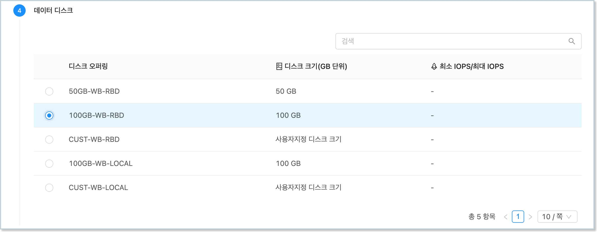
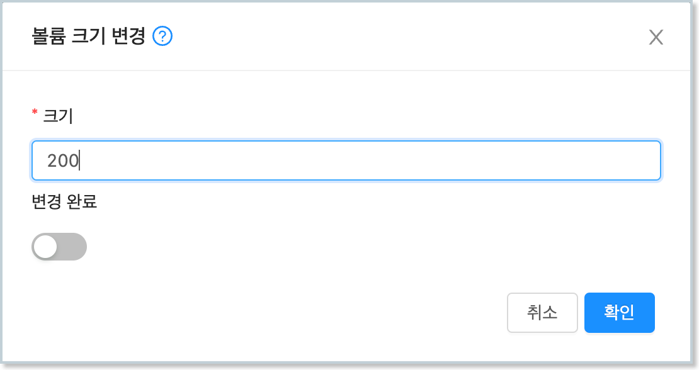
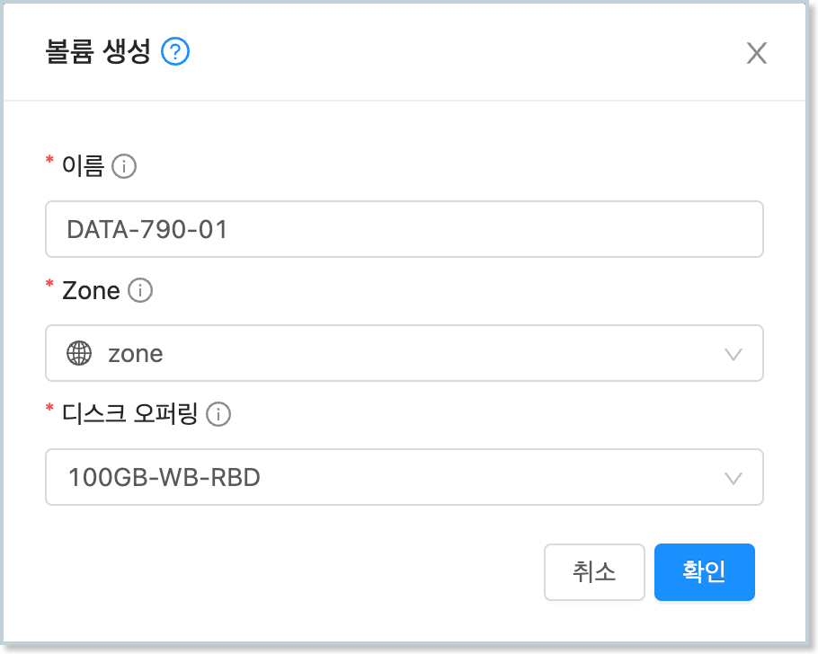
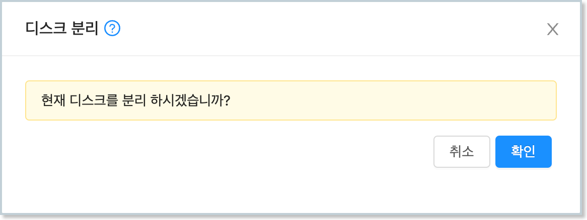

ABLESTACK은 가상머신에서 사용할 수 있도록 디스크를 생성하고, 연결, 관리할 수 있는 다양한 기능을 제공합니다. 본 가이드에서는 생성된 가상머신의 볼륨을 Ubuntu 운영체제 상에서 사용할 수 있는 방법을 설명합니다. 

## 루트 디스크 확장

템플릿 이미지를 통해 가상머신을 생성하면 기본적으로 템플릿이 가진 루트 디스크 사이즈를 그대로 사용하게 됩니다. 

ABLESTACK은 가상머신을 생성할 때, 그리고 가상머신이 운영 중일 때 루트 디스크의 크기를 변경하여 디스크를 확장할 수 있도록 기능을 제공합니다.

### 가상머신 생성 시 확장

가상머신 생성 시 루트 디스크 사이즈를 변경하려면 다음의 순서로 가상머신을 생성합니다. 

1. 배포 인프라를 선택합니다.
   
2. 템플릿/ISO를 선택한 후 "루트 디스크 크기 무시"를 선택합니다. 그리고 원하는 디스크 크기를 입력합니다. 이 때 루트 디스크의 크기를 반드시 처음에 설정된 크기보다 커야 합니다.
  { style="margin-top: 20px;" width="600" }

3. 컴퓨트 오퍼링을 선택합니다.
    
4. 데이터 디스크를 선택합니다.
    
5. 네트워크를 선택합니다. 
   
6. SSH 키 쌍을 선택합니다. 
   
7. 확장 모드를 설정합니다. 
   
8. 상세 정보를 설정한 후 가상머신을 실행합니다. 

위와 같이 가상머신을 실행하면 루트 디스크로 설정되어 있는 물리적인 디스크의 크기가 확장되어 여유공간이 있는 것을 확인할 수 있습니다. 

### 가상머신 생성 후 확장

이미 생성되어 있는 가상머신의 루트 디스크 크기를 변경하고자 하는 경우에는 다음과 같이 가상머신의 디스크 크기를 변경할 수 있습니다. 

1. 루트 디스크의 크기를 변경하고자 하는 가상머신의 상세화면으로 이동합니다.
   
2. "볼륨" 탭을 클릭하여 가상머신의 디스크 목록을 표시합니다. 
   
3. 루트 디스크를 클릭하여 볼륨 상세 화면으로 이동합니다. 
   
4. 우측 상단의 액션 아이콘 메뉴에서 "볼륨 크기 변경" 아이콘을 클릭합니다. 
   
5. 현재 크기보다 큰 단위의 크기를 입력하고 "변경 완료"를 비활성화 한 후 "확인" 버튼을 클릭합니다. 
  { style="margin-top: 20px;" width="450" }

6. 가상머신 내에서 디스크의 크기가 변경되었는지 확인합니다.

가상머신이 실행 중인 경우에도 디스크가 동적으로 변경됩니다. 가상머신 콘솔 등으로 가상머신에 접속하여 실행 결과를 바로 확인할 수 있습니다. 

### 루트 디스크 LVM 확장(fdisk)

가상머신의 디스크를 확장하는 것은 물리적인 디스크의 용량을 확장하는 것입니다. 실제 가상머신의 ROOT 볼륨의 크기가 변경된 것이 아닙니다. 실제 ROOT 디스크의 물리적인 용량을 확장한 상태에서 볼륨에 할당된 용량과 디스크의 물리적 용량을 비교해 보면 다음과 같습니다. 

``` hl_lines="6 14 16"
$ df -h
Filesystem                         Size  Used Avail Use% Mounted on
devtmpfs                           3.8G     0  3.8G   0% /dev
tmpfs                              3.8G     0  3.8G   0% /dev/shm
tmpfs                              1.6G  8.9M  1.5G   1% /run
/dev/mapper/ubuntu--vg-ubuntu--lv   46G  4.4G   41G  10% /
tmpfs                              3.8G     0  3.8G   0% /tmp
/dev/vda1                         1014M  263M  752M  26% /boot
tmpfs                              769M   36K  769M   1% /run/user/0

$ lsblk
NAME                      MAJ:MIN RM  SIZE RO TYPE MOUNTPOINTS
sr0                        11:0    1 1024M  0 rom
vda                       252:0    0  100G  0 disk
├─vda1                    252:1    0    1G  0 part /boot
└─vda2                    252:2    0   49G  0 part
  ├─ubuntu--vg-ubuntu--l  253:0    0 45.1G  0 lvm  /
```

위의 명령 실행 결과를 보면 실제 물리 디스크인 vda의 전체 용량은 100GB이지만 루트 영역이 49GB가 할당되어 있는 것을 볼 수 있습니다.

그리고 루트 디스크 볼륨은 lvm으로 만들어져 있는 것을 확인할 수 있습니다. 본 가이드에서는 100GB로 확장된 전체 디스크 중 나머지 영역을 fdisk를 이용해 확장하는 방법을 설명합니다. 

루트 디스크의 파티션 형식이 lvm이므로 fdisk를 이용해 루트 디스크가 있는 디스크의 나머지 공간을 새로운 파티션으로 생성하고 Device Type을 Linux LVM으로 변경합니다. 다음과 같습니다. 

``` hl_lines="1 11 15 16 17 18 22 23 24 28"
$ fdisk /dev/vda

Welcome to fdisk (util-linux 2.37.2).
Changes will remain in memory only, until you decide to write them.
Be careful before using the write command.

This disk is currently in use - repartitioning is probably a bad idea.
It's recommended to umount all file systems, and swapoff all swap
partitions on this disk.

Command (m for help): n
Partition type
   p   primary (2 primary, 0 extended, 2 free)
   e   extended (container for logical partitions)
Select (default p): p
Partition number (3,4, default 3): 3
First sector (104857600-209715199, default 104857600):
Last sector, +/-sectors or +/-size{K,M,G,T,P} (104857600-209715199, default 209715199):

Created a new partition 3 of type 'Linux' and of size 50 GiB.

Command (m for help): t
Partition number (1-3, default 3): 3
Hex code or alias (type L to list all): 8e

Changed type of partition 'Linux' to 'Linux LVM'.

Command (m for help): w
The partition table has been altered.
Syncing disks.
```

다시 한번 fdisk를 이용해 여유 공간 전체가 새로운 디스크 파티션으로 생성 되었는지 확인하고, 파티션 타입이 'Linux LVM'인지 확인합니다. 

아래의 결과를 보면 /dev/vda3이 만들어지고, 나머지 공간인 50GB가 할당된 것을 확인할 수 있습니다. 

``` hl_lines="12"
$ fdisk -l /dev/vda
Disk /dev/vda: 100 GiB, 107374182400 bytes, 209715200 sectors
Units: sectors of 1 * 512 = 512 bytes
Sector size (logical/physical): 512 bytes / 512 bytes
I/O size (minimum/optimal): 512 bytes / 512 bytes
Disklabel type: dos
Disk identifier: 0x001a9913

Device     Boot     Start       End   Sectors Size Id Type
/dev/vda1  *         2048   2099199   2097152   1G 83 Linux
/dev/vda2         2099200 104857599 102758400  49G 8e Linux LVM
/dev/vda3       104857600 209715199 104857600  50G 8e Linux LVM
```

생성된 파티션을 물리 볼륨으로 생성하기 위해 pvcreate 명령을 이용합니다.

다음과 같이 새로 추가된 파티션(vda3)을 물리 볼륨으로 생성합니다.

```
$ pvcreate /dev/vda3
  Physical volume "/dev/vda3" successfully created.
```

물리 볼륨이 정상적으로 생성되면 루트디스크로 할당된 Volume Group을 `vgs`를 통해 확인하고, 루트 디스크에 해당 하는 볼륨 그룹을 `vgextend`를 이용해 확장합니다.

다시 vgs를 이용해 VFree 항목에 여유공간이 생성되었는지 확인합니다.

```
$ vgs
  VG         #PV #LV  #SN Attr   VSize    VFree
  ubuntu-vg   1   2   0   wz--n- <49.00g  0

$ vgextend ubuntu-vg /dev/vda3
  Volume group "ubuntu-vg" successfully extended

$ vgs
  VG         #PV #LV #SN Attr   VSize  VFree
  ubuntu-vg   2   2   0  wz--n- 98.99g <50.00g
```

볼륨 그룹에 여유 공간이 할당되었다면 `lvs`를 이용해 논리 볼륨을 확인한 후 root로 설정된 논리 볼륨을 `lvextend` 명령을 이용해 확장합니다. 

```
$ lvs
  LV        VG        Attr       LSize  Pool Origin Data%  Meta%  Move Log Cpy%Sync Convert
  ubuntu-lv ubuntu-vg -wi-ao---- 45.05g

$ lvextend ubuntu-vg/ubuntu-lv -l +100%FREE
  Size of logical volume ubuntu-vg/ubuntu-lv changed from 45.05 GiB (11533 extents) to <95.05 GiB (24332 extents).
  Logical volume ubuntu-vg/ubuntu-lv successfully resized.
```

루트 디스크의 파일 시스템을 `mount` 명령으로 확인 한 뒤 적절한 파일 시스템 용량 증설 명령을 통해 파일 시스템을 확장합니다. 

예제에서는 루트디스크의 파일 시스템이 `xfs` 파일 시스템으로 `xfs_growfs` 명령을 이용해 디스크를 확장합니다.

```
$ mount | grep ubuntu
/dev/mapper/ubuntu--vg-ubuntu--lv on / type xfs (rw,relatime,seclabel,attr2,inode64,logbufs=8,logbsize=32k,noquota)

$ xfs_growfs /dev/mapper/ubuntu--vg-ubuntu--lv
meta-data=/dev/mapper/ubuntu--vg-ubuntu--lv   isize=512    agcount=4, agsize=2952448 blks
         =                       sectsz=512   attr=2, projid32bit=1
         =                       crc=1        finobt=1, sparse=1, rmapbt=0
         =                       reflink=1    bigtime=1 inobtcount=1
data     =                       bsize=4096   blocks=11809792, imaxpct=25
         =                       sunit=0      swidth=0 blks
naming   =version 2              bsize=4096   ascii-ci=0, ftype=1
log      =internal log           bsize=4096   blocks=5766, version=2
         =                       sectsz=512   sunit=0 blks, lazy-count=1
realtime =none                   extsz=4096   blocks=0, rtextents=0
data blocks changed from 11809792 to 24915968
```

최종적으로 `df` 명령을 이용해 확장된 용량을 확인 합니다.

```
$ df -h
Filesystem                         Size  Used Avail Use% Mounted on
devtmpfs                           3.8G     0  3.8G   0% /dev
tmpfs                              3.8G     0  3.8G   0% /dev/shm
tmpfs                              1.6G  8.9M  1.5G   1% /run
/dev/mapper/ubuntu--vg-ubuntu--lv   96G  4.7G   91G   5% /
tmpfs                              3.8G     0  3.8G   0% /tmp
/dev/vda1                         1014M  263M  752M  26% /boot
tmpfs                              769M   36K  769M   1% /run/user/0
```

### 루트 디스크 LVM 확장(growpart)

위에서 설명한 fdisk를 이용해 루트 디스크의 LVM을 확장하는 방법 외에 growpart라는 패키지를 통해 쉽게 파티션을 확장하는 방법을 사용할 수 있습니다. 

확장하고자 하는 ROOT 디스크의 파티션 정보를 확인하여 확장할 여유공간이 있는지 확인합니다. 

```
$ lsblk
NAME                      MAJ:MIN RM  SIZE RO TYPE MOUNTPOINTS
sr0                        11:0    1 1024M  0 rom
vda                       252:0    0  200G  0 disk
├─vda1                    252:1    0    1G  0 part /boot
├─vda2                    252:2    0   49G  0 part
│ ├─ubuntu--vg-ubuntu--lv 253:0    0   95G  0 lvm  /
└─vda3                    252:3    0   50G  0 part
  └─ubuntu--vg-ubuntu--lv 253:0    0   95G  0 lvm  /
```

`growpart`를 이용해 vda의 두번째 파티션인 vda3 파티션을 확장합니다. 다음과 같습니다. 

```
$ growpart /dev/vda 3
CHANGED: partition=3 start=104857600 old: size=104857600 end=209715200 new: size=314572767 end=419430367
```

다시 `lsblk` 명령을 실행하면 디스크 파티션의 크기가 확장된 것을 확인할 수 있습니다. 

이제 ROOT 디스크의 논리 볼륨을 해당 크기만큼 늘려줘야 합니다. 먼저 `pvresize`를 이용해 물리 볼륨을 확장합니다. 

```
$ pvresize /dev/vda3
  Physical volume "/dev/vda3" changed
  1 physical volume(s) resized or updated / 0 physical volume(s) not resized
```

볼륨 그룹을 확인하여 해당 볼륨 그룹의 여유공간이 생성되었는지 확인합니다. 

```
$ vgs
  VG              #PV #LV #SN Attr   VSize   VFree
  ubuntu-vg         2   2   0 wz--n- 198.99g 100.00g
```

이제 논리 볼륨을 다음과 같이 확장합니다. `lvextend` 명령의 `-r` 옵션은 논리 볼륨을 확장한 후 논리 볼륨의 파일 시스템도 같이 사이즈를 변경하도록 합니다. 

예제의 ROOT 디스크는 xfs 파일 시스템이므로 `xfs_growfs` 명령을 실행한 것과 동일한 결과가 실행됩니다. 

```
$ lvextend -r -l +100%FREE ubuntu-vg/ubuntu-lv
  Size of logical volume ubuntu-vg/ubuntu-lv changed from <95.05 GiB (24332 extents) to <195.05 GiB (49932 extents).
  Logical volume ubuntu-vg/ubuntu-lv successfully resized.
meta-data=/dev/mapper/ubuntu--vg-ubuntu--lv isize=512    agcount=9, agsize=2952448 blks
         =                       sectsz=512   attr=2, projid32bit=1
         =                       crc=1        finobt=1, sparse=1, rmapbt=0
         =                       reflink=1    bigtime=1 inobtcount=1
data     =                       bsize=4096   blocks=24915968, imaxpct=25
         =                       sunit=0      swidth=0 blks
naming   =version 2              bsize=4096   ascii-ci=0, ftype=1
log      =internal log           bsize=4096   blocks=5766, version=2
         =                       sectsz=512   sunit=0 blks, lazy-count=1
realtime =none                   extsz=4096   blocks=0, rtextents=0
data blocks changed from 24915968 to 51130368
```

최종적으로 `df -h` 명령을 실행하여 ROOT 디스크가 확장되었는지 확인합니다. 

## 데이터 디스크

ABLESTACK은 가상머신에 ROOT 디스크 외에 별도의 데이터 디스크를 추가하여 연결할 수 있도록 기능을 제공합니다. 

가상머신 생성 시에 필요한 경우 데이터 디스크를 추가적으로 연결할 수 있으며, 이 때 연결할 수 있는 데이터 디스크의 수는 1개 입니다. 

또한 가상머신 운영 중에 사용자가 데이터 디스크를 추가적으로 생성하여 가상머신에 연결할 수 있습니다. 

### 디스크 생성 및 연결

ABLESTACK은 가상머신에 데이터 디스크를 생성하여 연결하는 두가지 방법을 제공합니다. 

첫번째 방법은 템플릿을 이용해 가상머신을 생성할 때 가상머신에 연결할 데이터 디스크를 생성하여 연결하도록 하는 것입니다. 

두번째 방법은 별도의 디스크 생성 및 연결 기능을 이용해 디스크를 생성하고, 연결하는 방법입니다. 

이 섹션에서는 템플릿을 이용해 가상머신을 생성할 때, 디스크를 추가 생성하여 연결하는 방법을 설명합니다. 두번째 방법은 아래의 [추가 디스크 연결 및 확장](#_7) 부분을 참고합니다. 

템플릿을 이용해 가상머신을 생성할 때 디스크를 생성하여 연결하는 절차는 다음과 같습니다. 

1. `컴퓨트 > 가상머신`으로 이동하여 "가상머신 추가" 마법사를 시작합니다. 
   
2. 배포 인프라를 선택합니다. 
   
3. 템플릿/ISO에서 Ubuntu 기반의 템플릿을 선택합니다. 
   
4. 컴퓨트 오퍼링을 선택합니다. 
   
5. 데이터 디스크를 원하는 크기(오퍼링)로 다음과 같이 선택합니다. 
  { style="margin-top: 20px;" width="600" }

6. 네트워크를 선택합니다. 
   
7. SSH 키 쌍을 선택합니다. 
   
8. 확장 모드의 정보를 선택/입력합니다. 
   
9.  상세 정보에 가상머신 이름 등을 입력합니다. 
    
10. 가상머신을 시작합니다. 

데이터 디스크를 추가하여 가상머신을 생성한 후 가상머신 상세 화면에서 볼륨 탭을 클릭하면 다음과 같이 데이터 디스크가 추가되어 있는 것을 확인할 수 있습니다. 

<center>{ width="600" }</center>

가상머신에 접속하여 디스크를 사용할 수 있도록 설정합니다. 추가된 데이터 디스크는 LVM 상의 XFS 파일 시스템으로 포맷하여 마운트할 것입니다. 다음과 같은 순서로 데이터 디스크의 사용을 준비합니다. 

먼저 가상머신에 SSH 또는 콘솔을 통해 접속한 뒤 다음의 명령을 이용해 디스크의 인식 여부를 확인합니다.

```
$ lsblk
NAME                      MAJ:MIN RM  SIZE RO TYPE MOUNTPOINTS
sr0                        11:0    1 1024M  0 rom
vda                       252:0    0   50G  0 disk
├─vda1                    252:1    0    1G  0 part /boot
└─vda2                    252:2    0   49G  0 part
  ├─ubuntu--vg-ubuntu--lv 253:0    0 45.1G  0 lvm  /
vdb                       252:16   0  100G  0 disk
```

100GB의 데이터 디스크가 연결되어 있는 것을 확인한 후 LVM을 생성하기 위해 디스크에 다음과 같이 파티션을 생성합니다. 

```
$ fdisk /dev/vdb

Welcome to fdisk (util-linux 2.37.2).
Changes will remain in memory only, until you decide to write them.
Be careful before using the write command.

Device does not contain a recognized partition table.
Created a new DOS disklabel with disk identifier 0x14a56515.

Command (m for help): n
Partition type
   p   primary (0 primary, 0 extended, 4 free)
   e   extended (container for logical partitions)
Select (default p): p
Partition number (1-4, default 1): 1
First sector (2048-209715199, default 2048):
Last sector, +/-sectors or +/-size{K,M,G,T,P} (2048-209715199, default 209715199):

Created a new partition 1 of type 'Linux' and of size 100 GiB.

Command (m for help): t
Selected partition 1
Hex code or alias (type L to list all): 8e
Changed type of partition 'Linux' to 'Linux LVM'.

Command (m for help): w
The partition table has been altered.
Calling ioctl() to re-read partition table.
Syncing disks.

```

파티션을 생성한 후 LVM을 다음과 같이 생성합니다. 

```
$ pvcreate /dev/vdb1
  Physical volume "/dev/vdb1" successfully created.

$ vgcreate data1_vg /dev/vdb1
  Volume group "data1_vg" successfully created

$ lvcreate -l 100%FREE -n data1_lv0 data1_vg
  Logical volume "data1_lv0" created.
```

LVM을 생성한 후 다음과 같이 파일 시스템을 생성하고 마운트 합니다. 

```
$ mkfs.xfs /dev/data1_vg/data1_lv0
meta-data=/dev/data1_vg/data1_lv0 isize=512    agcount=4, agsize=6553344 blks
         =                       sectsz=512   attr=2, projid32bit=1
         =                       crc=1        finobt=1, sparse=1, rmapbt=0
         =                       reflink=1    bigtime=1 inobtcount=1
data     =                       bsize=4096   blocks=26213376, imaxpct=25
         =                       sunit=0      swidth=0 blks
naming   =version 2              bsize=4096   ascii-ci=0, ftype=1
log      =internal log           bsize=4096   blocks=12799, version=2
         =                       sectsz=512   sunit=0 blks, lazy-count=1
realtime =none                   extsz=4096   blocks=0, rtextents=0

$ mkdir /data1

$ mount /dev/data1_vg/data1_lv0 /data1
```

디스크를 마운트 한 후 정상적으로 마운트 되었는지 확인합니다. 

```
$ df -h
Filesystem                         Size  Used Avail Use% Mounted on
devtmpfs                           3.8G     0  3.8G   0% /dev
tmpfs                              3.8G     0  3.8G   0% /dev/shm
tmpfs                              1.6G  8.9M  1.5G   1% /run
/dev/mapper/ubuntu--vg-ubuntu--lv   46G  4.4G   41G  10% /
tmpfs                              3.8G     0  3.8G   0% /tmp
/dev/vda1                         1014M  263M  752M  26% /boot
tmpfs                              769M   36K  769M   1% /run/user/0
/dev/mapper/data1_vg-data1_lv0     100G  746M  100G   1% /data1
```

마운트 된 디스크는 가상머신이 재시작하는 경우 마운트가 해제됩니다. 가상머신의 재시작 여부와 관계없이 항구적으로 해당 디스크를 마운트 하도록 설정해야 합니다. 

`vi` 에디터를 이용해 fstab를 편집하여 다음의 내용을 추가합니다. 

```
$ vi /etc/fstab

# Add the following config to the fstab
/dev/data1_vg/data1_lv0     /data1      xfs     defaults      0   0
```

가상머신을 재시작한 후 해당 디스크가 자동으로 마운트 되는지 확인합니다.

### 디스크 사이즈 변경

연결된 데이터 디스크에 대해 디스크의 크기를 변경하여 확장할 수 있습니다. 

데이터 디스크의 디스크 크기를 변경하려면 먼저 크기를 변경하고자 하는 디스크의 상세 화면으로 이동합니다. 

해당 화면의 우측 상단의 아이콘 액션 메뉴 중 "볼륨 크기 변경" 버튼을 클릭합니다. 다음과 같이 대화상자가 표시되면 원하는 디스크의 크기를 입력한 후 "확인" 버튼을 클릭합니다. 

<center>{ width="450" }</center>

가상머신에 접속하여 `lsblk` 명령을 실행하여 디스크 크기가 변경 되었는지 확인합니다. 디스크 크기 변경은 가상머신 실행 중에 가능합니다. 

```
$ lsblk
NAME                      MAJ:MIN RM  SIZE RO TYPE MOUNTPOINTS
sr0                        11:0    1 1024M  0 rom
vda                       252:0    0   50G  0 disk
├─vda1                    252:1    0    1G  0 part /boot
└─vda2                    252:2    0   49G  0 part
  ├─ubuntu--vg-ubuntu--lv 253:0    0 45.1G  0 lvm  /
vdb                       252:16   0  200G  0 disk
└─vdb1                    252:17   0  100G  0 part
  └─data1_vg-data1_lv0    253:2    0  100G  0 lvm  /data1
```

변경된 디스크를 이용해 파일 시스템을 확장하는 방법은 위에서 설명한 [루트 디스크 LVM 확장(fdisk)](#lvm-fdisk)와 [루트 디스크 LVM 확장(growpart)](#lvm-growpart)의 방법과 동일합니다. 

디스크 확장의 구체적인 절차는 위 섹션의 문서를 참고하십시오.

### 추가 디스크 연결 및 확장

가상머신의 데이터 디스크에 추가로 디스크를 연결하고 확장할 수 있습니다. 

`스토리지 > 볼륨` 화면에서 '볼륨 생성' 버튼을 클릭합닌다. 대화상자에 디스크의 이름과 오퍼링을 선택한 후 "확인" 버튼을 클릭합니다. 

<center>{ width="450" }</center>

디스크가 생성되면 해당 디스크의 상세 화면으로 이동한 후 우측 상단의 아이콘 액션 버튼 중 "디스크 연결" 버튼을 클릭합니다. 표시된 대화상자에서 연결할 가상머신을 선택한 후 "확인" 버튼을 클릭합니다. 

<center>{ width="450" }</center>

가상머신에 디스크가 연결되면, 가상머신에 접속하여 볼륨을 확장합니다. `lsblk`를 이용해 디스크 연결 상태를 확인합니다. 

```
$ lsblk
NAME                      MAJ:MIN RM  SIZE RO TYPE MOUNTPOINTS
sr0                        11:0    1 1024M  0 rom
vda                       252:0    0   50G  0 disk
├─vda1                    252:1    0    1G  0 part /boot
└─vda2                    252:2    0   49G  0 part
  ├─ubuntu--vg-ubuntu--lv 253:0    0 45.1G  0 lvm  /
vdb                       252:16   0  200G  0 disk
└─vdb1                    252:17   0  200G  0 part
  └─data1_vg-data1_lv0    253:2    0  200G  0 lvm  /data1
vdc                       252:32   0  100G  0 disk
```

`fdisk`를 이용해 디스크에 파티션을 생성합니다. 

```
$ fdisk /dev/vdc

Welcome to fdisk (util-linux 2.37.2).
Changes will remain in memory only, until you decide to write them.
Be careful before using the write command.

Device does not contain a recognized partition table.
Created a new DOS disklabel with disk identifier 0xc04c992f.

Command (m for help): n
Partition type
   p   primary (0 primary, 0 extended, 4 free)
   e   extended (container for logical partitions)
Select (default p): p
Partition number (1-4, default 1): 1
First sector (2048-209715199, default 2048):
Last sector, +/-sectors or +/-size{K,M,G,T,P} (2048-209715199, default 209715199):

Created a new partition 1 of type 'Linux' and of size 100 GiB.

Command (m for help): t
Selected partition 1
Hex code or alias (type L to list all): 8e
Changed type of partition 'Linux' to 'Linux LVM'.

Command (m for help): w
The partition table has been altered.
Calling ioctl() to re-read partition table.
Syncing disks.
```

`pvcreate` 명령을 이용해 파티션을 물리 볼륨으로 생성합니다. 

```
$ pvcreate /dev/vdc1
  Physical volume "/dev/vdc1" successfully created.
```

`vgextend`를 실행하여 물리 볼륨을 볼륨 그룹에 추가하여 확장합니다. 

```
$ vgextend data1_vg /dev/vdc1
  Volume group "data1_vg" successfully extended
```

`lvextend`를 실행하여 논리 볼륨을 확장하고 파일 시스템을 확장합니다. 

```
$ lvextend -r -l +100%FREE /dev/data1_vg/data1_lv0
  Size of logical volume data1_vg/data1_lv0 changed from <200.00 GiB (51199 extents) to 299.99 GiB (76798 extents).
  Logical volume data1_vg/data1_lv0 successfully resized.
meta-data=/dev/mapper/data1_vg-data1_lv0 isize=512    agcount=9, agsize=6553344 blks
         =                       sectsz=512   attr=2, projid32bit=1
         =                       crc=1        finobt=1, sparse=1, rmapbt=0
         =                       reflink=1    bigtime=1 inobtcount=1
data     =                       bsize=4096   blocks=52427776, imaxpct=25
         =                       sunit=0      swidth=0 blks
naming   =version 2              bsize=4096   ascii-ci=0, ftype=1
log      =internal log           bsize=4096   blocks=12799, version=2
         =                       sectsz=512   sunit=0 blks, lazy-count=1
realtime =none                   extsz=4096   blocks=0, rtextents=0
data blocks changed from 52427776 to 78641152
```

### 디스크 연결 해제

이번 섹션에서는 가상머신에 연결된 디스크를 안전하게 해제하는 방법을 설명합니다. 

먼저 디스크의 볼륨이 마운트 되어 있는 디렉토리를 확인하기 위해 다음의 명령을 실행합니다. 

```
$ df -h
Filesystem                         Size  Used Avail Use% Mounted on
devtmpfs                           3.8G     0  3.8G   0% /dev
tmpfs                              3.8G     0  3.8G   0% /dev/shm
tmpfs                              1.6G  8.9M  1.5G   1% /run
/dev/mapper/ubuntu--vg-ubuntu--lv   46G  4.4G   41G  10% /
tmpfs                              3.8G     0  3.8G   0% /tmp
/dev/mapper/data1_vg-data1_lv0     300G  2.2G  298G   1% /data1
/dev/vda1                         1014M  263M  752M  26% /boot
tmpfs                              769M   36K  769M   1% /run/user/0
```

마운트 지점을 확인한 후 해당 디렉토리의 볼륨의 마운트 해제합니다. 

```
$ umount /data1
```

마운트 해제한 볼륨이 가상머신 재부팅 이후에 다시 마운트 되지 않도록 fstab에서 설정을 삭제합니다. 

```
$ vi /etc/fstab

# Delete following line of fstab
/dev/data1_vg/data1_lv0           /data1                  xfs     defaults        0 0
```

가상머신에 연결된 디스크를 선택하여 "디스크 분리" 아이콘 액션 메뉴를 클릭합니다. 표시되는 대화상자에서 "확인" 버튼을 클릭하여 디스크를 가상머신에서 분리합니다. 

<center>{ width="450" }</center>

동일한 방법으로 연결되어 있는 데이터 디스크를 모두 연결 해제한 후 `lsblk` 명령을 실행하여 디스크가 분리 되었는지 확인합니다. 

```
$ lsblk
NAME                      MAJ:MIN RM  SIZE RO TYPE MOUNTPOINTS
sr0                        11:0    1 1024M  0 rom
vda                       252:0    0   50G  0 disk
├─vda1                    252:1    0    1G  0 part /boot
└─vda2                    252:2    0   49G  0 part
  ├─ubuntu--vg-ubuntu--lv 253:0    0 45.1G  0 lvm  /
```

!!! info "분리된 디스크의 재사용"
    디스크를 삭제하지 않는 한 가상머신으로부터 분리된 디스크는 언제든 다시 연결하여 사용할 수 있습니다. 

    해당 디스크에는 볼륨 정보가 남아 있고, 이 논리 볼륨 정보를 이용해 다른 가상머신에서도 돌일하게 마운트하여 사용할 수 있습니다. 