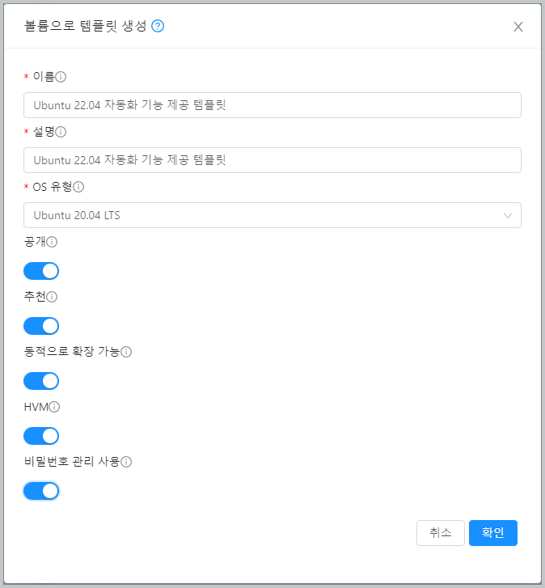
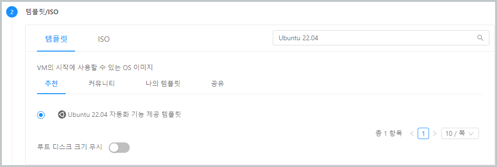
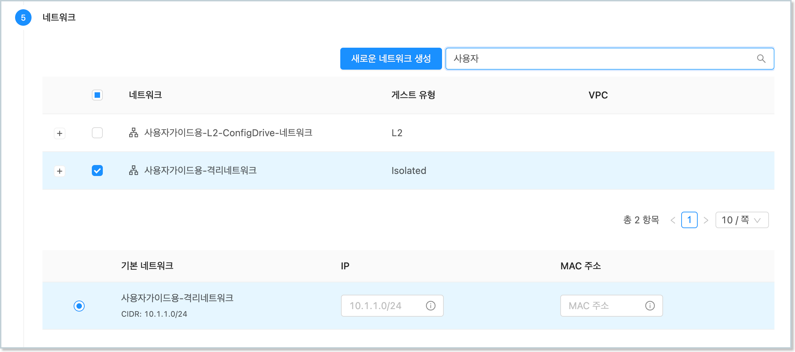
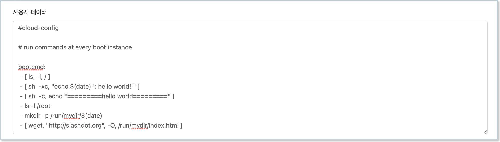
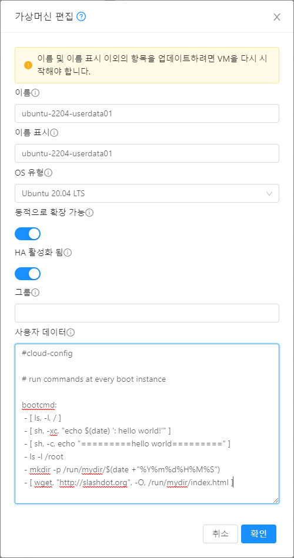

ABLESTACK은 가상머신 생성 시, 그리고 가상머신 편집 기능을 이용해 가상머신에 사용자가 원하는 데이터, 즉 사용자 데이터를 전송하여 가상머신에서 해당 데이터를 받아 원하는 작업을 처리할 수 있도록 하는 사용자 데이터 전송 및 처리 기능을 지원합니다. 

ABLESTACK은 이러한 사용자 데이터를 처리하기 위해 가장 보편적인 사용자 데이터 처리 도구인 cloud-init을 사용합니다. 본 문서에서는 Ubuntu 기반의 가상머신에 cloud-init을 이용해 사용자 데이터를 전송하고 처리하는 방법을 설명합니다. 

!!! info "예제에서 사용되는 가상머신 이미지"
    본 문서의 예제에서 사용되는 가상머신 이미지는 Ubuntu 가상머신 가이드의 [비밀번호 및 SSH Key 관리](/userGuide/vms/ubuntu-guide-ssh-key-use#_1) 가이드에서 생성한 비밀번호 및 SSH Key 관리가 가능한 가상머신 템플릿 이미지를 사용합니다. 

    따라서 본 가이드의 예제를 사용하기 전에 해당하는 가상머신 템플릿 이미지를 먼저 생성하여 사용하십시오.(사용자 데이터 처리를 위해 비밀번호 또는 SSH Key 관리가 꼭 필요한 것은 아닙니다. 예제의 실행을 기본 가상머신 템플릿을 사용해도 사용자 데이터를 처리할 수 있습니다)

## 가상머신 이미지 준비

cloud-init을 이용해 가상머신 생성 또는 재부팅 시 사용자 데이터를 전송하여 처리하기 위해서는 cloud-init이 설치 및 설정되어 있는 가상머신 이미지를 준비해야 합니다. 새로운 가상머신을 만들어 cloud-init 만 설치하거나 기존의 템플릿 이미지에 cloud-init을 추가 설치하여 새로운 템플릿 이미지를 만드는 방법 등을 사용할 수 있습니다. 

먼저, 템플릿 이미지를 이용해 가상머신을 생성하여 실행합니다. 앞서 생성한 가상머신 템플릿 이미지를 선택하고, 적합한 네트워크 및 컴퓨트 오퍼링 등을 선택한 후 가상머신을 생성합니다. 

### cloud-init 설치 및 설정

실행된 가상머신에 다음의 명령을 실행하여 cloud-init을 설치합니다. 

~~~
$ apt-get install cloud-init
~~~

cloud-init 설치가 완료되면 해당 가상머신이 Mold의 가상라우터 등의 사용자 데이터 제공자와의 통신을 위해 구성 정보 설정을 해야 합니다. 다음의 명령을 실행하여 설정 파일을 생성합니다. 

~~~
$ cd /etc/cloud/cloud.cfg.d
$ vi 99_ablestack.cfg
~~~

생성된 파일에 다음의 내용을 작성한 후 저장합니다. 

~~~
datasource:
    CloudStack:
        max_wait: 120
        timeout: 50

datasource_list: [ CloudStack, None ]
~~~

설정이 완료되면 가상머신을 정지하여 템플릿 이미지 생성을 준비합니다. 

### 템플릿 이미지 생성

가상머신이 정지되면 다음의 순서로 가상머신에 대한 템플릿 이미지를 생성합니다. 

1. 가상머신의 상세 화면으로 이동합니다.
   
2. 볼륨 탭을 선택하여 볼륨 목록을 조회합니다. 
   
3. 볼륨 중 ROOT 디스크를 클릭하여 볼륨 상세 화면으로 이동합니다. 
   
4. 우측 상단에 있는 액션 아이콘 메뉴 중 오른쪽에 있는 "볼륨으로 템플릿 생성"을 클릭합니다. 
   
5. 대화상자에 템플릿 정보를 입력합니다. 

    { style="margin-top: 20px;" width="450" }

6. "확인" 버튼을 클릭하여 템플릿을 생성합니다. 

사용자가 선택한대로 템플릿이 생성됩니다. 

## 사용자 데이터 전송 및 처리

사용자 데이터는 가상머신에 다양한 데이터를 전송해 필요한 작업을 하는데 사용합니다. 

대표적인 것인 cloud-init의 cloud-config 스크립트를 전송하여 다양한 가상머신 설정 작업을 자동화 하는 것입니다. 사용자 데이터 전송은 가상머신 생성 시, 그리고 가상머신 운영 중에 필요한 경우 전송하고 이를 처리할 수 있도록 할 수 있습니다. 

본 가이드에서는 간단한 cloud-config 스크립트를 전송할 것입니다. 스크립트는 다음과 같습니다. 

~~~
#cloud-config

# run commands at every boot instance

bootcmd:
 - [ ls, -l, / ]
 - [ sh, -xc, "echo $(date) ': hello world!'" ]
 - [ sh, -c, echo "=========hello world=========" ]
 - ls -l /root
 - mkdir -p /run/mydir/$(date +"%Y%m%d%H%M%S")
 - [ wget, "http://slashdot.org", -O, /run/mydir/index.html ]
~~~

이 스크립트는 가상머신이 부팅될 때 마다 실행되는 스크립트를 정의한 것입니다. 

### 가상머신 생성 시 전송/처리

가장 일반적인 경우는 가상머신 생성 시 사용자 데이터를 전송하는 것입니다. 다음과 같은 순서로 가상머신을 생성하여 위의 샘플 cloud-config 데이터를 전송합니다. 

1. `컴퓨트 > 가상머신` 화면에서 "가상머신 추가" 버튼을 클릭합니다. 
   
2. 템플릿/ISO에서 사용자 데이터 전송/처리 기능이 설정된 템플릿을 선택합니다. 

    { style="margin-top: 20px;" width="600" }

3. 네트워크에서 사용자데이터 전송을 지원하는 네트워크를 선택합니다. 

    { style="margin-top: 20px;" width="600" }

4. "확장 모드" 단계에서 "고급 설정 표시"를 활성화 한 후 "사용자 데이터" 항목에 위의 스트립트를 입력합니다. 

    { style="margin-top: 20px;" width="600" }

5. 그 외의 필요한 정보를 입력한 후 "VM 시작" 버튼을 클릭하여 가상머신을 시작합니다. 

가상머신을 시작한 후 스크립트가 정상적으로 전송되어 실행되었는지 확인합니다. 

1. 가상머신 부팅 시 기록된 로그를 `journalctl -xe` 명령을 실행하여 , "Hello World" 텍스트가 있는지 확인합니다.
2. `/run/mydir/` 디렉토리에 날짜로 된 디렉토리가 생성되었는지 확인합니다.
3. 위 디렉토리에 index.html 파일이 있는지 확인합니다. 

위의 사항이 확인되었다면 사용자 데이터가 정상적으로 처리된 것입니다. 사용자는 사용자 데이터를 신규로 만들어서 언제든지 가상머신에 적용할 수 있습니다. 

!!! info "사용자 데이터 전송 지원 네트워크"
    ABLESTACK은 사용자 데이터를 전송하기 위해 가상머신의 네트워크를 사용합니다. 따라서 사용자 데이터 전송을 위해서는 이에 적합한 네트워크를 사용해야 합니다.

    가상머신에 연결된 네트워크가 사용자 데이터 전송을 지원하는지 확인하려면 다음의 절차로 해당 기능의 지원여부를 확인합니다. 

    1. 가상머신 상세 화면에서 "NIC" 탭을 클릭합니다.
    2. 연결된 네트워크 목록에서 링크를 클릭하여 네트워크 상세 화면으로 이동합니다. 
    3. 네트워크 상세 화면의 좌측 가운데에 "네트워크 오퍼링" 항목의 링크를 클릭하여 네트워크 오퍼링 상세화면으로 이동합니다. 
    4. 네트워크 오퍼링 상세화면의 우측 하단에 "지원되는 서비스"의 서비스 중 UserData 항목이 있는지 확인합니다. 

### 가상머신 운영 중 전송/처리

사용자 데이터를 전송할 수 있도록 설정된 템플릿으로 만들어진 가상머신에는, 가상머신이 생성된 후에도 사용자 데이터를 전송할 수 있습니다. 

이미 생성된 가상머신에 사용자 데이터를 전송하고자 하는 경우, 다음과 같은 순서로 사용자 데이터를 전송합니다. 

1. 가상머신 상세 화면의 우측 상단 액션 아이콘 메뉴에서 "가상머신 편집" 버튼을 클릭합니다. 

2. 표시된 "가상머신 편집" 대화상자의 하단에 있는 "사용자 데이터" 항목에 원하는 데이터를 입력합니다. 

    { style="margin-top: 20px;" width="450" }

3. "확인" 버튼을 클릭하여 가상머신을 편집한 내용을 적용합니다. 

4. 가상머신을 재부팅 합니다. 

새롭게 적용된 사용자 데이터는 가상머신이 재부팅 될 때 적용됩니다. 입력한 사용자 데이터의 내용이 가상머신에 적용되었는지 확인합니다. 

!!! info "cloud-init을 통한 가상머신 자동화"
    사용자 데이터를 통해 가상머신 구성을 자동화 하고자 한다면 cloud-init에 대한 사용 방법을 좀 더 자세히 알아야 합니다. 

    cloud-init에 대한 상세한 사용 방법을 알고자 한다면 [cloud-init 온라인 설명서](https://cloudinit.readthedocs.io/en/latest/){ target="_blank" }를 참고하십시오.