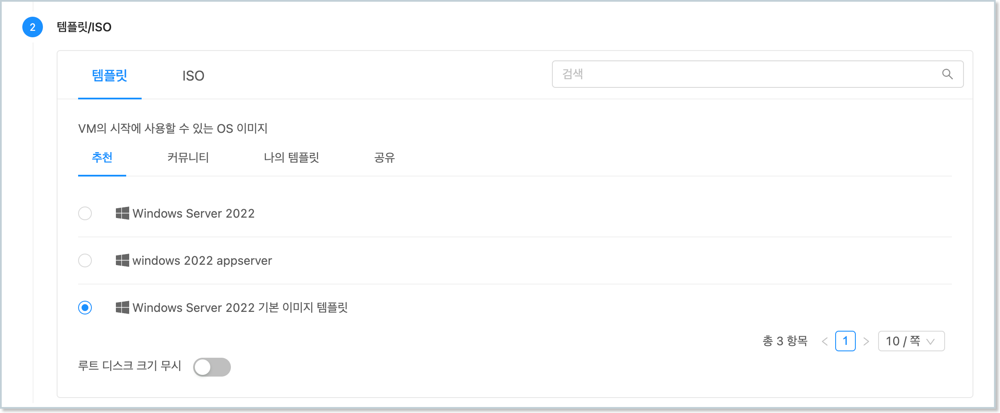
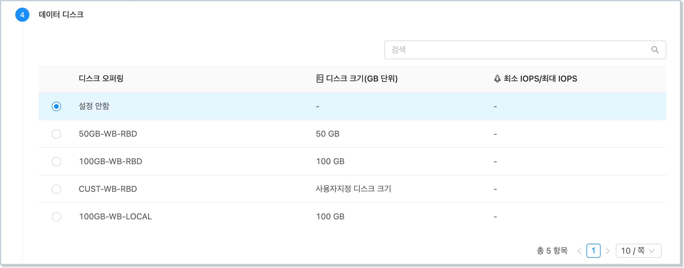
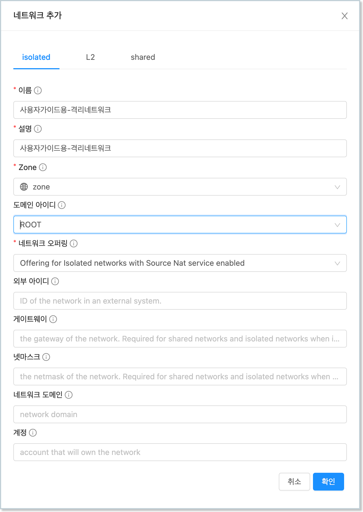
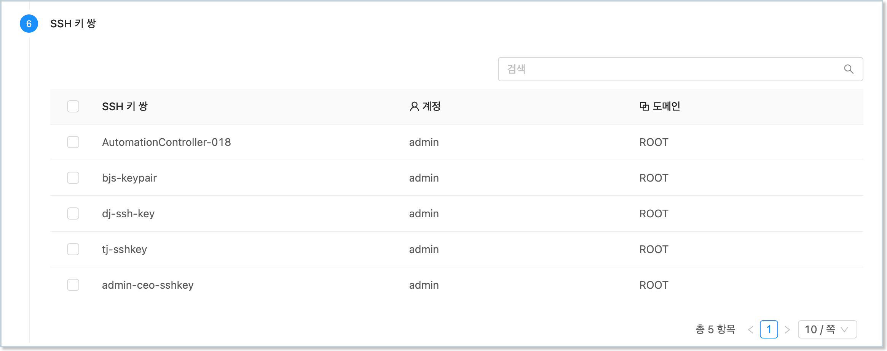
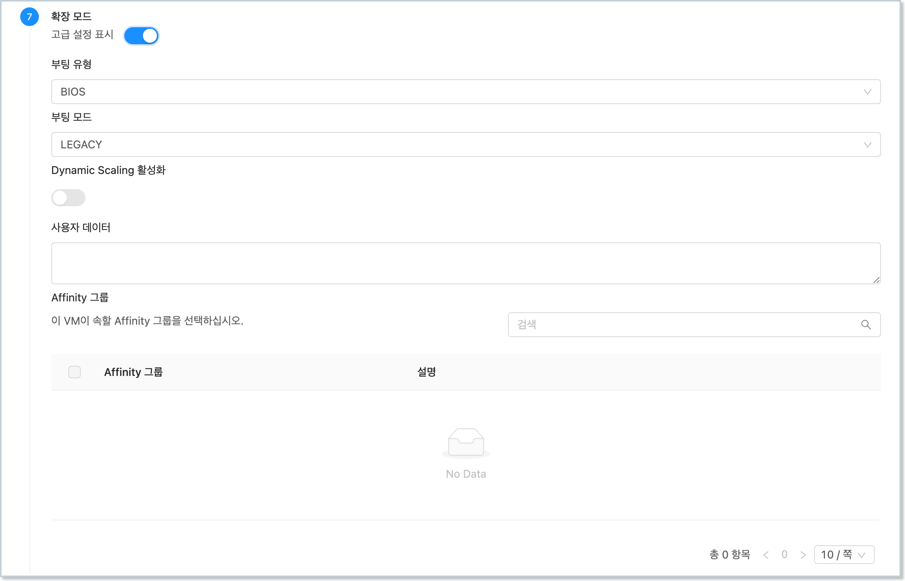
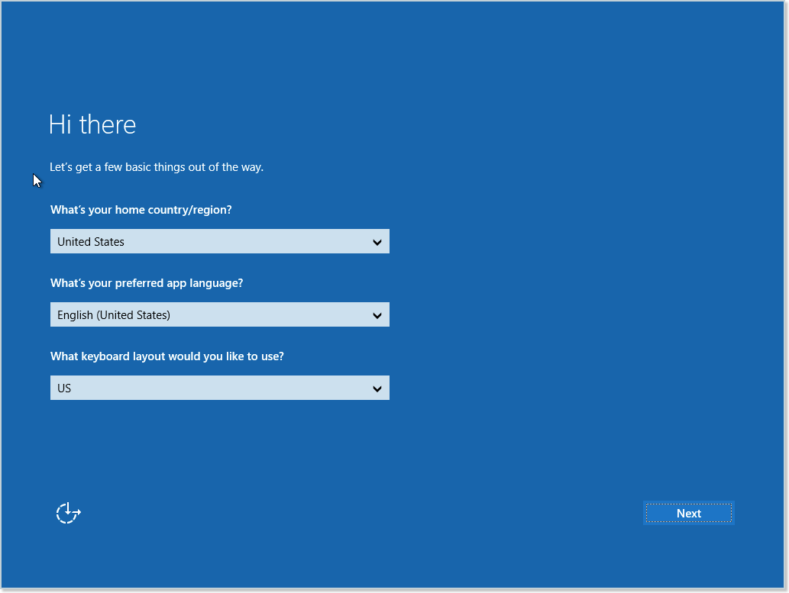
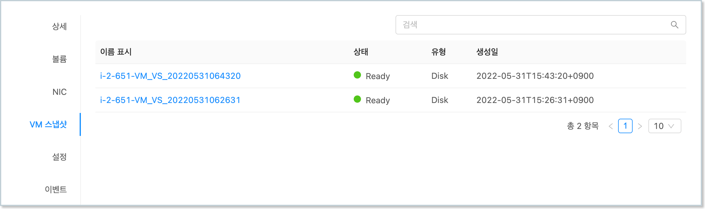
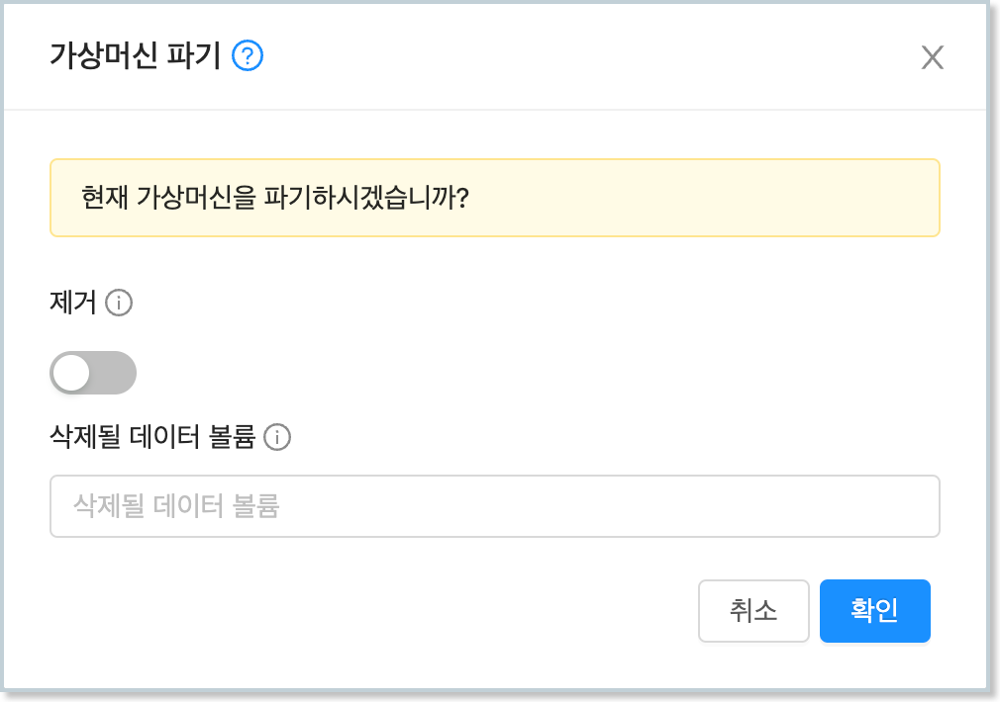

가상머신 사용 준비 과정을 통해 가상머신 템플릿 이미지를 만든 후에는 언제든지 템플릿을 이용해 동일한 형상의 가상머신을 추가할 수 있습니다. 

본 문서에서는 ABLESTACK Mold를 이용해 가상머신을 추가하고, 가상머신의 전원을 관리하며, 가상머신의 형상을 관리하고, 최종적으로 가상머신을 삭제하는 기능을 사용하는 방법을 설명합니다. 

## 템플릿으로 가상머신 추가

ABLESTACK Mold는 기본적으로 템플릿을 이용해 가상머신을 생성하고 사용하는 것을 권장합니다. 따라서 본 문서를 이용해 가상머신을 생성하기 전에 먼저 "[가상머신 사용 준비](../windows-guide-prepare-vm)" 단계를 통해 Windows 기반의 가상머신 템플릿 이미지를 생성하여 등록하는 절차를 수행해야 합니다. 

!!! info "ISO를 이용한 가상머신 추가"
    템플릿을 이용한 가상머신 추가 외에 운영체제 ISO 이미지를 이용해 가상머신 추가가 가능합니다. 템플릿을 사용하지 않고, 완전히 새롭게 가상머신을 생성하고자 하는 경우 [ISO를 이용한 가상머신 생성](../windows-guide-prepare-vm#iso) 문서를 참고하십시오.

가상머신을 추가하기 위해 `컴퓨트 > 가상머신` 화면으로 이동하여 `가상머신 추가` 버튼을 클릭합니다. "새 가상머신" 마법사 페이지가 표시됩니다. 해당 페이지에서는 다음과 같은 절차로 가상머신을 생성합니다. 

1. 배포 인프라 선택 : 가상머신을 배포할 물리적인 ABLESTACK 인프라를 선택
2. 템플릿/ISO : 가상머신 추가에 사용할 템플릿 또는 ISO 이미지 선택
3. 컴퓨트 오퍼링 : CPU, Memory를 할당하기 위한 정책
4. 데이터 디스크 : 가상머신의 ROOT 디스크 외 추가적인 데이터 디스크를 필요로 할 때 용량 선택
5. 네트워크 : 가상머신의 NIC에 연결할 네트워크 선택
6. SSH 키 쌍 : 가상머신의 SSH 로그인 시 사용할 SSH 키 쌍 선택
7. 확장 모드 : 부팅모드, 다이나믹 스케일링, 사용자 데이터, Affinity 그룹 정보 등의 설정
8. 상세 : 가상머신 이름 및 그룹 등의 설정

위의 절차 및 항목을 이용해 가상머신의 구성을 선택하면 화면 우측의 "귀하의 가상머신" 영역에 선택한 정보가 표시되어 요약정보를 바로 확인할 수 있습니다. 

### 배포 인프라 선택

가상머신은 특정 ABLESTACK의 인프라에 배포됩니다. ABLESTACK Mold는 클라우드 플랫폼으로 인프라 지원을 Zone, Pod, 클러스터, 호스트로 구분합니다. 

Zone은 일반적으로 ABLESTACK이 위치한 데이터센터를 의미하며, Pod은 동일 관리 네트워크 상의 자원을 의미합니다. 따라서 단일 클러스터로 구성된 인프라의 경우, Zone, Pod, 클러스터가 단일 환경으로 되어 있으며, 호스트 만 다수로 구성됩니다. 사용자는 다음의 화면과 같이 명시적으로 배포 인프라를 선택할 수 있습니다. 

{ width="600" }

다만, 특별한 이유가 없다면 위의 그림과 같은 단계에서 사용자가 특정 자원을 명시적으로 선택하지 않아도 됩니다. Mold가 자동으로 적합한 호스트를 식별하여 가상머신을 배포하게 됩니다. 

### 템플릿/ISO

가상머신 추가 시 사용자는 가상머신 OS 및 애플리케이션 등이 이미 설치되어 있는 템플릿 이미지를 사용하거나, 신규로 운영체제를 설치하기 위해 ISO 이미지를 사용할 수 있습니다. 

본 가이드에서는 이미 만들어져 있는 템플릿 이미지를 이용해 가상머신을 추가하는 방법을 설명합니다. "새 가상머신" 마법사의 템플릿/ISO 선택 단계의 화면은 다음의 그림과 같습니다. 

{ width="600" }

사용자는 먼저 "템플릿" 탭을 선택하고, 가상머신 이미지를 검색하기 위해 추천, 커뮤니티, 나의 템플릿, 공유 탭 중 하나를 선택하여 원하는 템플릿을 선택하거나, 검색 기능을 이용해 템플릿의 범위를 좁힌 후 템플릿을 선택할 수 있습니다. 

템플릿 이미지는 기본적으로 루트 디스크의 크기가 설정되어 있는데, 만약 해당 디스크의 크기를 확장하고 싶은 경우 "루트 디스크 크기 무시" 항목을 활성화 한 후 원하는 디스크의 크기를 입력하여 설정할 수 있습니다. 

!!! info "루트 디스크 크기 설정"
    템플릿 생성 시에는 최소한의 루트 디스크 크기를 설정하고, 언제든 루트 디스크의 크기를 확장할 수 있습니다. 단, 해당 디스크의 파티션이 자동으로 확장되는 것이 아니기 때문에 사용자가 직접 디스크의 파티션을 확장하는 작업을 수행해야 합니다. 

### 컴퓨트 오퍼링

가상머신을 생성하기 위해서는 가상머신의 연산과 데이터 처리를 담당할 CPU와 메모리의 할당이 필요합니다. 컴퓨트 오퍼링은 사전에 관리자에 의해서 정의된 컴퓨트 자원 제공 정책을 의미합니다. 컴퓨트 오퍼링을 선택하는 단계의 화면은 다음과 같습니다. 

{ width="600" }

목록에 표시되는 오퍼링 정책은 관리자 또는 사용자에 의해 미리 만들어진 정책입니다. 컴퓨트 오퍼링 이름과 가상머신에 할당될 CPU, 그리고 메모리의 크기를 확인할 수 있습니다. 

검색 기능을 통해 원하는 컴퓨트 오퍼링을 검색하거나, 페이지 이동을 통해 탐색할 수 있습니다. 

"루트 디스크 오퍼링 무시" 항목을 선택하면 가상머신의 루트디스크에 할당할 디스크 오퍼링을 별도로 선택할 수 있으며, 가상머신의 루트디스크의 전체적인 크기가 변경됩니다. 

### 데이터 디스크

템플릿을 사용하여 가상머신을 생성하는 경우, 루트 디스크가 이미 만들어져 있기 때문에 가상머신을 생성할 때 별도의 데이터 디스크를 추가적으로 설정할 수 있습니다. 디스크를 추가할 때는 관리자 또는 사용자가 미리 생성한 디스크 오퍼링, 즉 디스크 할당 정책의 목록 중 필요한 정책을 선택해야 합니다. 데이터 디스크 정책을 선택하는 단계의 화면은 다음과 같습니다. 

{ width="600" }

디스크 오퍼링은 위의 화면과 같이 목록으로 표시되며, 디스크 오퍼링의 이름, 디스크의 크기, 그리고 설정이 되어 있는 경우 최소 IOPS/최대 IOPS 값이 표시됩니다. 검색을 통해 오퍼링을 탐색하거나, 페이지 이동을 통해 원하는 디스크 오퍼링을 탐색할 수 있습니다. 

디스크 오퍼링을 선택함으로써 가상머신에 추가하도록 설정한 데이터 디스크는 루트 디스크 외의 별도의 디스크로 할당됩니다. 사용자는 가상머신이 시작된 후 해당 볼륨을 확인하여, 파티션 작업 등의 별도의 디스크 작업을 실행해야 디스크를 사용할 수 있습니다. 

데이터 디스크는 언제든 필요할 때 추가할 수 있습니다. 따라서 가상머신 생성 시점에 디스크가 별도로 필요한 경우가 아니라면 "설정 안함"을 선택합니다. 

### 네트워크

가상머신은 실행 시 반드시 1개 이상의 NIC가 가상머신에 연결되고, 해당 NIC는 사용자가 생성한 네트워크에 연결되어야 합니다. 

가상머신 추가 시 네트워크 선택 단계의 화면은 다음과 같습니다. 

{ width="600" }

네트워크 선택 목록에서 원하는 네트워크를 찾기 위해 검색 기능 또는 페이지 탐색을 이용할 수 있습니다. 

만약 연결하고자 하는 네트워크가 없다면 "새로운 네트워크 생성" 버튼을 클릭하여 "네트워크 추가" 대화상자를 통해 새로운 네트워크를 추가할 수 있습니다. 

{ width="450" }

새로운 네트워크를 추가 하기 위해 네트워크 추가 대화상자에서 네트워크 유형을 선택합니다. 예제에서는 "isolated" 유형을 선택합니다. 

해당 유형의 네트워크 생성을 위해 네트워크 이름, 설명, 네트워크를 생성할 Zone, 네트워크 오퍼링을 선택합니다.

"확인" 버튼을 클릭하여 네트워크를 새로 생성합니다. 

{ width="600" }

위의 그림과 같이 새롭게 생성된 네트워크가 목록에 표시되고, 해당 네트워크가 가상머신에 연결되도록 선택되어 있는 상태로 표시됩니다. 

선택된 네트워크는 가상머신의 기본 네트워크로 설정됩니다. 네트워크가 Isolated 유형의 네트워크인 경우 가상머신에 할당할 IP와 MAC 주소를 수동으로 입력할 수 있습니다. 

만약 정보를 입력하지 않는 경우 자동으로 MAC 주소가 설정되고, DHCP 서버에 의해 자동으로 IP가 생성되어 할당됩니다. 

### SSH 키 쌍

리눅스 계열의 가상머신의 경우, 가상머신의 SSH 접속을 위해 SSH 키 쌍을 가상머신에 등록할 수 있습니다. 

{ width="600" }

해당 기능은 Windows 기반의 템플릿으로는 사용할 수 없으므로 SSH 키 쌍은 선택하지 않고 다음 단계로 이동합니다. 

### 확장 모드

확장 모드 단계에서는 가상머신의 부팅 유형 및 부팅 모드, 그리고 다이나믹 스케일링, 가상머신에 전송할 사용자 데이터, 가상머신이 속할 Affinity 그룹 등을 선택할 수 있습니다. 확장 모드를 선택하는 단계의 화면은 다음과 같습니다. 

{ width="600" }

가상머신의 부팅 유형 및 부팅 모드는 기존의 템플릿에 설정되어 있는 부팅 유형 및 부팅 모드와 동일해야 합니다. 본 예제에서는 단순한 가상머신의 추가, 사용을 위해 가상머신을 추가하는 것이므로 별도의 확장 모드를 선택하지 않고, 다음 단계로 이동합니다. 

### 상세

마지막 단계는 가상머신의 이름, 그리고 가상머신의 그룹 등의 정보를 입력하는 단계인 상세 단계 입니다. 상세 단계의 화면은 다음과 같습니다. 

{ width="600" }

가상머신의 이름을 입력한 후, "가상머신 시작" 선택 버튼을 활성화 한 후 "VM 시작" 버튼을 클릭합니다. 

{ width="600" }

가상머신이 시작되면서 위와 같이 가상머신이 시작중인 상태로 전환되는 것을 확인할 수 있습니다. 위의 화면에서 "업데이트" 버튼을 클릭하여 가상머신의 상태가 정상적으로 "실행중" 상태로 변경되는지 확인합니다. 

### 가상머신 사용자화

Windows 템플릿 생성 과정 중에는 '가상머신 일반화' 과정이 포함됩니다. 따라서 가상머신이 생성되어 처음 실행되면 처음 사용자를 위한 사용자화 단계가 콘솔 화면에 표시됩니다. 다음의 화면과 같습니다. 

{ width="600" }

사용자화 단계에서 언어, 라이선스 동의, 계정 설정 등을 수행하여 사용자화를 완료합니다. 

## 가상머신 정지/시작/재시작

가상머신은 Mold를 통해 언제든지 가상머신을 시작하거나, 정지, 재시작할 수 있습니다. 

생성된 가상머신의 상세 페이지의 우측 상단에는 다음과 같은 아이콘 버튼이 있습니다. 

{ width="450" }

위의 버튼 이미지는 가상머신이 실행 중인 상태에서 표시되는 메뉴 이미지입니다. 

### 가상머신 정지

위 예제에서 실행 중인 가상머신을 정지하기 위해서는 위 메뉴의 네번째 버튼인 전원 모양의 버튼, 즉 "가상머신 정지" 버튼을 클릭합니다. 

다음과 같은 "가상머신 정지" 대화상자가 표시됩니다. 

{ width="450" }

"확인"을 누르면 가상머신이 정지됩니다. 이 때 가상머신은 가상머신 내에서 '시작' 메뉴의 '시스템 종료'를 실행한 것과 같은 작업이 이루어집니다. 이러한 가상머신 셧다운 작업을 "Graceful Shutdown" 이라고 부릅니다. 

대화상자에서 "강제"를 선택하고 "확인"을 누르면 가상머신은 바로 강제 종료됩니다. 이 동작은 컴퓨터의 전원버튼을 길게 눌러 강제로 전원을 차단하는 것과 같은 작업입니다. 이러한 가상머신 셧다운 작업을 "Immediate Shutdown" 이라고 부릅니다. 

!!! warning "가상머신 내부에서의 가상머신 정지"
    사용자는 가상머신 콘솔을 통해 가상머신을 정지할 수도 있습니다. 하지만 이렇게 가상머신을 정지한 경우 다음의 이슈가 있을 수 있습니다. 

       - 가상머신에 HA(고가용성) 설정이 활성화 되어 있는 경우 가상머신이 재시작됩니다.
       - 가상머신 Activity 체크 시간 설정에 따라 Mold에서 실제 가상머신 정지를 인식하는 데 시간이 소요될 수 있습니다. 
  
    따라서 사용자가 CLI를 통해 방법이 아닌 Mold를 통해 가상머신을 정상적으로 정지하는 것을 권장입니다. 

### 가상머신 시작

가상머신이 정지된 상태라면 언제는 사용자는 Mold를 통해 가상머신을 시작할 수 있습니다. 정지 상태인 가상머신의 상세 화면으로 이동하여 우측 상단의 아이콘 메뉴를 확인하면 다음과 같습니다. 

{ width="450" }

가상머신을 시작하려면, 아이콘 메뉴 중 네번째 메뉴인 "가상머신 시작"을 클릭합니다. 다음과 같은 "가상머신 시작" 대화상자가 표시됩니다. 

{ width="450" }

해당 대화상자는 가상머신이 시작할 인프라를 선택하는 것입니다. 가상머신은 기본적으로 가상머신이 정지되기 전에 실행되었던 호스트에서 실행하도록 설정되어 있습니다. 만약 해당 설정을 취소하고, 특정 인프라 즉, 특정 호스트에서 시작하기를 원하는 경우 해당 호스트를 명시적으로 지정해야 합니다. 

가상머신 시작 위치를 선택 또는 기본값으로 설정한 후 "확인" 버튼을 클릭하면 가상머신이 시작합니다. 

### 가상머신 재시작

가상머신이 시작이 된 상태라면 가상머신 상세 조회 화면의 우측 상단 아이콘 메뉴는 다음과 같은 상태로 표시됩니다. 

{ width="450" }

해당 메뉴에서 다섯번째 메뉴인 "가상머신 재시작" 버튼을 클릭하면 다음과 같은 대화 상자가 표시됩니다. 

{ width="450" }

가상머신 재시작 대화상자에서 "확인" 버튼을 누르면 가상머신이 재시작됩니다. 가상머신의 재시작은 가상머신 콘솔에서 '시작' 메뉴를 통해 '시스템 재시작' 명령을 실행하여 "Graceful Reboot"을 한 것과 동일하게 작업이 이루어집니다. 

만약 대화상자에서 "강제" 항목을 선택하고, "확인" 버튼을 누르면 가상머신이 강제 재시작됩니다. 이러한 가상머신 재시작은 "Immediate Reboot"을 한 것과 동일하게 작업이 이루어집니다. 

## 가상머신 스냅샷 관리

가상머신 스냅샷(VM 스냅샷)은 가상머신 전체, 즉 가상머신에 연결되어 있는 루트디스크 및 데이터디스크 전체에 대한 현재 형상을 스냅샷을 보관하여, 언제든지 해당 형상으로 가상머신을 복구할 수 있도록 지원하는 기능입니다. 

가상머신 스냅샷을 이용하면 가상머신이 애플리케이션에 의해서, 또는 사용자의 조작 실수로 인해서 장애가 발생하는 경우, 최종 실패 지점에서 최종 또는 과거 성공 지점으로 가상머신을 되돌릴 수 있습니다. 

가상머신 스냅샷은 가상머신이 실행 중인 상태에서 생성할 수 있으며, 스냅샷 복원은 가상머신을 중지하고 실행할 수 있습니다. 

### 가상머신 스냅샷 생성

가상머신 실행 중에 가상머신 스냅샷을 생성하기 위해서는 먼저 Windows 기반의 가상머신에 가상화 에이전트가 실행 중인지 확인해야 합니다. 

가상머신이 실행 중인 상태에서의 가상머신 상세 화면의 우측 상단의 액션 아이콘 메뉴는 다음과 같습니다. 

{ width="450" }

첫번째 아이콘, 즉 "콘솔 보기" 아이콘을 클릭하여 가상머신 콘솔에 접속한 후 Windows의 파워쉘(PowerShell)을 실행하여 다음의 명령을 실행합니다. 

~~~
Get-Service "qemu*"
~~~

표시된 목록에 QEMU-GA가 Running 상태인지 확인합니다. 에이전트가 실행 중인 경우 가상머신 스냅샷을 생성할 수 있습니다. 다음과 같이 가상머신 스냅샷 생성을 위한 대화상자를 확인합니다.

{ width="450" }

대화상자에 이름 및 설명을 입력한 후 "확인" 버튼을 클릭하여 가상머신 스냅샷을 생성합니다. 생성된 가상머신 스냅샷은 해당 가상머신의 상세 화면의 "VM 스냅샷" 탭을 클릭하여 확인할 수 있습니다. 

### 가상머신 스냅샷 복원

가상머신 스냅샷을 복원하려면 먼저 가상머신을 정지해야 합니다. 

스냅샷을 복원할 가상머신의 상세 화면에서 가상머신 정지 아이콘을 클릭하여 가상머신을 정지한 후, 상세 화면의 "VM 스냅샷" 탭을 클릭하여 스냅샷 목록을 조회합니다. 조회한 화면은 다음의 이미지와 같습니다. 

{ width="600" }

복원하고자 하는 가상머신 스냅샷을 선택하여 VM 스냅샷 상세 화면으로 이동하면 우측 상단에 액션 아이콘 메뉴를 확인할 수 있습니다. 다음의 그림과 같습니다. 

{ width="130" }

액션 아이콘 메뉴 중 두번째 아이콘, 즉 "VM 스냅샷 복원"을 클릭합니다. 표시되는 "VM 스냅샷 복원" 확인 대화상자에서 "확인" 버튼을 클릭하여 스냅샷 복원 작업을 실행합니다. 

가상머신 스냅샷 복원이 완료되면 가상머신을 시작하여 이전 형상으로 복원되었는지 확인합니다. 가상머신 스냅샷을 각 시점별로 여러 개 생성해 놓고 관리하면 언제든지 해당 시점으로 가상머신을 북원할 수 있습니다. 

### 가상머신 스냅샷 삭제

생성된 가상머신 스냅샷은 언제든지 삭제할 수 있습니다. 가상머신 스냅샷은 일반적으로 다음의 경우에 삭제하게 됩니다. 

- 스냅샷이 오래되어 더 이상 스냅샷을 보관할 필요가 없을 때
- 가상머신의 볼륨을 추가하거나, 확장해야 하는 물리적 볼륨 변경을 해야 하는 경우

!!! info "가상머신 스냅샷이 있는 경우의 제약사항"
    가상머신 스냅샷은 가상머신의 디스크 전체의 형상을 스냅샷으로 생성합니다. 

    따라서 가상머신의 디스크가 추가적으로 필요하거나 디스크를 제거해야 하는 등의 물리적인 볼륨 형상 변경이 필요한 경우 가상머신 스냅샷을 삭제한 후 작업해야 합니다. 

생성된 가상머신 스냅샷 목록을 확인하는 방법은 특정 가상머신의 상세 화면을 통하거나, `스토리지 > VM 스냅샷` 메뉴를 통해 가상머신 스냅샷 목록을 조회하는 방법을 사용하는 것입니다. 

스냅샷 목록 조회 후 삭제하고자 하는 스냅샷의 팝업 메뉴에 마우스를 오버하면 다음과 같이 메뉴가 표시됩니다. 

{ width="600" }

액션 아이콘 메뉴에서 휴지통 모양 아이콘 즉, "VM 스냅샷 삭제" 버튼을 클릭하면 해당 스냅샷이 삭제됩니다. 

## 가상머신 삭제

사용자는 언제든지 가상머신을 삭제할 수 있습니다. 가상머신의 삭제는 가상머신 목록 또는 상세 화면의 액션 아이콘 메뉴에서 우측 마지만 아이콘인 휴지통 아이콘, 즉 "가상머신 파기" 이이콘을 클릭하여 실행할 수 있습니다. 

가상머신 파기를 실행하면 다음과 같은 "가상머신 파기" 대화상자가 표시됩니다. 

{ width="450" }

대화상자에는 "제거" 여부를 선택하는 토글 버튼과 삭제될 데이터볼륨을 선택하는 선택 상자가 있습니다. 가상머신을 삭제하면 실제로 가상머신을 제거하지 않고, 가상머신이 삭제되었다고 표시하는 것입니다. 그리고 일정 시간(기본값은 1일)이 지나면 해당 가상머신과 디스크가 제거됩니다. 

!!! info "파기된 가상머신의 복원"
    가상머신이 완전히 제거 되기 전에는 가상머신을 복원할 수 있습니다. 파기된 가상머신의 복원 권한은 관리자에게 있습니다. 

    만약 사용자가 생성한 가상머신의 삭제 후 복원을 원하는 경우 관리자에게 문의하여 복원 절차를 수행해야 합니다. 

만약 가상머신을 완전히 제거하고자 하는 경우 "제거" 여부를 선택한 후 "확인" 버튼을 클릭합니다. 

가상머신이 루트 디스크 외 1개 이상의 데이터 디스크에 연결되어 있는 경우 해당 데이터 디스크의 삭제 여부를 선택할 수 있습니다. 사용자의 선택에 의해 데이터 디스크를 남겨 놓고 나중에 사용할 수도 있습니다. 

모든 옵션을 선택한 후 "확인" 버튼을 클릭하면, 가상머신이 실행 중이 경우 가상머신이 중지되고, 가상머신을 파기 후, 최종적으로 제거하게 됩니다. 
