ABLESTACK Mold는 다양한 운영체제의 가상머신을 지원합니다. 그 중 가장 많이 사용하는 운영체제 중 하나는 Windows Server 및 Windows PC 운영체제 입니다. 해당 운영체제는 모두 Microsoft의 Windows 계열의 운영체제입니다. 본 문서에서는 사용자가 Windows 운영체제를 탑재한 가상머신을 만들고, 사용하는 방법을 설명합니다. 

!!! info "가이드를 활용할 수 있는 운영체제"
    본 문서는 Windows 계열의 운영체제를 사용하여 Mold에서 가상머신을 준비하고 활용하는 가이드로 다음의 운영체제의 가상머신에 적용할 수 있습니다. 

    - Windows Server 2016 이상의 서버 운영체제
    - Windows 10

## 가상머신 사용 준비 개요

ABLESTACK은 가상머신을 빠르게 배포하고 사용자에게 편리한 사용환경을 제공하기 위해 다양한 자동화 기능을 내장하고 있습니다. 이러한 기능을 모두 사용하기 위해서는 ABLESTACK Mold 환경에 적합한 가상머신 이미지 템플릿을 준비해야 합니다. 즉, 가상머신을 사용할 준비를 해야 하는데 다음의 단계로 구성됩니다. 

- 운영체제 이미지 준비 : ISO 형식의 설치 이미지를 준비합니다.
- 네트워크 준비 : 가상머신을 실행하기 위한 임시 네트워크를 준비합니다.
- ISO를 이용한 가상머신 생성 : ISO를 이용해 가상머신을 생성합니다. 
- 가상머신 템플릿 생성 : 생성된 가상머신을 이용해 가상머신 템플릿을 생성합니다. 

다음의 절차를 따라 가상머신 사용 준비를 수행합니다.

## 운영체제 이미지 준비

가상머신을 만들기 위해서는 운영체제가 필요합니다. 가상머신 운영체제는 ISO 형식의 이미지를 사용합니다. Windows ISO 이미지는 정식 버전의 ISO 이미지를 사용하거나 다음의 공식 사이트에서 Evaluation 라이선스 운영체제를 다운로드 하는 것을 권장합니다. 

```
https://go.microsoft.com/fwlink/p/?LinkID=2195280&clcid=0x409&culture=en-us&country=US
```

ISO 이미지는 다운로드할 이미지의 주소를 이용하여 Mold에 직접 등록할 수 있습니다. Mold UI에서 `이미지 > ISO` 화면으로 이동한 후 `ISO 등록` 버튼을 클릭하면 다음과 같은 대화상자가 표시됩니다. 

<center>
{ width="400" }
</center>

ISO 등록 대화상자는 ISO 이미지를 URL로 등록하기 위한 항목을 필요로 합니다. 입력 항목은 다음과 같습니다. 

- URL : 이미지를 다운로드 하기 위한 온라인 주소 
- 이름 : ISO 이미지의 이름
- 설명 : ISO 이미지의 설명
- Zone : ISO 이미지를 사용할 ABLESTACK Zone
- 부팅가능 : ISO 이미지가 부팅 가능한 이미지인지의 여부(OS 이미지는 일반적으로 부팅 가능 이미지)
- OS 유형 : 이미지의 OS 이름 및 버전
- 추출 가능 : 이미지 추출 가능 여부(추출 가능으로 선택하면 관리자 및 사용자가 이미지를 다운로드 할 수 있음)
- 공개 : 이미지를 다른 사용자에게 공개할 것인지의 여부
- 추천 : 이미지를 추천 이미지 목록에 표시할 것인지의 여부

대화상자에서 필수항목 등에 필요한 값을 입력하여 운영체제 이미지를 등록합니다. 등록된 이미지는 `이미지 > ISO` 화면에서 목록을 통해 확인하거나, 해당 목록에서 상세 화면으로 이동하여 확인할 수 있습니다. 확인한 결과는 다음의 그림과 유사합니다. 

!!! info "Windows 이미지에 대한 OS 유형으로 Windows PV 선택"
    Mold는 가상머신에 다양한 디스크 형식의 장치를 연결할 수 있습니다. 가상머신의 디스크 형식은 사용자의 명시적 설정이 없는 경우 운영체제에 기본적으로 설정되어 있는 장치 형식을 사용하여 연결합니다. 

    Windows 운영체제에서 사용할 수 있는 디스크 장치 형식은 다음과 같습니다. 

    - IDE (Windows 계열 운영체제 기본값)
    - VirtIO BLK (Windows PV 기본값)
    - VirtIO SCSI Passthrough (사용자 명시적 지정에 의해 사용)

    위의 형식 중 일반적으로 높은 성능을 제공하는 디바이스 장치는 VirtIO BLK 이며, 운영체제에서는 SCSI 디스크로 인식됩니다. 따라서 일반적인 수준 이상의 성능을 필요로 하는 경우 OS 유형은 "Windows PV" 선택을 권장합니다. 

<center>
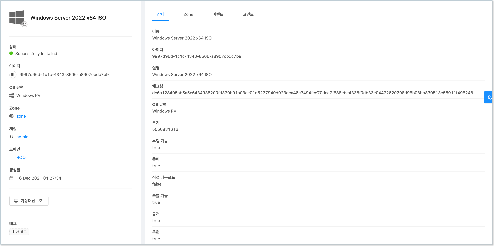{ width="600" }
</center>

## 드라이버 이미지 준비

Windows 운영체제 기반의 가상머신에는 Cell 하이퍼바이저 상에서 가상머신의 각종 디바이스를 최적화하여 연결, 사용할 수 있도록 전용 드라이버를 설치해야 합니다. 

전용 드라이버는 VirtIO Windows 드라이버라고 부르며, 스토리지, 네트워크 등의 각종 장치에 대한 드라이버를 제공합니다. 해당 드라이버는 ISO 파일 형식으로 제공합니다. 

최신의 드라이버 ISO는 다음의 URL을 통해 확인하여 다운로드 할 수 있습니다. 

```
http://images.ablecloud.io/virtio-win/
```

드라이버 ISO는 운영체제 ISO를 등록하는 방법과 동일한 방법을 사용합니다. 

먼저 `이미지 > ISO` 화면으로 이동하여 `ISO 등록` 버튼을 클릭하여 다음과 같이 드라이버 이미지 등록을 위한 정보를 입력합니다. 

<center>
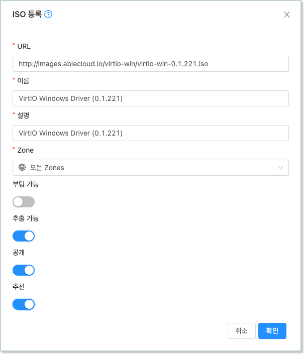{ width="450" }
</center>

위의 대화상자에서 "확인" 버튼을 클릭하면 드라이버 이미지가 Mold에 등록됩니다. 

## 네트워크 준비

ISO 이미지를 이용해 가상머신을 생성하기 전에, 먼저 가상머신이 연결할 네트워크를 준비해야 합니다. ABLESTACK Mold는 다양한 형식의 네트워크를 선택적으로 만들어 가상머신에 연결할 수 있습니다. ABLESTACK Mold의 기본 네트워크 형식은 Isolated Network입니다. 

!!! info "가상머신을 위한 인터넷 가능 네트워크"
    가상머신을 설치할 때, 사용자가 원하는 애플리케이션 설치 및 패키지 설치를 위해 인터넷 연결이 필요할 수 있습니다. ABLESTACK Mold를 이용해 가상머신을 생성할 때에는 인터넷 연결이 가능한 네트워크를 사용하는 것을 권장합니다. 단, ISO에 있는 기본 패키지 만을 사용하는 경우에는 인터넷 연결을 필요로 하지 않습니다. 

가상머신에 연결할 네트워크를 준비하기 위해 `네트워크 > 가상머신용 네트워크` 화면으로 이동한 후 `네트워크 추가` 버튼을 클릭하여 "네트워크 추가" 대화상자를 표시합니다. 

<center>
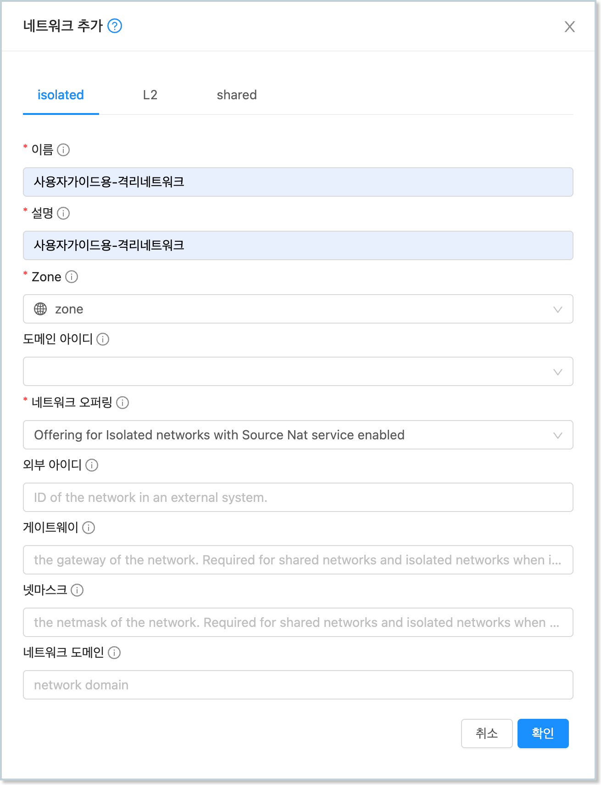{ width="400" }
</center>

"네트워크 추가" 대화 상자에서 "Isolated" 탭을 선택하면 다음과 같은 입력항목을 확인할 수 있습니다. 

- 이름 : 신규로 생성할 네트워크의 이름
- 설명 : 네트워크에 대한 설명
- Zone : 네트워크가 배포될 ABLESTACK의 Zone
- 도메인 아이디 : 네트워크를 사용할 도메인 아이디 (기본값 : 네트워크를 생성한 도메인)
- 네트워크 오퍼링 : 네트워크에 적용할 네트워크 제공 정책 (특별한 설정이 없다면 기본 정책이 적용됨)
- 외부 아이디 : 외부 시스템(Mold와 연결된 SDN, 외부 네트워크 장치) 내의 네트워크 ID
- 게이트웨이 : Isolated 네트워크의 vRouter의 사설 네트워크의 IP 주소(자동으로 생성)
- 넷마스크 : Isolated 네트워크의 사설 네트워크의 서브넷 마스크(자동으로 생성)
- 네트워크 도메인 : 네트워크의 도메인 주소(자동으로 생성, cloud.internal)

가상머신 준비를 위한 네트워크는 위의 항목 중, 이름과 설명만 입력하면 기본값이 설정되어 자동으로 생성됩니다. 다음의 그림은 네트워크 생성 결과는 `네트워크 > 가상머신용 네트워크`에서 조회한 상세화면 결과의 예 입니다. 

<center>
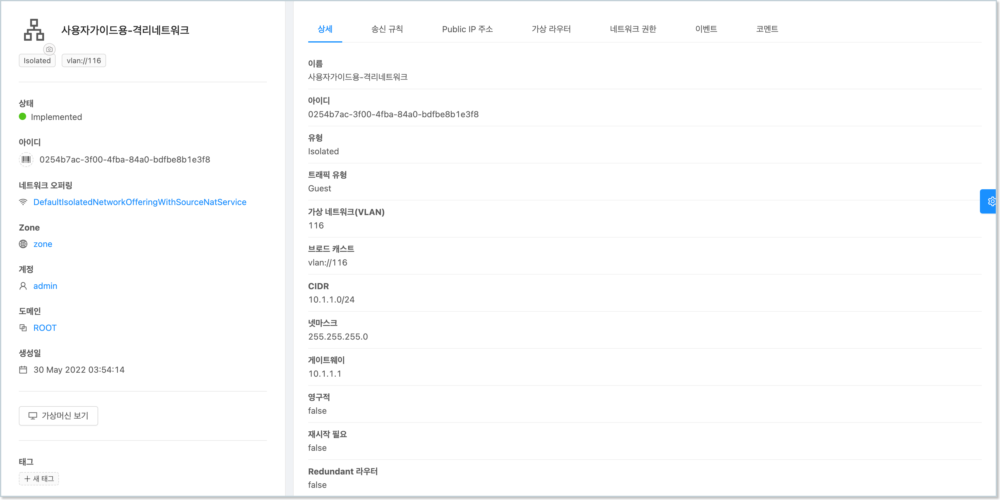{ width="600" }
</center>

## ISO를 이용한 가상머신 생성

ISO와 가상머신 생성용 네트워크가 준비되었다면 이제 ISO를 이용해 가상머신을 생성합니다. 가상머신의 생성을 위해 `컴퓨트 > 가상머신` 화면으로 이동해 `가상머신 추가` 버튼을 클릭하여 "새 가상머신" 마법사를 실행합니다. 가상머신 배포는 다음의 단계로 이루어집니다. 

1. 배포 인프라 선택 : 가상머신을 배포할 인프라 선택
2. 템플릿/ISO : 가상머신 생성에 사용할 이미지 선택
3. 컴퓨트 오퍼링 : 가상머신에 할당할 CPU, Memory 자원 선택
4. 디스크크기 : 가상머신의 루트 디스크 크기 선택
5. 네트워크 : 가상머신에 연결할 네트워크 선택
6. SSH키 쌍 : 가상머신에 할당할 SSH 키 쌍 정보 선택 (가상머신 준비 단계에서는 사용하지 않음)
7. 확장모드 : EFI, UserData 등의 확장 정보 선택
8. 상세 : 가상머신 기타 정보 입력

먼저 가상머신을 배포할 인프라를 선택합니다. "새 가상머신" 마법사의 배포 인프라 선택 단계의 화면은 다음과 같습니다. 

<center>
{ width="600" }
</center>

가상머신은 사용자가 선택한 위치에 배포됩니다. 기본적으로 ABLESTACK의 기본 Zone이 선택되어 있고, 나머지 자원은 ABLESTACK이 자동으로 선택합니다. 별도의 배포 인프라를 선택해야 하는 경우, Pod, 클러스터, 호스트를 차례로 선택합니다. 

인프라를 선택한 후 가상머신 생성에 사용할 이미지를 선택합니다. 마법사의 템플릿/ISO 선택 화면은 다음과 같습니다. 

<center>
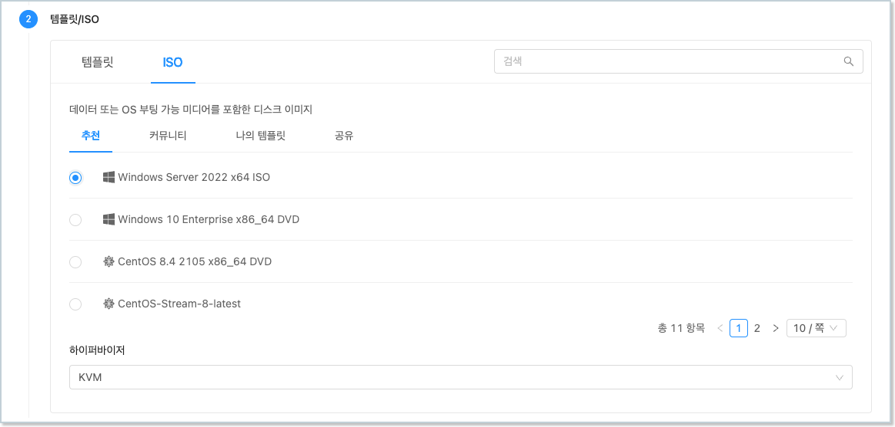{ width="600" }
</center>

템플릿/ISO 선택화면에서 "ISO" 탭을 선택하고 목록에서 가상머신 생성에 사용할 ISO 이미지를 선택합니다. 

해당 이미지를 사용하기 위해서는 ABLESTACK이 사용하고 있는 기반 하이퍼바이저를 지정해야 합니다. "하이퍼바이저" 항목에서 적합한 하이퍼바이저를 선택합니다. 만약 Cell 하이퍼바이저를 사용하고 있는 경우, KVM을 선택합니다. 

가상머신을 실행하기 위해서는 해당 가상머신을 실행하기 위한 적절한 컴퓨트 자원, 즉 CPU 및 메모리 자원이 필요합니다. "컴퓨트 오퍼링" 선택 단계에서 해당 자원을 선택합니다. 해당 화면은 다음과 같습니다. 

<center>
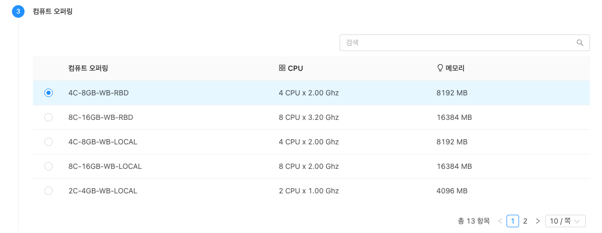{ width="600" }
</center>

Windows Server 기반의 기본 가상머신 이미지를 생성하기 위해서는 4vCore의 CPU, 8GB 메모리면 충분합니다. 목록에서 필요한 컴퓨트 자원을 선택합니다. 

가상머신에 ISO 이미지를 이용해 운영체제를 설치하려면 가상머신에 루트 디스크가 연결되어야 합니다. 루트 디스크를 선택하는 화면은 다음과 같습니다. 

<center>
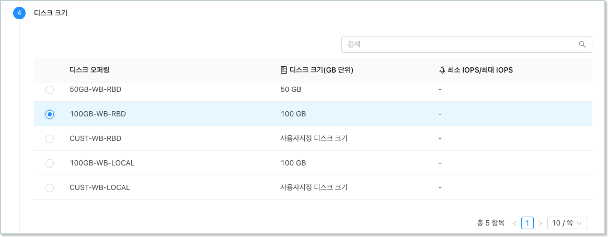{ width="600" }
</center>

가상머신의 디스크는 Windows의 경우 40GB 이상의 크기로 설정하여 생성하는 것을 권장합니다. "디스크 크기" 화면의 목록에서 적정한 디스크 오퍼링을 선택합니다. 

가상머신 실행을 이해서는 NIC의 연결이 필요합니다. NIC의 연결은 특정 네트워크에 연결되어야 합니다. 따라서 "네트워크" 화면에서 가상머신 NIC에 연결할 네트워크를 선택해야 합니다. 해당 화면은 다음과 같습니다. 

<center>
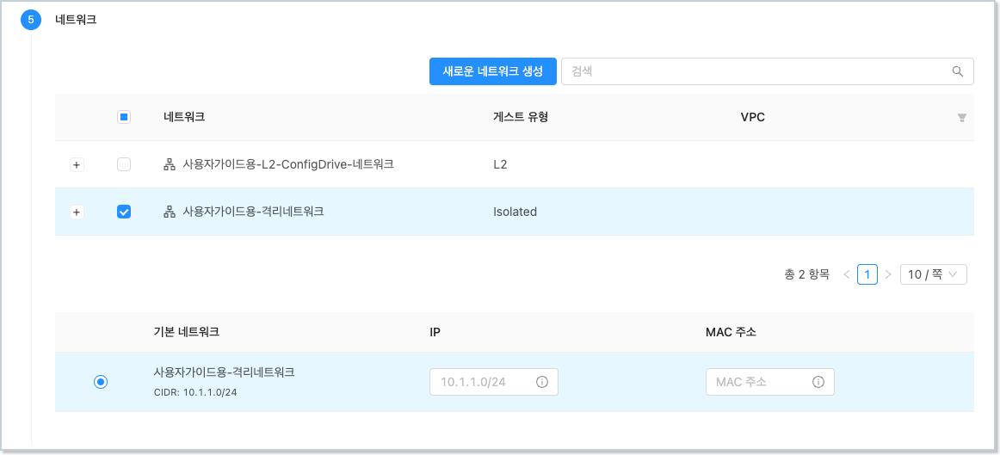{ width="600" }
</center>

"네트워크" 화면에 표시되는 목록 중, 가상머신 준비를 위해 생성한 네트워크를 선택합니다. 네트워크를 선택하면 선택된 네트워크에 대한 기본 정보 및 CIDR 정보, 그리고 IP 정보, MAC 주소 정보를 입력할 수 있습니다. 가상머신 준비를 위해서는 이러한 정보를 입력하지 않고 기본값을 사용합니다.  

!!! warning "가상머신 네트워크 선택 시 주의사항"
    가상머신에는 1개 이상의 NIC를 설치할 수 있습니다. 따라서 네트워크는 다중으로 선택할 수 있도록 체크박스로 되어 있습니다. 따라서 가상머신 준비용 네트워크를 선택할 때 해당 네트워크 외에 다른 네트워크가 선택되어 있지는 않은지 확인해야 합니다. 

다음 단계는 SSH 키 쌍을 설정하는 단계인데, Windows 가상머신 준비 단계에서는 해당 설정을 적용할 수 없기 때문에 해당 단계는 선택하지 않습니다. 

가상머신의 확장 설정을 하기 위해서 확장 모드 단계의 "고급 설정 표시" 단추를 클릭하여 해당 화면을 엽니다. 해당 화면은 다음과 같습니다. 

<center>
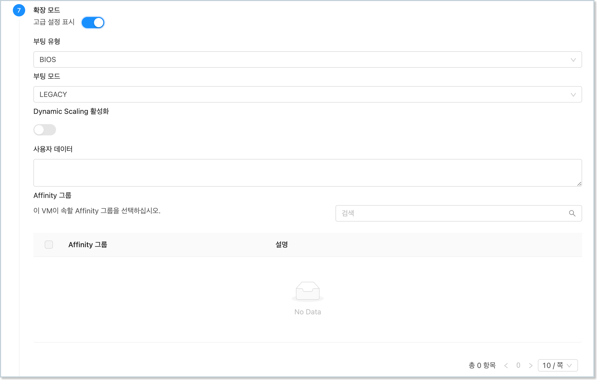{ width="600" }
</center>

확장 모드에서는 가상머신의 부팅 유형을 설정합니다. 가상머신은 레거시 방식 또는 EFI 방식 중에서 하나를 부팅 방식으로 선택할 수 있습니다. EFI 방식을 선택하는 경우 부팅 모드를 LEGACY 또는 SECURE 중에서 선택할 수 있습니다. 원하는 가상머신의 부팅 방식을 선택합니다. 

!!! warning "부팅 유형 선택 시 주의사항"
    가상머신은 초기 부팅 유형 선택에 의해 가상머신이 부팅되고, 운영체제가 설치되면 그 다음부터 가상머신은 반드시 해당 부팅 유형으로 시작되어야 합니다. 따라서 가상머신 부팅 유형을 선택할 때 주의해야 합니다. 기본값은 BIOS, LEGACY 모드입니다. 

마지막으로 가상머신의 상세 정보를 설정합니다. "상세" 화면은 다음과 같습니다. 

<center>
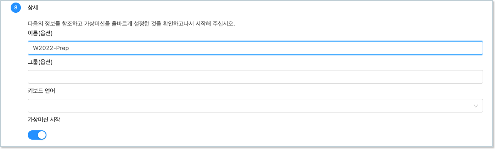{ width="600" }
</center>

상세화면에서 가상머신의 이름을 입력하면 가상머신을 시작할 모든 준비가 완료됩니다. 가상머신을 실행합니다. 

## 운영체제 설치

가상머신이 실행되면 `컴퓨트 > 가상머신` 화면에 표시되는 목록에서 해당 가상머신의 실행 여부를 확인할 수 있습니다. 다음의 그림과 같습니다. 

<center>
{ width="600" }
</center>

위의 그림에서 :fontawesome-solid-ellipsis-v: 버튼에 마우스를 올려 놓으면 메뉴가 표시되는데 첫번째 메뉴 아이콘이 가상머신의 콘솔을 표시하는 메뉴입니다. 해당 메뉴를 클릭하면 브라우저의 신규 탭에 해당 가상머신의 콘솔이 다음과 같이 표시됩니다. 

<center>
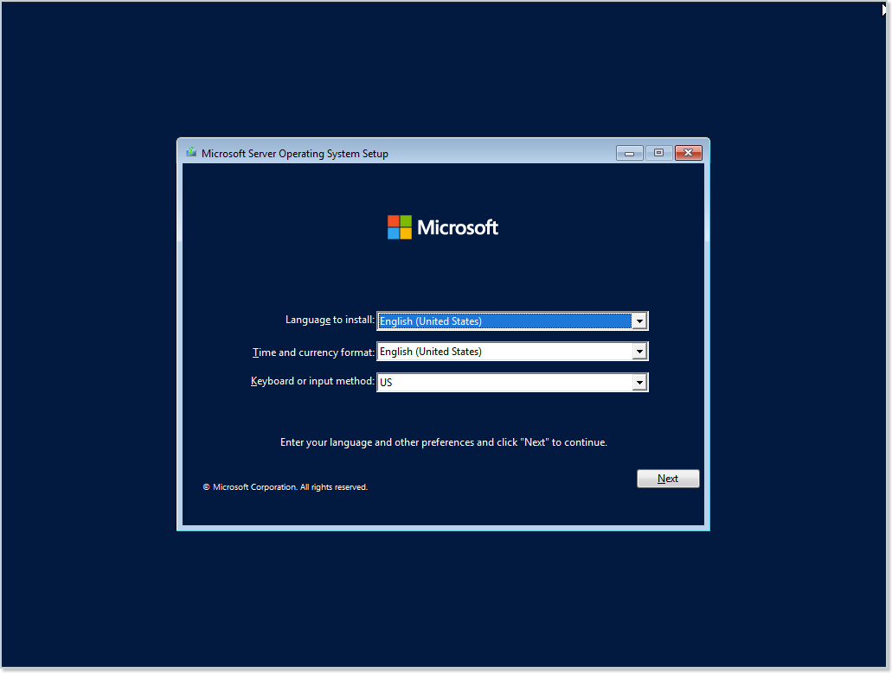{ width="600" }
</center>

콘솔에 접속했다면 화면에 표시된 선택항목 (Language to install, Time and currency format, Keyboard or input method)은 기본값으로 선택한 후 "Next" 버튼을 클릭합니다. 

<center>
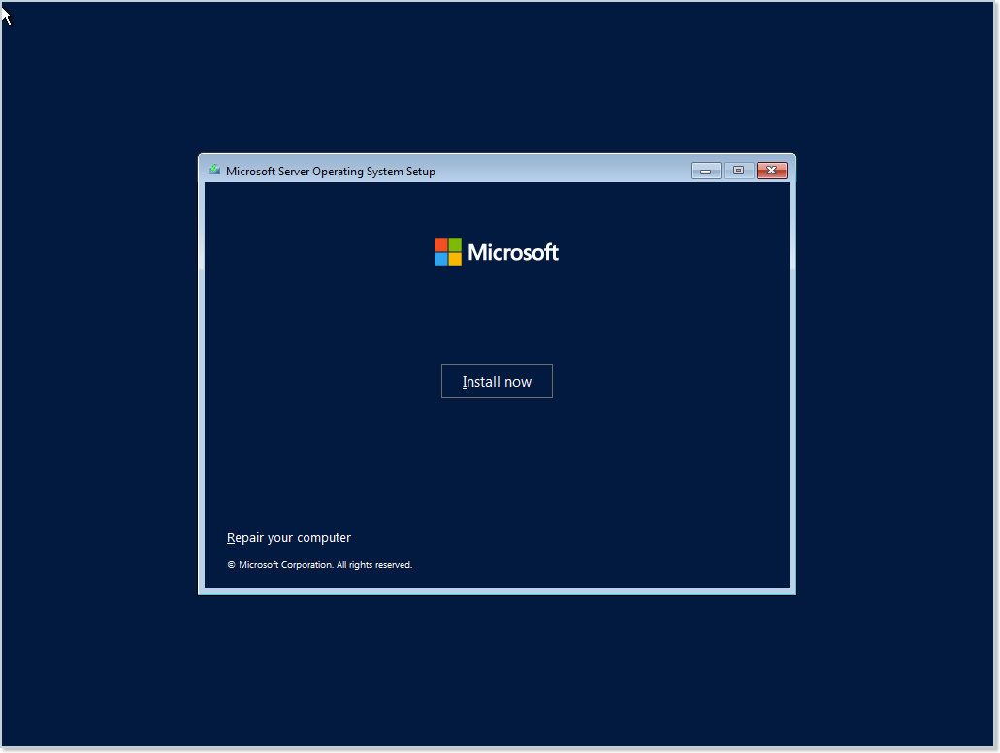{ width="600" }
</center>

위와 같은 설치 시작 화면에서 "Install now"를 클릭합니다. 

<center>
{ width="600" }
</center>

설치하고자 하는 운영체제 선택 화면에서 원하는 운영체제 종류를 선택합니다. 본 예제에서는 'Windows Server 2022 Standard Evaluation (Desktop Experience)'를 선택하였습니다. 설치할 운영체제를 선택한 후 "Next" 버튼을 클릭합니다. 

<center>
{ width="600" }
</center>

라이선스 문서 동의 화면에서 라이선스 동의를 선택한 후 "Next" 버튼을 클릭합니다. 

<center>
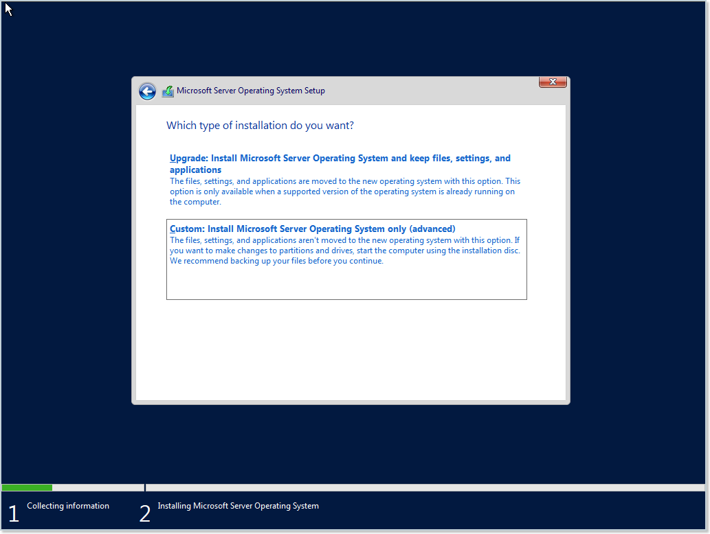{ width="600" }
</center>

설치 형식을 선택하는 화면에서 "Custom: Install Microsoft Server Operating System only (advanced)"을 선택합니다. 

<center>
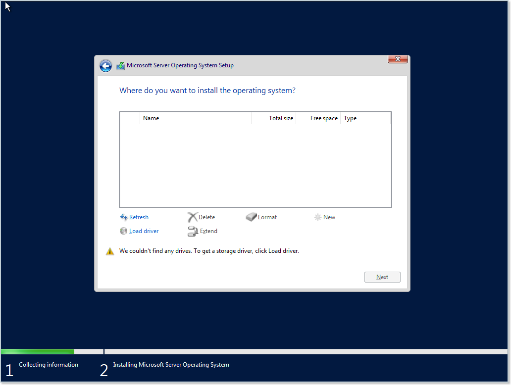{ width="600" }
</center>

운영체제를 설치할 위치를 선택하는 화면이 위와 같이 표시되는데 디스크가 표시되지 않는 것을 확인할 수 있습니다. 이는 기본적인 Windows 설치 디스크에 Cell 하이퍼바이저 장치를 위한 드라이버가 설치되어 있지 않기 때문에 실제 가상머신에는 디스크가 연결되어 있지만 설치 화면에는 표시되지 않는 상태입니다. 

이 문제를 해결하기 위한 절차는 다음과 같습니다. 

1. 가상머신에 연결된 Windows 설치 ISO 연결을 해제합니다.
2. 가상머신에 VirtIO Windows Driver ISO 이미지를 연결합니다. 
3. 가상머신에 드라이버를 설치합니다. 
4. 가상머신에 연결된 VirtIO Windows Driver ISO 이미지의 연결을 해제하고 Windows 설치 ISO를 다시 연결합니다. 
5. Windows 설치를 진행합니다. 

첫번째 단계로 가상머신에 연결된 Windows 설치 ISO 연결을 해제 합니다.

<center>
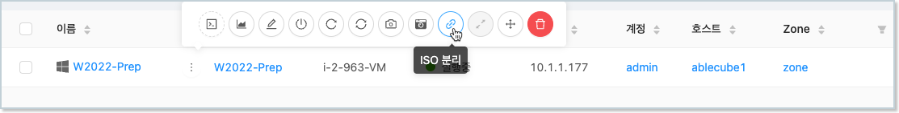{ width="600" }
</center>

위의 그림과 같이 가상머신 목록에서 해당 가상머신의 액션 아이콘 버튼을 표시한 후 "ISO 분리" 버튼을 다음과 같이 클릭합니다. 

<center>
{ width="350" }
</center>

"ISO 분리" 확인 대화 상자에서 "확인" 버튼을 클릭하여 Windows 설치 ISO 이미지 연결을 해제합니다. 

두번째 단계에서 가상머신에 VirtIO Windows Driver ISO 이미지를 연결합니다. 

<center>
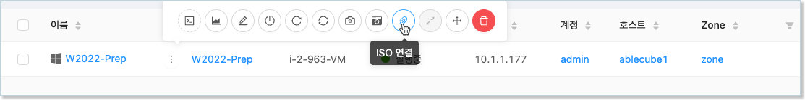{ width="600" }
</center>

위의 그림과 같이 가상머신 목록에서 해당 가상머신의 액션 아이콘 버튼을 표시한 후 "ISO 연결" 버튼을 다음과 같이 클릭합니다. 

<center>
{ width="450" }
</center>

"ISO 연결" 대화상자에서 VirtIO Windows Driver 이미지를 선택한 후 "확인" 버튼을 클릭합니다. 가상머신에 드라이버 ISO 이미지가 연결됩니다. 

세번째 단계에서 가상머신에 드라이버를 설치합니다. 드라이버를 설치하기 위해 가상머신 콘솔로 다시 이동한 후 "Load driver" 아이콘을 클릭합니다. 

<center>
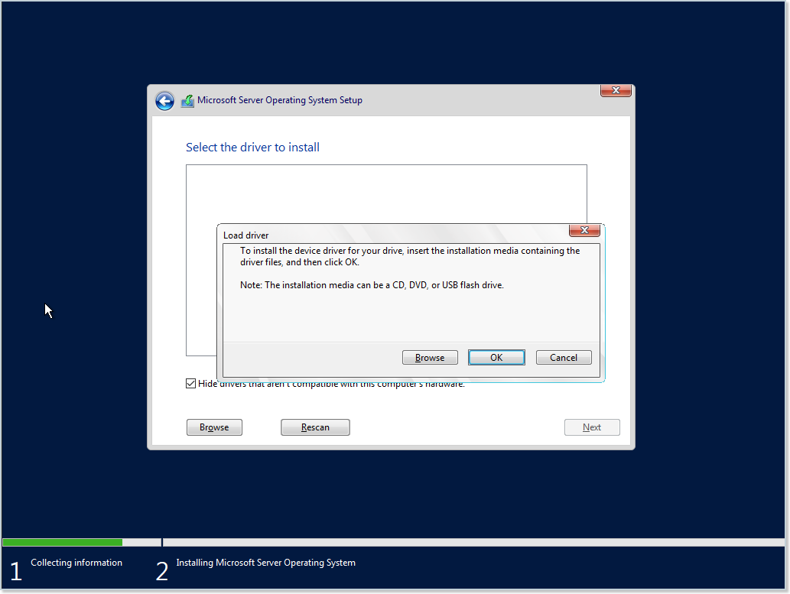{ width="600" }
</center>

위의 그림과 같이 Load driver 대화상자가 표시되면 "Browse" 버튼을 클릭합니다. 

<center>
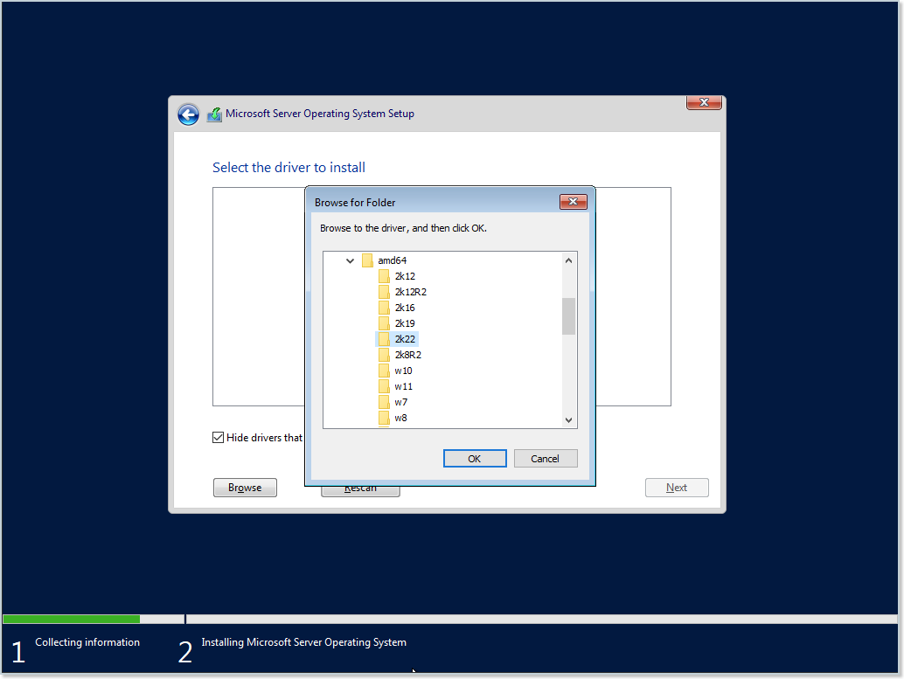{ width="600" }
</center>

위의 그림과 같이 "Browse for Folder" 대화상자가 표시됩니다. `CD Drive\amd64\2k22` 경로(운영체제에 따라 적절한 운영체제 경로를 선택)를 선택한 후 "OK" 버튼을 클릭합니다.

<center>
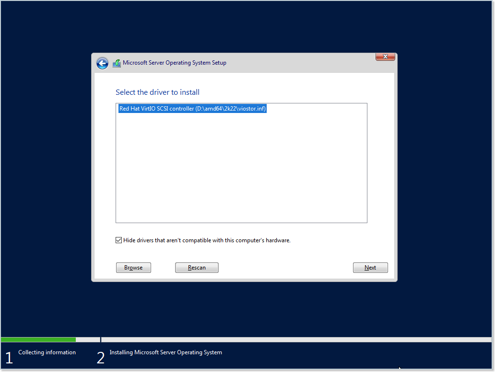{ width="600" }
</center>

가상머신에 디스크가 정상적으로 연결되어 있다면 위와 같이 설치할 드라이버, VirtIO SCSI controller가 표시됩니다. "Next" 버튼을 클릭합니다. 드라이버가 설치된 후 다시 운영체제 설치 위치를 선택하는 화면으로 다음과 같이 이동됩니다. 

<center>
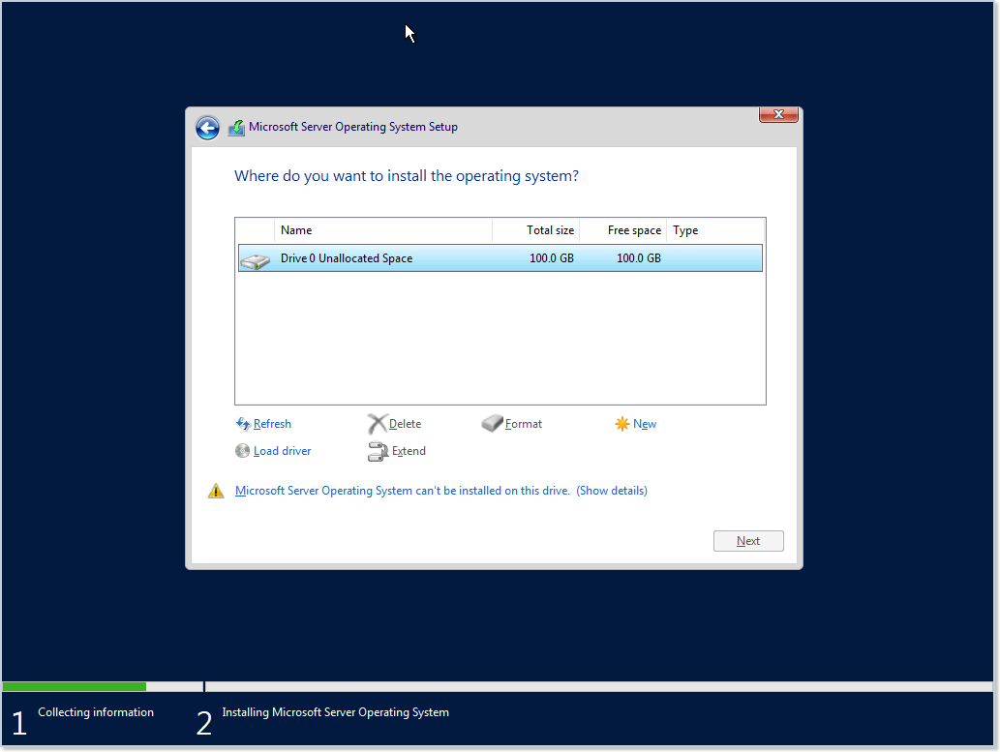{ width="600" }
</center>

네번째 단계에서 가상머신에 연결된 VirtIO Windows Driver ISO 이미지의 연결을 해제하고, Windows 설치 이미지를 연결합니다. 

ISO 이미지의 연결을 해제하고, 새로운 이미지를 선택하여 연결하는 과정은 위의 첫번째, 두번째 단계에서 설명한 내용과 동일합니다. 본 과정을 통해 Windows 설치 이미지를 가상머신에 다시 연결한 후 콘솔 화면에서 새로 연결된 설치 이미지를 인식하도록 하기 위해 "Refresh" 버튼을 클릭합니다. 새로 고침이 정상적으로 이루어지면 "Next" 버튼을 클릭합니다. 

<center>
{ width="600" }
</center>

위와 같이 Windows 설치가 진행됩니다. 모든 파일 및 기능이 설치가 되면 가상머신이 자동으로 재시작 됩니다. 그리고 운영체제가 설치된 디스크를 이용해 가상머신을 부팅하게 됩니다. 

가상머신 준비 과정을 거친 후 가상머신 사용자화를 위한 단계를 시작합니다. 

<center>
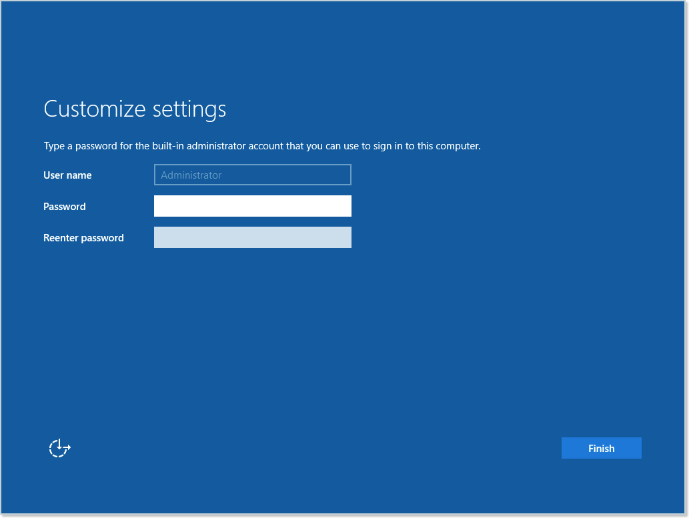{ width="600" }
</center>

위의 화면에서 관리자(Administrator) 계정에 대한 비밀번호를 입력하고 "Finish" 버튼을 클릭합니다. 

가상머신 설치 작업이 완료되고, 가상머신의 Windows 초기 화면이 표시됩니다. 마지막으로 가상머신에 연결된 Windows 설치 이미지의 연결을 해제합니다. 

## Windows 드라이버 설치

가상머신에 Windows 운영체제를 설치할 때 디스크 드라이버를 설치했지만 가상머신에 연결되어 있는 다른 디바이스에 대한 드라이버, 그리고 가상머신 에이전트 등은 추가적인 설치 작업이 필요합니다. 

가상머신에 전체적인 드라이버 설치를 위한 절차는 다음과 같습니다. 

1. 가상머신에 VirtIO Windows Driver ISO 이미지를 연결합니다. 
2. 윈도우즈에 로그인 해서 탐색기로 연결된 CD 드라이브로 이동합니다. 
3. 드라이버 설치를 위해 Setup 프로그램을 실행한다. 
4. 가상머신에 연결된 VirtIO Windows Driver ISO 이미지 연결을 해제합니다. 

첫번째로 Windows 드라이버를 설치하고자 하는 가상머신에 VirtIO Windows Driver ISO 이미지를 연결합니다. 

<center>
{ width="600" }
</center>

위의 그림과 같이 가상머신의 액션 버튼 메뉴의 "ISO 연결" 버튼을 클릭합니다. 

<center>
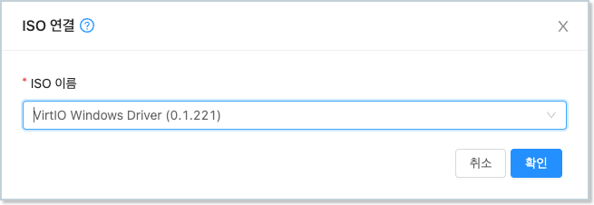{ width="600" }
</center>

"ISO 연결" 대화상자에서 VirtIO Windows Driver 이미지를 선택하고 "확인" 버튼을 클릭합니다. 가상머신에 ISO가 연결됩니다. 

두번째로 윈도우즈에 로그인해서 CD 드라이브로 이동합니다. 

콘솔에 접속하여 "Ctrl+Alt+Del" 키를 누릅니다. Administrator 계정에 대한 로그인 화면이 표시됩니다. 

<center>
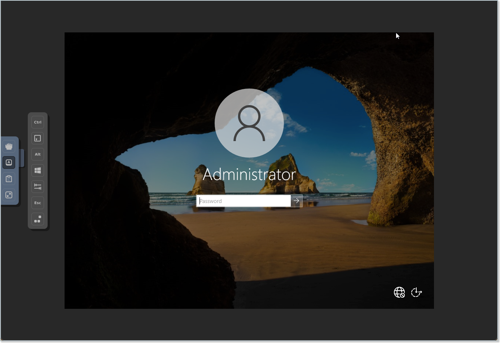{ width="600" }
</center>

Windows에 로그인 한 후, 윈도우즈 탐색기를 실행하여 연결되어 있는 CD 드라이브로 이동합니다. 

<center>
{ width="600" }
</center>

탐색기에 표시된 파일 중 `virtio-win-gt-x64` 프로그램을 더블클릭하여 실행합니다. 설치 마법사가 다음과 같이 실행됩니다. 

<center>
{ width="600" }
</center>

마법사 단계별로 실행하여 설치를 완료합니다. 

설치가 완료되면 탐색기에 표시된 파일 중 `virtio-win-guest-tools` 프로그램을 더블클릭하여 실행합니다. 설치 마법사가 실행되면 마법사 단계별로 실행하여 설치를 완료합니다. 

Windows 가상머신을 위한 모든 드라이버 설치가 완료되었다면 마지막으로 드라이버 ISO 이미지의 연결을 해제합니다. 

## Windows 시스템 일반화

새로운 가상머신을 만들 때, Windows 이미지를 배포하려면 먼저 해당 이미지를 일반화 해야 합니다. 이미지를 일반화하면 설치된 드라이버 및 컴퓨터 SID(보안 식별자)와 같은 현재 컴퓨터를 위해 설정된 정보가 제거됩니다. 단, 드라이버는 설치 정보가 제거되는 것이지 PC에 있는 드라이버 파일이 제거되는 것이 아닙니다. 따라서 새로운 가상머신에 해당 디바이스가 연결되면 드라이버 설치작업이 다시 이루어집니다. 

!!! info "일반화 권장 및 일반화 횟수 제한"
    가상머신은 일반적으로 비슷한 하드웨어를 사용합니다. 하지만 이러한 환경에서도 Windows 설치를 일반화 하여 Windows 설치에서 고유한 PC 관련 정보를 제거해야 합니다. 

    특히 보안 관련 기존 정보가 남아 있는 경우 Windows 기반의 도메인 관리 등의 다양한 보안 옵션을 사용하지 못하게 됩니다. 

    일반화 과정을 통해 Windows 가상머신 이미지를 안전하게 사용할 수 있으며 Windows 8.1 및 Windows Server 2012 이상의 운영체제인 경우 일반화 횟수가 1001번으로 제한됩니다. 

현재 가상머신을 일반화 하기 위해서 가상머신 콘솔에서 PowerShell을 다음의 그림과 같이 실행합니다. 

<center>
{ width="600" }
</center>

PowerShell을 실행 한 후 명령창에 다음의 명령을 입력하여 가상머신의 이미지를 일반화 합니다. 

```
C:> cd \Windows\System32\Sysprep
C:\Windows\System32\Sysprep> .\sysprep.exe /generalize /oobe /shutdown 
```

위의 명령을 실행하면 일반화 과정이 실행 되고, 가상머신이 자동으로 종료됩니다. 

## 가상머신 템플릿 생성

가상머신 설치 및 Windows 드라이버의 설치, Windows 이미지 일반화가 정상적으로 완료 되었다면, 마지막으로 가상머신 템플릿을 생성합니다. 가상머신 템플릿은 사용자가 생성한 가상머신의 형상을 그대로 이미지로 만들어, 언제든지 동일한 형상의 가상머신을 바로 만들 수 있도록 하기 위해 제공되는 기능입니다. 

!!! info "가상머신 템플릿 생성 없이 가상머신을 사용할 수 있는가?"
    사용자는 가상머신을 생성할 때 템플릿을 이용해서 생성할지, 또는 ISO를 이용해서 생성할지의 여부를 결정할 수 있습니다. 즉, 사용자는 반드시 템플릿을 생성해야 하는 것은 아닙니다. 만약 모든 가상머신을 ISO를 이용해 생성하기로 하는 경우 별도로 템플릿을 생성할 필요는 없습니다. 단, ISO를 통해 가상머신을 생성하는 경우, ABLESTACK Mold에서 제공하는 다양한 자동화 기능 중 일부를 사용하지 못할 수 있습니다. 

가상머신 템플릿을 생성하기 위해 실행 중인 가상머신을 정지합니다. 가상머신 목록 또는 상세화면의 가상머신 메뉴에서 "가상머신 정지" 버튼을 클릭합니다. 

!!! info "정지된 가상머신의 인식"
    Windows 이미지의 일반화 과정을 통해 자동으로 가상머신이 종료된 경우, Mold에서는 해당 가상머신의 종료 여부를 확인하는데 최대 3분의 시간이 소요될 수 있습니다. 

    만약 이미 종료된 가상머신에 대해 Mold에서 가상머신을 정지하게 되면 바로 정시 상태로 전환됩니다. 

가상머신이 정지된 후 가상머신의 상세 페이지를 확인하면 다음과 같습니다. 

<center>
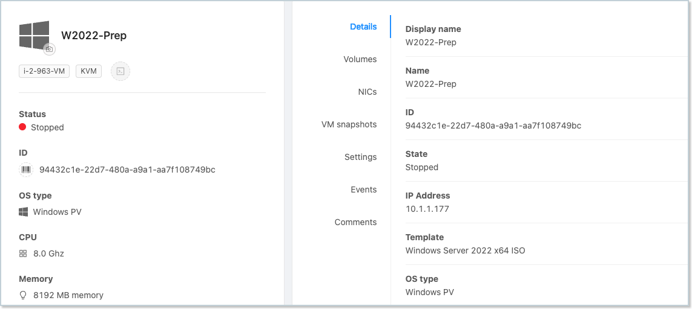{ width="600" }
</center>

위의 화면에서 우측의 상세 화면에서 "볼륨" 탭을 클릭하면 해당 가상머신에 연결된 볼륨의 목록이 표시됩니다. 처음 만든 가상머신이기 때문에 ROOT 디스크만 표시됩니다. 해당 디스크를 클릭하여 볼륨의 상세 화면으로 이동합니다. 다음의 그림과 같습니다. 

<center>
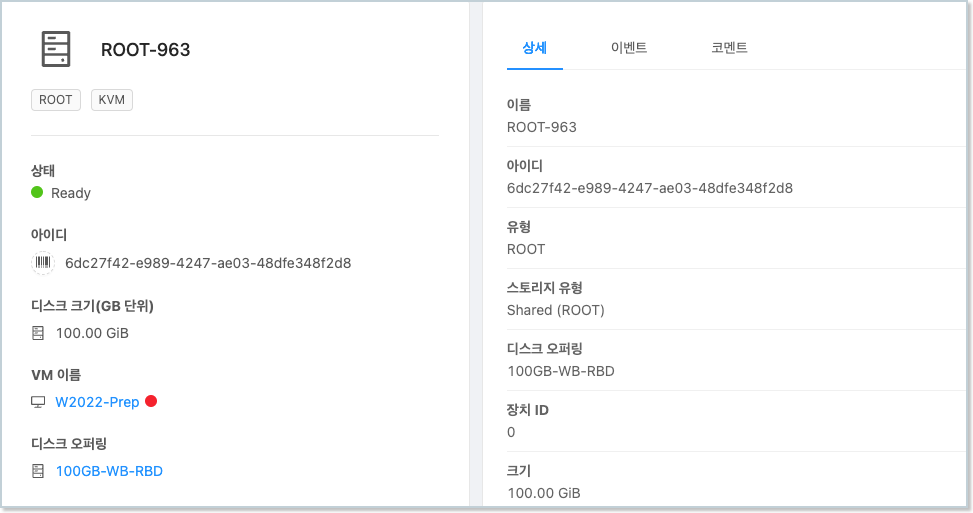{ width="600" }
</center>

위 화면에서 우측 상단의 볼륨 액션 메뉴 중 맨 우측의 "볼륨으로 템플릿 생성" 버튼을 클릭하여 가상머신 템플릿 생성을 시작합니다. 다음과 같은 "볼륨으로 템플릿 생성" 대화상자가 표시됩니다. 

<center>
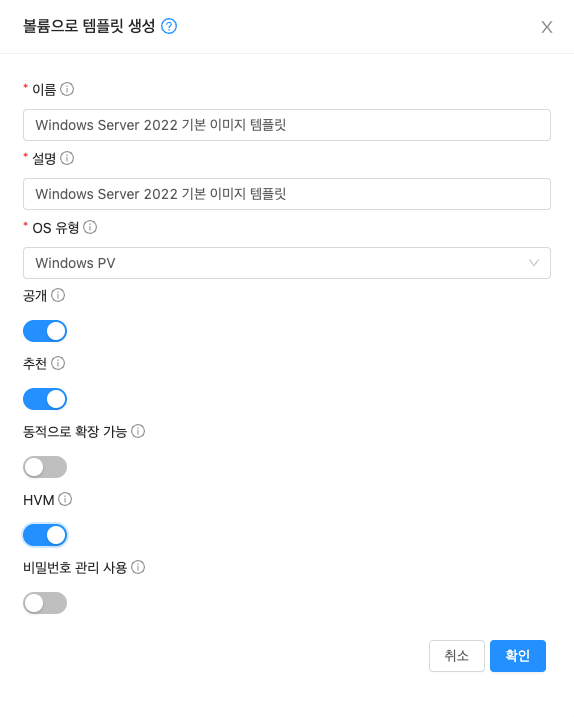{ width="450" }
</center>

"볼륨으로 템플릿 생성" 대화상자는 정지되어 있는 가상머신의 루트 디스크를 이용해 해당 가상머신에 대한 이미지를 생성하는 기능을 제공합니다. 다음의 정보를 입력합니다. 

- 이름 : 템플릿 이미지의 이름 (예제에서는 "Windows Server 2022 기본 이미지 템플릿" )
- 설명 : 템플릿 이미지에 대한 설명 (예제에서는 이름과 동일하게 설정)
- OS유형 : 이미지의 원본 가상머신의 OS 유형 (예제에서는 Windows PV)
- 공개 : 이미지를 모든 사용자에게 공개할 것인지의 여부 (예제에서는 공개)
- 추천 : 이미지를 추전 이미지로 설정할 것인지의 여부 (예제에서는 추천)
- 동적으로 확장 가능 : 템플릿에 의해 생성된 가상머신에 대해 동적 스케일링을 지원할 것인지의 여부 (예제에서는 선택하지 않음)
- HVM : 하드웨어 가상화를 지원하는지의 여부 (예제에서는 선택)
- 비밀번호 관리 사용 : 가상머신 생성 시 root 사용자에 대한 비밀번호를 생성할 것인지의 여부 (예제에서는 선택하지 않음)

모든 정보를 입력한 후 "확인" 버튼을 눌러 템플릿 생성을 시작합니다. 생성이 완료되면 해당 템플릿은 `이미지 > 템플릿` 화면의 목록을 통해 확인할 수 있으며, 해당 목록을 클릭하여 상세화면으로 확인하면 다음과 같이 템플릿 이미지가 생성됨을 확인할 수 있습니다. 

<center>
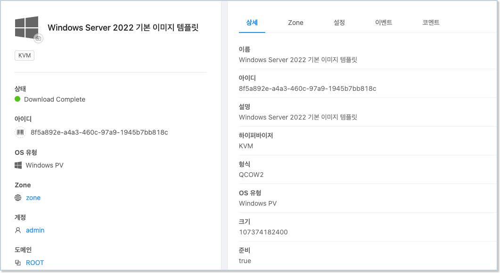{ width="600" }
</center>

이제 생성된 기본 템플릿을 이용해 언제든지 가상머신을 생성할 수 있습니다. 

!!! info "템플릿을 생성한 원본 가상머신의 관리"
    가상머신의 형상, 즉 최초로 생성한 원본 가상머신은 나중에 시스템을 운영할 때, 다양한 기능을 추가하여 템플릿을 생성하고자 할 때 유용하게 사용할 수 있습니다. 따라서 이러한 템플릿 운영 편리성을 위해 최초로 생성한 가상머신은 가상머신 스냅샷 등을 통해 시점별로 보관하여 관리하는 것을 권장합니다. 