ABLESTACK은 가상머신에서 사용할 수 있도록 디스크를 생성하고, 연결, 관리할 수 있는 다양한 기능을 제공합니다. 본 가이드에서는 생성된 가상머신의 볼륨을 Windows 운영체제 상에서 사용할 수 있는 방법을 설명합니다.

## 루트 디스크 확장

템플릿 이미지를 통해 가상머신을 생성하면 기본적으로 템플릿이 가진 루트 디스크 사이즈를 그대로 사용하게 됩니다.

ABLESTACK은 가상머신을 생성할 때, 그리고 가상머신이 운영 중일 때 루트 디스크의 크기를 변경하여 디스크를 확장할 수 있도록 기능을 제공합니다.

### 가상머신 생성 시 확장

가상머신 생성 시 루트 디스크 사이즈를 변경하려면 다음의 순서로 가상머신을 생성합니다.

1. 배포 인프라를 선택합니다.

2. 템플릿/ISO를 선택한 후 "루트 디스크 크기 무시"를 선택합니다. 그리고 원하는 디스크 크기를 입력합니다. 이 때 루트 디스크의 크기를 반드시 처음에 설정된 크기보다 커야 합니다.
  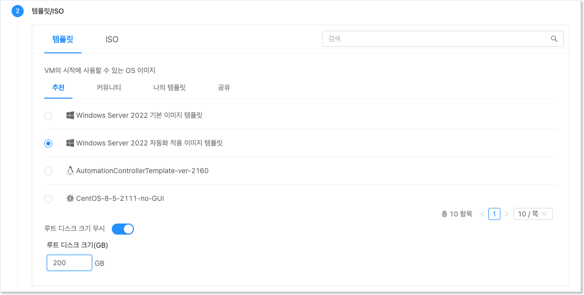{ style="margin-top: 20px;" width="600" }

3. 컴퓨트 오퍼링을 선택합니다.

4. 데이터 디스크를 선택합니다.

5. 네트워크를 선택합니다.

6. SSH 키 쌍을 선택합니다.

7. 확장 모드를 설정합니다.

8. 상세 정보를 설정한 후 가상머신을 실행합니다.

위와 같이 가상머신을 실행하면 루트 디스크로 설정되어 있는 물리적인 디스크의 크기가 확장되어 여유공간이 있는 것을 확인할 수 있습니다.

### 가상머신 생성 후 확장

이미 생성되어 있는 가상머신의 루트 디스크 크기를 변경하고자 하는 경우에는 다음과 같이 가상머신의 디스크 크기를 변경할 수 있습니다.

1. 루트 디스크의 크기를 변경하고자 하는 가상머신의 상세화면으로 이동합니다.

2. "볼륨" 탭을 클릭하여 가상머신의 디스크 목록을 표시합니다.

3. 루트 디스크를 클릭하여 볼륨 상세 화면으로 이동합니다.

4. 우측 상단의 액션 아이콘 메뉴에서 "볼륨 크기 변경" 아이콘을 클릭합니다.

5. 현재 크기보다 큰 단위의 크기를 입력하고 "변경 완료"를 비활성화 한 후 "확인" 버튼을 클릭합니다.
  { style="margin-top: 20px;" width="450" }

6. 가상머신 내에서 디스크의 크기가 변경되었는지 확인합니다.

가상머신이 실행 중인 경우에도 디스크가 동적으로 변경됩니다. 가상머신 콘솔 등으로 가상머신에 접속하여 실행 결과를 바로 확인할 수 있습니다.

### 루트 디스크 확장

가상머신의 디스크를 확장하는 것은 물리적인 디스크의 용량을 확장하는 것입니다. 실제 가상머신의 ROOT 볼륨(C 드라이브)의 크기가 변경된 것이 아닙니다. 실제 ROOT 디스크(디스크 0)의 물리적인 용량을 확장한 상태에서 볼륨에 할당된 용량과 디스크의 물리적 용량을 비교하면 아직 할당되지 않는 물리적 용량을 확인할 수 있습니다.

다음의 순서로 디스크 용량을 확인합니다.

1. 윈도우즈에서 "컴퓨터 관리"를 실행합니다.
2. 왼쪽 트리에서 "스토리지 > 디스크 관리"를 클릭합니다.
3. 디스크 0에 대한 파티션 정보를 확인합니다.

위와 같은 순서로 디스크 정보를 확인하면 다음의 그림과 유사합니다.

<center>{ style="margin-top: 20px;" width="600" }</center>

위의 그림과 같이 현재 물리적인 디스크의 총 용량과 C 드라이브에 할당되어 있는 용량이 서로 다르고, 물리적인 디스크에 할당되지 않은 공간이 있음을 확인할 수 있습니다.

하지만 위의 그림과 같은 경우 C 드라이브를 확장할 수 없습니다. 확장하고자 하는 공간은 반드시 확장하고자 하는 볼륨의 바로 옆에 존재해야 합니다. 하지만 위의 그림을 보면 확장할 볼륨과 할당되지 않은 영역 사이에 "복구 파티션"이 있는 것을 확인할 수 있습니다. 파티션을 확장하기 위해서는 이 복구 파티션을 삭제해야 합니다.

!!! warning "복구 파티션 삭제 시 주의사항"
    복구 파티션은 Windows에 시스템 오류가 있을 때 이를 복구하기 위해 시동 복구 후 명령 프롬프트 등을 표시하기 위한 파티션 입니다.

    만약 복구 파티션을 삭제하는 경우 설치 매체, 즉 ISO 이미지가 없이 시동 복구 모드로 돌아갈 수 없습니다. 사용자는 복구 파티션 삭제에 매우 신중해야 하며, ABLESTACK Mold의 백업 기능 및 VM 스냅샷 기능 등을 이용해 장애 시 언제든 복구가 가능하도록 준비해야 합니다.

복구 파티션 삭제를 포함한 볼륨 확장 순서는 다음과 같습니다.

1. 관리자 모드로 cmd 창을 실행
2. diskpart 프로그램을 실행하고 복구 파티션을 삭제
3. 할당되지 않는 영역을 C 드라이브로 확장

먼저 Windows에서 관리자 모드로 cmd 창을 실행합니다.

<center>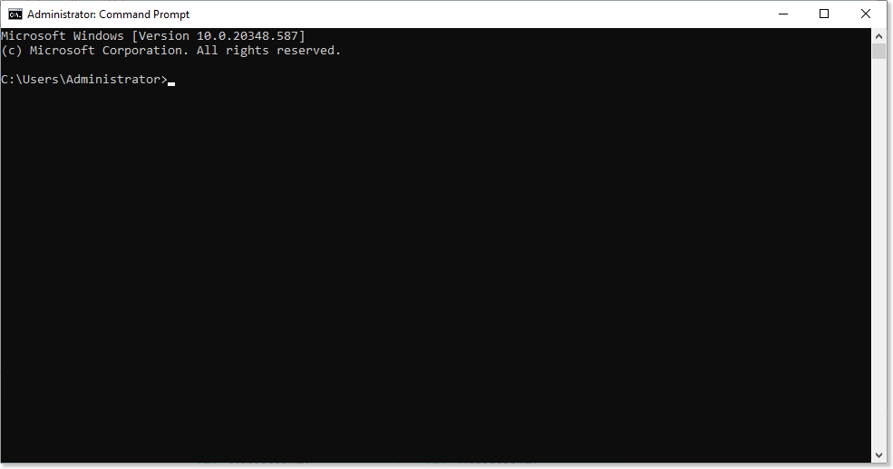{ style="margin-top: 20px;" width="600" }</center>

다음의 순서로 명령을 실행하여 복구 파티션을 찾습니다.

```
C:\> diskpart
DISKPART> list disk
DISKPART> sel disk 0
DISKPART> list par
```

표시된 파티션 목록에서 Recovery 타입으로 설정되어 있는 파티션 번호로 이동하여 파티션을 삭제합니다.

```
DISKPART> sel par 3
DISKPART> delete partition override
```

디스크 관리 화면에서 파티션이 삭제되고 할당되지 않은 디스크 용량에 추가되었음을 다음과 같이 확인할 수 있습니다.

<center>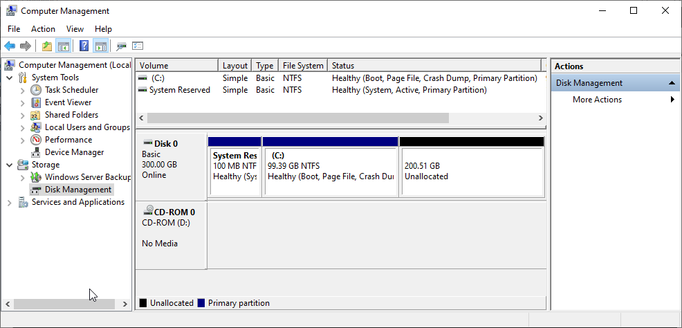{ style="margin-top: 20px;" width="600" }</center>

디스크 관리 화면에서 C 드라이브를 선택하고 마우스 오른쪽 버튼을 클릭하여 "볼륨 확장" 메뉴를 클릭합니다.

<center>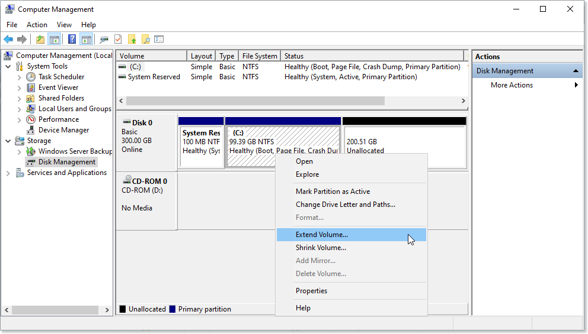{ style="margin-top: 20px;" width="600" }</center>

실행된 볼륨 확장 마법사에서 디스크의 미할당 용량 중 확장하고자 하는 용량을 입력한 후 루트 디스크 확장을 완료합니다. 다음과 같이 확장됩니다.

<center>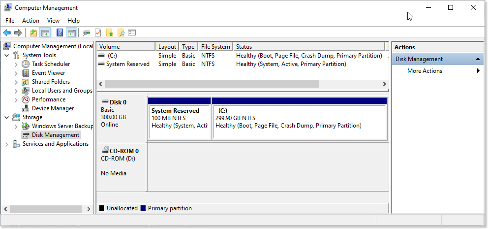{ style="margin-top: 20px;" width="600" }</center>

## 데이터 디스크

ABLESTACK은 가상머신에 ROOT 디스크 외에 별도의 데이터 디스크를 추가하여 연결할 수 있도록 기능을 제공합니다.

가상머신 생성 시에 필요한 경우 데이터 디스크를 추가적으로 연결할 수 있으며, 이 때 연결할 수 있는 데이터 디스크의 수는 1개 입니다.

또한 가상머신 운영 중에 사용자가 데이터 디스크를 추가적으로 생성하여 가상머신에 연결할 수 있습니다.

### 디스크 생성 및 연결

ABLESTACK은 가상머신에 데이터 디스크를 생성하여 연결하는 두가지 방법을 제공합니다.

첫번째 방법은 템플릿을 이용해 가상머신을 생성할 때 가상머신에 연결할 데이터 디스크를 생성하여 연결하도록 하는 것입니다.

두번째 방법은 별도의 디스크 생성 및 연결 기능을 이용해 디스크를 생성하고, 연결하는 방법입니다.

이 섹션에서는 템플릿을 이용해 가상머신을 생성할 때, 디스크를 추가 생성하여 연결하는 방법을 설명합니다. 두번째 방법은 아래의 [추가 디스크 연결 및 확장](#_7) 부분을 참고합니다.

템플릿을 이용해 가상머신을 생성할 때 디스크를 생성하여 연결하는 절차는 다음과 같습니다.

1. `컴퓨트 > 가상머신`으로 이동하여 "가상머신 추가" 마법사를 시작합니다.

2. 배포 인프라를 선택합니다.

3. 템플릿/ISO에서 Windows 기반의 템플릿을 선택합니다.

4. 컴퓨트 오퍼링을 선택합니다.

5. 데이터 디스크를 원하는 크기(오퍼링)로 다음과 같이 선택합니다.
  { style="margin-top: 20px;" width="600" }

6. 네트워크를 선택합니다.

7. SSH 키 쌍을 선택합니다.

8. 확장 모드의 정보를 선택/입력합니다.

9. 상세 정보에 가상머신 이름 등을 입력합니다.

10. 가상머신을 시작합니다.

데이터 디스크를 추가하여 가상머신을 생성한 후 가상머신 상세 화면에서 볼륨 탭을 클릭하면 다음과 같이 데이터 디스크가 추가되어 있는 것을 확인할 수 있습니다.

<center>{ width="600" }</center>

가상머신에 접속하여 디스크를 사용할 수 있도록 설정합니다. 추가된 데이터 디스크는 초기화 후 볼륨만들기를 할 것입니다. 다음과 같은 순서로 데이터 디스크의 사용을 준비합니다.

먼저 가상머신에 콘솔을 통해 접속한 뒤 다음의 순서로 디스크 용량을 확인합니다.

1. 윈도우즈에서 "컴퓨터 관리"를 실행합니다.
2. 왼쪽 트리에서 "스토리지 > 디스크 관리"를 클릭합니다.
3. 디스크 1에 대한 파티션 정보를 확인합니다.

위와 같은 순서로 디스크 정보를 확인하면 다음의 그림과 유사합니다.

<center>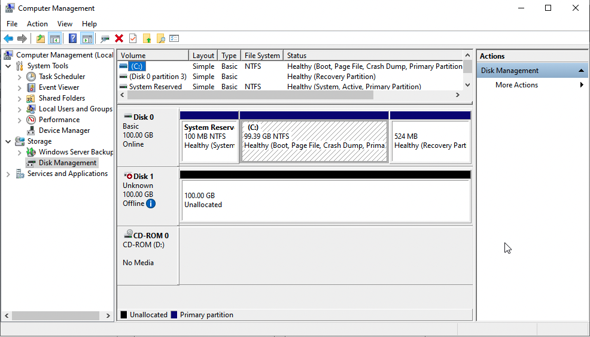{ style="margin-top: 20px;" width="600" }</center>

100GB의 데이터 디스크가 연결되어 있는 것을 확인한 후 디스크를 읽기 및 쓰기 권한이 탑재된 온라인 상태로 설정합니다.

<center>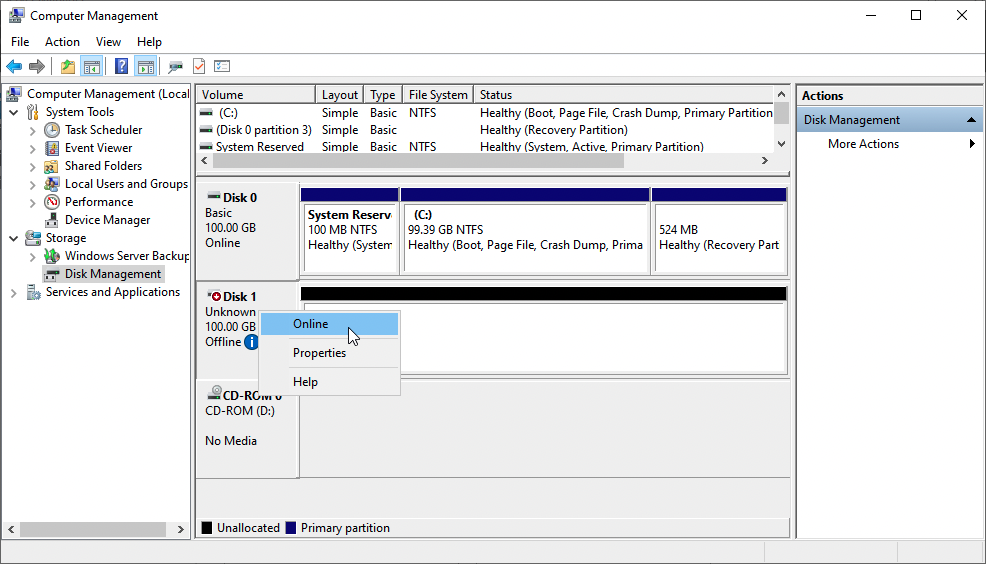{ style="margin-top: 20px;" width="600" }</center>

디스크를 초기화합니다.

<center>{ style="margin-top: 20px;" width="600" }</center>

볼륨만들기 마법사를 통해 파티션 지정 및 드라이브를 선택합니다.

<center>{ style="margin-top: 20px;" width="600" }</center>

디스크가 정상적으로 인식 되었는지 확인합니다.

<center>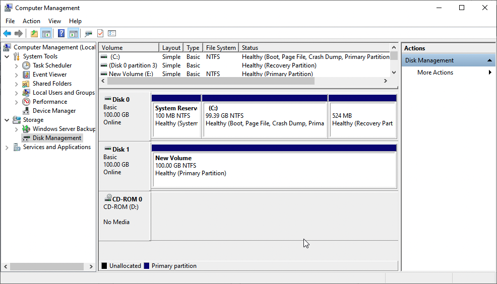{ style="margin-top: 20px;" width="600" }</center>


### 디스크 사이즈 변경

연결된 데이터 디스크에 대해 디스크의 크기를 변경하여 확장할 수 있습니다.

데이터 디스크의 디스크 크기를 변경하려면 먼저 크기를 변경하고자 하는 디스크의 상세 화면으로 이동합니다.

해당 화면의 우측 상단의 아이콘 액션 메뉴 중 "볼륨 크기 변경" 버튼을 클릭합니다. 다음과 같이 대화상자가 표시되면 원하는 디스크의 크기를 입력한 후 "확인" 버튼을 클릭합니다.

<center>{ width="450" }</center>

가상머신에 접속하여 디스크관리 화면에서 디스크 크기가 변경 되었는지 확인합니다. 디스크 크기 변경은 가상머신 실행 중에 가능합니다.

<center>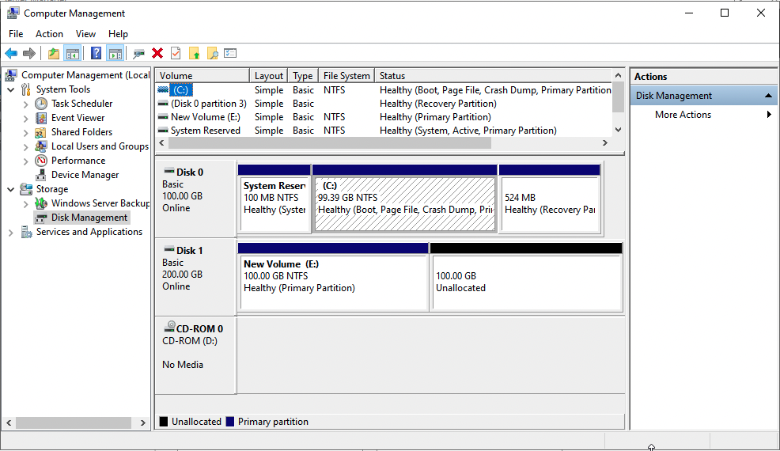{ style="margin-top: 20px;" width="600" }</center>

변경된 디스크를 이용해 볼륨 확장하는 방법은 위에서 설명한 [루트 디스크 확장](#_4)의 방법과 동일합니다.

디스크 확장의 구체적인 절차는 위 섹션의 문서를 참고하십시오.

### 추가 디스크 연결 및 확장

가상머신의 데이터 디스크에 추가로 디스크를 연결하고 확장할 수 있습니다.

`스토리지 > 볼륨` 화면에서 '볼륨 생성' 버튼을 클릭합닌다. 대화상자에 디스크의 이름과 오퍼링을 선택한 후 "확인" 버튼을 클릭합니다.

<center>{ width="450" }</center>

디스크가 생성되면 해당 디스크의 상세 화면으로 이동한 후 우측 상단의 아이콘 액션 버튼 중 "디스크 연결" 버튼을 클릭합니다. 표시된 대화상자에서 연결할 가상머신을 선택한 후 "확인" 버튼을 클릭합니다.

<center>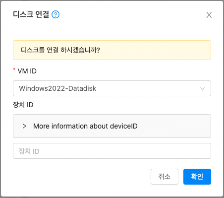{ width="450" }</center>

가상머신에 디스크가 연결되면, 가상머신에 접속하여 볼륨을 확장합니다. 디스크관리를 이용해 디스크 연결 상태를 확인합니다.

<center>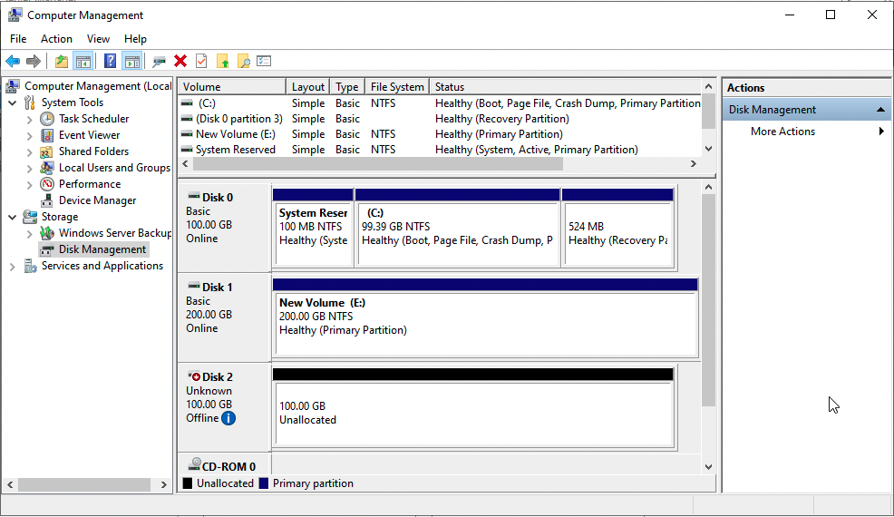{ width="450" }</center>

추가된 디스크를 이용해 볼륨 확장하는 방법은 위에서 설명한 [루트 디스크 확장](#_4)의 방법과 동일합니다.

디스크 확장의 구체적인 절차는 위 섹션의 문서를 참고하십시오.

### 디스크 연결 해제

이번 섹션에서는 가상머신에 연결된 디스크를 안전하게 해제하는 방법을 설명합니다.

먼저 디스크의 볼륨을 확인하기 위해 가상머신 콘솔에서 디스크관리를 실행합니다.

<center>{ style="margin-top: 20px;" width="600" }</center>

해제할 볼륨을 선택하고 볼륨삭제를 실행합니다.

<center>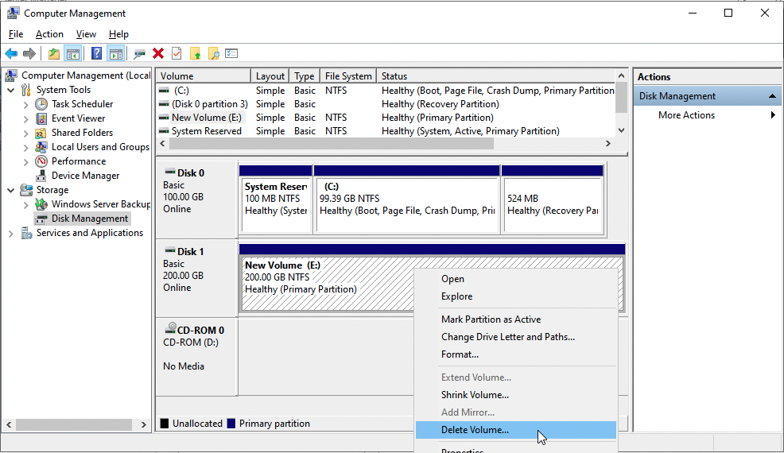{ style="margin-top: 20px;" width="600" }</center>

<center>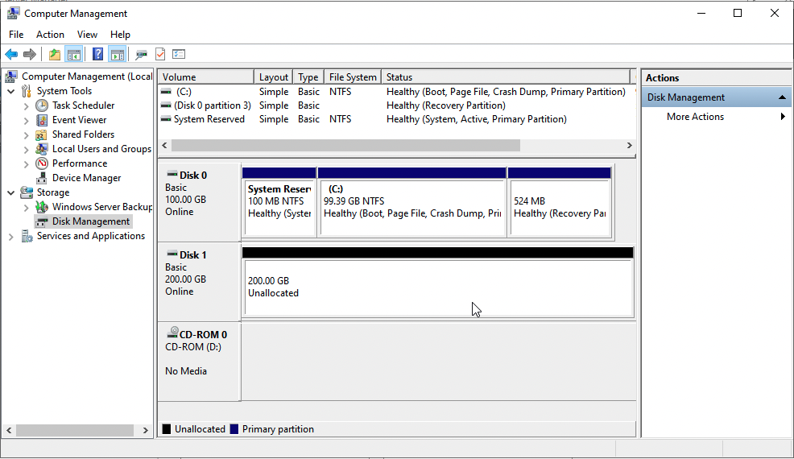{ style="margin-top: 20px;" width="600" }</center>

가상머신에 연결된 디스크를 선택하여 "디스크 분리" 아이콘 액션 메뉴를 클릭합니다. 표시되는 대화상자에서 "확인" 버튼을 클릭하여 디스크를 가상머신에서 분리합니다.

<center>{ width="450" }</center>

연결되어 있는 데이터 디스크를 연결 해제한 후 디스크관리를 실행하여 디스크가 분리 되었는지 확인합니다.

<center>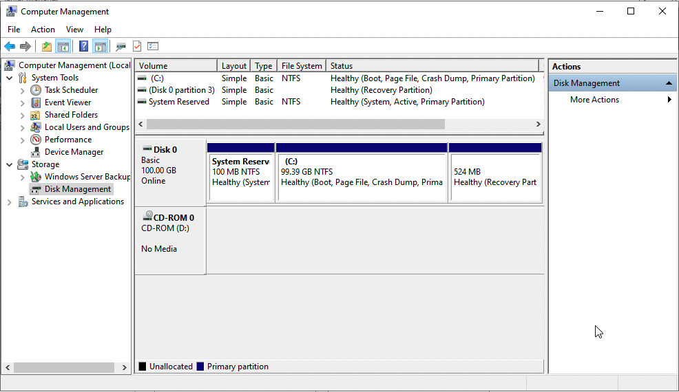{ width="450" }</center>

!!! info "분리된 디스크의 재사용"
    디스크를 삭제하지 않는 한 가상머신으로부터 분리된 디스크는 언제든 다시 연결하여 사용할 수 있습니다.

    해당 디스크에는 볼륨 정보가 남아 있고, 이 볼륨 정보를 이용해 다른 가상머신에서도 동일하게 볼륨을 연결하여 사용할 수 있습니다.

디스크 구성을 완료합니다.
